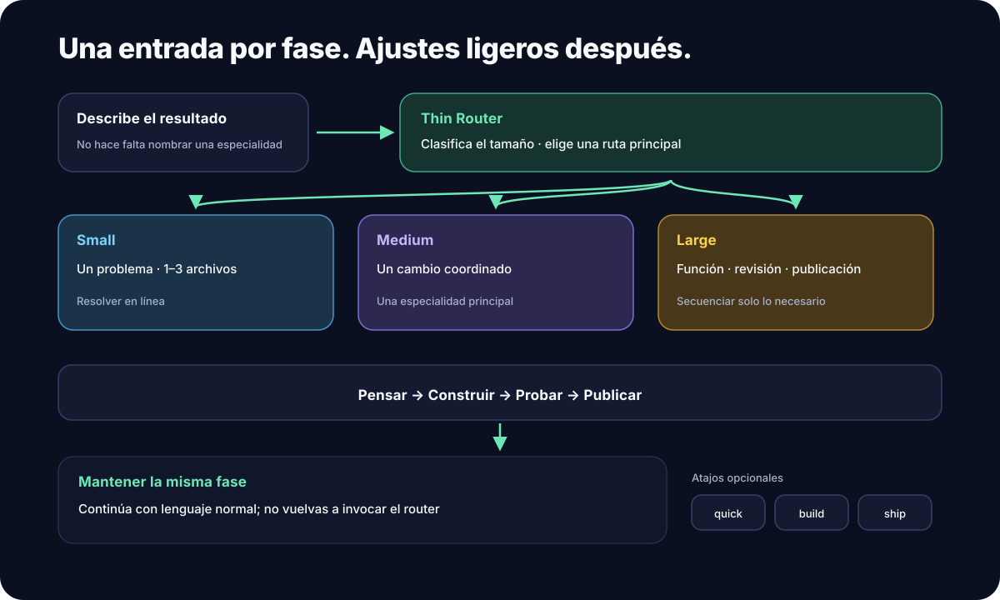
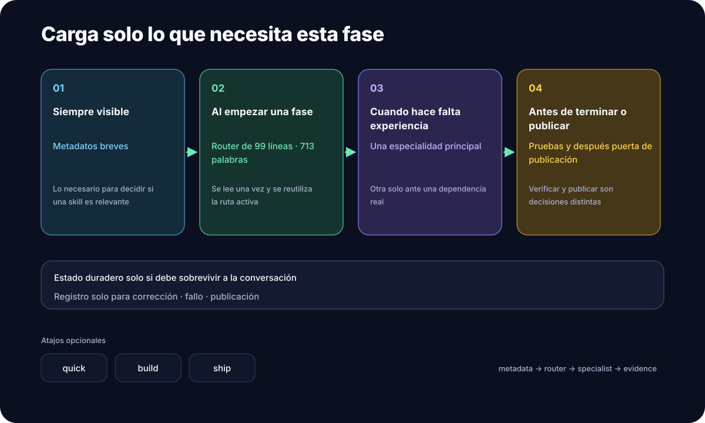

# superforge-skill

[English](./README.md) · [日本語](./README.ja.md) · [简体中文](./README.zh-CN.md) · **Español** · [한국어](./README.ko.md)

**Di en una frase qué quieres construir. Catorce skills lo llevan desde la idea hasta la revisión previa al lanzamiento, en el orden correcto.**

---

## ¿Qué es esto?

Una «skill» es **un conjunto de instrucciones que puedes añadir a una herramienta de AI** como Claude Code. Colocas una carpeta y la AI empieza a seguir ese procedimiento.

superforge son catorce de ellas. La que está en el centro, `superforge`, hace de **recepción de un taller**.

> Tú: «Quiero hacer una app para la cafetería de la esquina.»
> Recepción: «Primero damos forma a la idea; se la paso a `superforge-brain`. Esto pide criterio, así que va sobre Opus 5.»
> — y el trabajo arranca.

La recepción hace exactamente tres cosas.

1. **Decide quién se encarga**: una de las catorce, entre pensar / construir / probar / publicar
2. **Decide qué modelo se usa**: los modelos listos cuestan más, así que el trabajo barato no se paga caro
3. **Se asegura de que el resultado quede en un archivo**, para que nada muera al borrar la conversación

<p align="center">
  
</p>

---

## Por qué ayuda

### 1. Dejas de tener que averiguar por dónde empezar

Sabes lo que quieres hacer, pero no cuál es el primer paso. superforge recibe una frase, anuncia en qué orden va a trabajar y empieza. Ya no montas tú las instrucciones cada vez.

### 2. El trabajo barato deja de correr sobre modelos caros

Hay modelos listos y caros, y modelos rápidos y baratos. Por defecto, **todo corre sobre el caro**: un renombrado masivo se factura igual que una decisión de arquitectura.

superforge clasifica cada subtarea en uno de cuatro niveles antes de empezar y le asigna el modelo correspondiente. Y no solo para Claude: lleva el mapa equivalente para los entornos Gemini, Codex y Kimi.

<p align="center">
  
</p>

La fila de abajo, **D (texto masivo)**, es trabajo que nunca toca el repositorio: traducir, resumir, generar variaciones. Eso va a la CLI local `gemini`, así que **no consume nada de tu uso de Anthropic**.

### 3. Lo que decidiste no desaparece con la conversación

Todo lo que trabajas con una AI se esfuma en cuanto borras el hilo. Al día siguiente vuelves a explicarlo desde cero.

Las skills de superforge escriben un archivo en `docs/` antes de dar el parte. Decides el diseño y tienes `docs/design.md`. Decides el precio y tienes `docs/business-model.md`. Así, `/clear`, un cambio de modelo o una semana de pausa no te cuestan nada: **lo decidido sigue ahí para releerlo**.

---

## Las catorce skills

`superforge` es la recepción; las otras trece hacen el trabajo. También puedes llamarlas directamente, como `/superforge-ui`.

### 1. Pensar — decidir qué hacer

| Skill | Cuándo | Archivo que deja |
|---|---|---|
| [`superforge-brain`](./skills/superforge-brain/README.es.md) | quieres una idea que merezca construirse — la no obvia **y** la corriente pero necesaria (**motor BreakBias**, o un método clásico más ligero, a elegir) | `docs/product-idea.md` (+ mapa `.html` en un barrido completo) |
| [`superforge-biz`](./skills/superforge-biz/README.es.md) | si merece la pena entrar en este mercado; y después precio, paywall, cómo conseguir clientes, un pitch que cuantifique el valor, y la aritmética de vender capacidad en vez de un producto | `docs/business-model.md` |
| [`superforge-brand`](./skills/superforge-brand/README.es.md) | nombre, color, tono, y los prompts que generan los recursos | `docs/brand.md` |

### 2. Construir — hacerlo real

| Skill | Cuándo | Archivo que deja |
|---|---|---|
| [`superforge-ui`](./skills/superforge-ui/README.es.md) | diseño de interfaz que parte de una referencia real en vez del promedio del propio modelo, landing pages hechas para vender, y los primeros treinta segundos tras decidirse, con una guía de estilo que una persona abre y revisa | `docs/design.md` + `docs/design.html` |
| [`superforge-dev`](./skills/superforge-dev/README.es.md) | implementación: dividir el trabajo para que el paralelo no rompa, y repartirlo entre modelos adecuados | `docs/plan.md` |

### 3. Probar — comprobar que nada falla

| Skill | Cuándo | Archivo que deja |
|---|---|---|
| [`superforge-test`](./skills/superforge-test/README.es.md) | decidir qué merece una prueba, y escribirla antes que el código (Web / iOS / Android) | las pruebas |
| [`superforge-debug`](./skills/superforge-debug/README.es.md) | apareció un bug y quieres la causa, no un parche encima — incluidos los que no se reproducen | `docs/failforward.md` |
| [`superforge-a11y`](./skills/superforge-a11y/README.es.md) | accesibilidad comprobada en serio: siete pasadas, no un escáner | `docs/accessibility.md` |
| [`superforge-secure`](./skills/superforge-secure/README.es.md) | ¿puede un usuario con sesión leer los datos de otro? siete pasadas, ordenadas por lo que consigue el atacante — y qué hacer cuando una clave ya se ha filtrado | `docs/security.md` |

### 4. Publicar — dejarlo listo para salir

| Skill | Cuándo | Archivo que deja |
|---|---|---|
| [`superforge-roast`](./skills/superforge-roast/README.es.md) | quieres oír los fallos antes de que los encuentren tus usuarios | `docs/critique.md` |
| [`superforge-verify`](./skills/superforge-verify/README.es.md) | «está listo» necesita pruebas adjuntas, graduadas, y honestidad sobre lo que no se comprobó | `docs/verification.md` |
| [`superforge-ship`](./skills/superforge-ship/README.es.md) | funciona — pero ¿podéis publicarlo? obligaciones legales, rechazos de tienda, medición que no se puede añadir después | `docs/ship-readiness.md` |
| [`superforge-handoff`](./skills/superforge-handoff/README.es.md) | antes de borrar una sesión o cambiar de herramienta | `.handoff/` |

---

## Instalación

Solo hacen falta `git` y una herramienta de AI que cargue skills, como Claude Code.

### Todas de una vez (recomendado)

Clona una vez y ejecuta el instalador. Busca todos los directorios de skills de tu máquina y enlaza las catorce.

```bash
git clone https://github.com/takaoumehara/superforge-skill
cd superforge-skill
./install.sh
```

`--dry-run` muestra qué pasaría sin cambiar nada; `--uninstall` lo quita. Es idempotente y solo toca sus propios enlaces simbólicos, así que puedes reejecutarlo tras cada `git pull`.

Estos son los directorios que busca. Solo enlaza los que existan.

```
~/.claude/skills                    Claude Code
~/.agents/skills                    lo leen tanto Codex CLI como Gemini CLI
~/.codex/skills                     Codex CLI
~/.gemini/skills                    Gemini CLI
~/.gemini/antigravity-ide/skills    Antigravity IDE
```

Reinicia tu herramienta de AI y escribe `/superforge`.

### Solo una skill

```bash
git clone https://github.com/takaoumehara/superforge-skill ~/src/superforge-skill
ln -s ~/src/superforge-skill/skills/superforge-ui ~/.claude/skills/superforge-ui
```

Cambia `superforge-ui` por la skill que quieras y `~/.claude/skills` por el directorio de tu herramienta.

> **Cuidado:** no clones el repositorio *dentro* de un directorio de skills. Las herramientas descubren skills **solo un nivel hacia abajo**. Clónalo donde quieras y luego enlaza.

### claude.ai (navegador)

Comprime la carpeta de una skill y súbela en Settings → Capabilities → Skills. El navegador acepta una por vez.

```bash
cd ~/src/superforge-skill/skills/superforge-ui
zip -r superforge-ui.zip .
```

### Dejarlo siempre activo (recomendado)

Las skills se activan **solas** cuando la IA las juzga relevantes; no hace falta escribir su nombre. Lo que sí conviene fijar es la asignación de modelo, porque aplica en todos los proyectos y con cualquier skill en marcha. Añádelo al archivo de instrucciones **global** de tu herramienta:

| Herramienta | Archivo |
|---|---|
| Claude Code | `~/.claude/CLAUDE.md` |
| Codex CLI | `~/.codex/AGENTS.md` |
| Gemini CLI / Antigravity | `~/.gemini/GEMINI.md` |

```
Antes de lanzar subagentes, consulta la skill `superforge` para asignar el
modelo adecuado a cada subtarea en vez de dejarlos todos en el mismo.
Imprime la asignación — tarea, modelo y por qué — antes de gastar nada.
```

**Lo que esto no hace, y es la lectura equivocada más frecuente.** No hace que las peticiones pequeñas corran en un modelo barato. El escalonado aplica a los **subagentes que la IA lanza**, no a la sesión en la que estás escribiendo — y una corrección de una línea sale más barata hecha directamente, porque lanzar un agente aparte cuesta *más* que hacerlo en el sitio. Para cambiar el modelo de tu propia sesión usa el ajuste de la herramienta (`/model` en Claude Code); ningún archivo de instrucciones lo sobreescribe.

Donde sí compensa: cualquier tarea lo bastante grande como para dividirse. Cinco subagentes en los cinco niveles correctos en vez de cinco en el más caro — para eso existe todo esto.

---
## Te pregunta el idioma una sola vez

Las skills están escritas en inglés. Tú no tienes por qué estarlo.

En la primera ejecución dentro de un proyecto hace una única pregunta — **con su suposición ya rellenada a partir de lo que acabas de escribir** — y después no vuelve a preguntar:

```
Conversación: español   ← deducido de cómo escribiste
Archivos en docs/: español

[1] ambos en inglés   [2] hablar en español, escribir archivos en inglés   [3] otro idioma
```

**Están separados a propósito.** Quien trabaja en español pero comparte el repositorio con gente de fuera suele querer respuestas en español y archivos en inglés, y a casi nadie se le ocurre pedirlo.

La respuesta vive en `docs/superforge.md`, sobrevive a `/clear`, viaja en la cápsula de traspaso y cambia en cuanto lo digas. Si ignoras la pregunta y planteas tu tarea directamente, toma la suposición y se pone a trabajar.

---

## ¿No sabes por dónde empezar?

Di **`/superforge help`** (o «cómo se usa esto»). Imprime un resumen corto y un menú numerado, y ahí se detiene — una sección cada vez, no un muro de texto:

`[1]` las catorce skills · `[2]` **dónde se ahorra de verdad** · `[3]` lo que no puede hacer · `[4]` malentendidos habituales · `[5]` uso avanzado

### Dónde se ahorra de verdad

El ahorro viene de **dónde se procesan los tokens**, no de cuántos agentes corren.

| Lo que pides | Qué pasa | ¿Más barato? |
|---|---|---|
| «corrige esta errata» | Lo hace tu propia sesión | **No — y ya es el camino más barato.** Lanzar un agente cuesta más |
| «resume estas 2.000 líneas de log» | **Un** agente en un nivel barato | **Sí, mucho** — el grueso se gasta en el modelo barato y solo vuelve el resultado |
| «construye esta función» (se parte en cinco tareas) | Un nivel por tarea | **Sí — este es el caso principal** |
| «decide la arquitectura» | El mejor modelo, sin delegar | No, y aquí no es donde hay que ahorrar |

Así que el criterio para delegar incluso *una sola* tarea no es «¿hay más de una?», sino **«¿va a consumir muchos tokens sin necesitar mucho criterio?»**

---

## Lo que no va a hacer

Dicho por delante, porque la distancia entre lo que una herramienta promete y lo que hace es justo donde se pierde la confianza.

- **No abarata tu propia sesión.** El escalonado aplica a subagentes. Tu sesión corre en el modelo que hayas configurado.
- **No escribe el código por sí sola.** Esto son instrucciones que la IA lee. El trabajo lo sigue haciendo la IA, y la IA se puede equivocar.
- **No es asesoría legal.** `superforge-ship` nombra qué obligaciones se activaron y dónde un abogado pasa a ser obligatorio. Nunca redacta la política.
- **Nunca dice que un producto es seguro.** `superforge-secure` informa de qué se comprobó y qué no — que es una afirmación distinta, y honesta.
- **No sustituye a hablar con usuarios.** `superforge-brain` te dice cómo preguntar; no puede saber la respuesta.
- **Sus veredictos valen lo que valgan sus datos.** Por eso cada cifra de mercado lleva su nivel de confianza.

---

## Dónde funciona

| Entorno | ¿Funciona? | Notas |
|---|---|---|
| Claude Code (CLI, extensiones de VS Code / JetBrains) | ✅ | soporte nativo de Skills |
| Codex CLI | ✅ | lee `~/.agents/skills/` y el `AGENTS.md` del proyecto |
| Gemini CLI | ✅ | lee `~/.agents/skills/` |
| Antigravity IDE | ✅ | lee su propio directorio `skills/` |
| claude.ai (navegador, Pro / Team / Enterprise) | ✅ | se sube como skill personalizada |
| Chat sin herramientas (ChatGPT / Gemini web) | ⚠️ | ahí no hay carga de skills ni forma de pasar trabajo a otro agente. Puedes pegar un `SKILL.md` como instrucciones, pero la asignación de modelo no tiene sobre qué actuar |

---

## Para profundizar

### Un sistema de diseño que una persona puede comprobar de verdad

`superforge-ui` produce **dos archivos que jamás deben contradecirse**.

- **`docs/design.md`** — las definiciones de color y tamaño, para que las lea el agente. Formato abierto [design.md](https://github.com/google-labs-code/design.md)
- **`docs/design.html`** — un archivo que abres en el navegador y muestra cada color, componente y estado renderizado de verdad, con las ratios de contraste medidas y su distintivo de aprobado o suspenso

El HTML **consume** los valores de `design.md` en lugar de redibujarlos a mano, así que «la especificación y lo real no coinciden» es estructuralmente imposible.

### Dónde deja de bastar un escáner de accesibilidad

Las herramientas automáticas dan una cifra y después se callan, **y ese silencio se lee como aprobación**. El motor estándar del sector incluye **63 reglas** para los niveles A y AA de WCAG. Ese mismo nivel tiene **55 criterios de conformidad**, y para varios de ellos —orden del foco, propósito del enlace en su contexto, sugerencia de corrección, alternativas al arrastre, autenticación accesible— **no existe ninguna regla automática**, porque cumplirlos es un juicio sobre el significado.

`superforge-a11y` ejecuta las otras seis pasadas: teclado, lector de pantalla, zoom y reflujo, color, movimiento y tiempo, formularios y errores. Después rellena un registro con todos los criterios de nivel A y AA marcados `cumple` / `no cumple` / `no aplica` / `sin evaluar`, porque **un criterio que falta en un informe se lee como aprobado**, y esa es la vía más fácil para que una auditoría se vuelva falsa.

Se niega a escribir «conforme» mientras quede algo «sin evaluar», y nombra a la persona bloqueada en cada hallazgo en lugar del número de regla. Web, iOS y Android, con la norma que de verdad te aplica: [EAA / EN 301 549, ADA Title II, Section 508, JIS X 8341-3](./skills/superforge-a11y/references/conformance-and-law.md).

### Dar una instrucción por la noche y leer el resultado por la mañana

El objetivo no es tomar menos decisiones, sino eliminar todo lo que **no** es una decisión.

Una ejecución puede seguir sola solo si es capaz de demostrar su propio avance: el alcance escrito como casillas, cada una con **el comando que demuestra que está hecha**, autorreparación ante fallos y estado volcado a disco después de cada tarea. Las preguntas abiertas se resuelven con un valor por defecto defendible y se registran, en lugar de detener el proceso.

Solo se detiene por cuatro cosas: una pérdida irreversible, gastar dinero, credenciales que faltan o un objetivo equivocado de raíz. Y aun así sigue avanzando en todo lo demás.

Protocolo completo → [`superforge-dev/references/autonomous-run.md`](./skills/superforge-dev/references/autonomous-run.md)

### Por qué catorce skills no ralentizan a la AI

Lo único permanentemente en el contexto de la AI es **la descripción de una línea de cada skill**. El cuerpo se carga cuando hace falta, y el material profundo vive en `references/` y se lee bajo demanda.

| Referencia | Qué contiene |
|---|---|
| [`superforge/references/intake.md`](./skills/superforge/references/intake.md) | convertir una petición en un brief escrito sin interrogar a nadie |
| [`superforge/references/wiring.md`](./skills/superforge/references/wiring.md) | cuándo pasar un paso a otra skill que ya tengas instalada |
| [`superforge-brain/references/ideation-tools.md`](./skills/superforge-brain/references/ideation-tools.md) | los submétodos que hacen exhaustiva cada técnica, las pruebas de descarte, el protocolo de juicio, la rúbrica de mercado |
| [`superforge-brain/references/classic-methods.md`](./skills/superforge-brain/references/classic-methods.md) | la alternativa más ligera al barrido completo — SCAMPER, Seis Sombreros, Crazy 8s, How Might We y más |
| [`superforge-brain/references/value-classification.md`](./skills/superforge-brain/references/value-classification.md) | por qué una sola puntuación borra negocios que funcionan — los cuadrantes Hero / Workhorse / Lab / Discard, las cuatro vías de victoria, la revisión de la lista de prohibidos |
| [`superforge-brain/references/talk-to-users.md`](./skills/superforge-brain/references/talk-to-users.md) | preguntar qué hicieron ya, no qué harían — y por qué un Hero y un Workhorse necesitan entrevistas opuestas |
| [`superforge-brain/references/idea-map-output.md`](./skills/superforge-brain/references/idea-map-output.md) | la especificación de `product-idea.html` — cada idea visualizada, incluidas las descartadas, más los tres mapas de prioridad |
| [`superforge-biz/references/market-sizing.md`](./skills/superforge-biz/references/market-sizing.md) | la puerta GO/NO-GO — el TAM calculado en ambas direcciones, niveles de confianza, cuántos clientes hacen falta de verdad |
| [`superforge-biz/references/behavioral-frameworks.md`](./skills/superforge-biz/references/behavioral-frameworks.md) | anclaje, aversión a la pérdida, opciones por defecto, el índice por síntoma y su línea ética |
| [`superforge-biz/references/customer-acquisition.md`](./skills/superforge-biz/references/customer-acquisition.md) | encaje canal-mercado, imanes de leads, cualificación por ajuste×intención, matemática de CAC/LTV |
| [`superforge-biz/references/service-business.md`](./skills/superforge-biz/references/service-business.md) | cuando lo que se vende es capacidad — el techo de ingresos que sale de la aritmética, el alcance como el verdadero entregable, el scope creep con precio en vez de absorbido, retainers, concentración de clientes |
| [`superforge-biz/references/value-pitch.md`](./skills/superforge-biz/references/value-pitch.md) | convertir cualquier función en un pitch de negocio cuantificado, lógica y luego emoción |
| [`superforge-ui/references/design-process.md`](./skills/superforge-ui/references/design-process.md) | los pasos de diseño, los cuatro estados de datos, la lista de calidad |
| [`superforge-ui/references/design-system-output.md`](./skills/superforge-ui/references/design-system-output.md) | la especificación de `design.md` + `design.html` |
| [`superforge-ui/references/design-sourcing.md`](./skills/superforge-ui/references/design-sourcing.md) | de dónde sale la dirección visual — seis capas de extracción, la línea entre referencia e imitación, convertir en sistema un diseño hecho en otra herramienta |
| [`superforge-ui/references/motion-system.md`](./skills/superforge-ui/references/motion-system.md) | duraciones, curvas elegidas según la propiedad animada, FLIP, sincronía de scroll, reduced-motion en tiempo de ejecución |
| [`superforge-ui/references/landing-page.md`](./skills/superforge-ui/references/landing-page.md) | diseño de páginas hechas para vender — orden de secciones, el hero, móvil frente a escritorio |
| [`superforge-brand/references/case-study.md`](./skills/superforge-brand/references/case-study.md) | escribir el trabajo ya enviado de forma creíble — por capas según el lector, la credibilidad en las decisiones y su coste, y la sección donde hizo falta tu criterio |
| [`superforge-ui/references/slide-page.md`](./skills/superforge-ui/references/slide-page.md) | una página larga hecha para ser ojeada — dos capas por pantalla, la forma elegida por lo que hace el contenido, y sin lenguaje visual propio |
| [`superforge-ui/references/first-run.md`](./skills/superforge-ui/references/first-run.md) | los primeros treinta segundos — llegar a un resultado en vez de explicar, permisos en el punto de uso, marcar el final de forma que aún puedas probarlo |
| [`superforge-ship/references/legal-triggers.md`](./skills/superforge-ship/references/legal-triggers.md) | qué obligaciones activó el propio comportamiento del producto, la base universal de cuatro puntos y dónde el abogado deja de ser opcional |
| [`superforge-ship/references/launch-metrics.md`](./skills/superforge-ship/references/launch-metrics.md) | la medición que no se puede añadir después, qué puede decidir cada número y las primeras cuatro semanas |
| [`superforge-roast/references/evaluation-methods.md`](./skills/superforge-roast/references/evaluation-methods.md) | evaluación heurística, auditoría de accesibilidad, carga cognitiva, personas simuladas |
| [`superforge-a11y/references/wcag22-ledger.md`](./skills/superforge-a11y/references/wcag22-ledger.md) | los 86 criterios de WCAG 2.2 y qué mirar en cada uno |
| [`superforge-a11y/references/audit-protocol.md`](./skills/superforge-a11y/references/audit-protocol.md) | las siete pasadas, su listón de aceptación y la evidencia que deja cada una |
| [`superforge-a11y/references/tooling.md`](./skills/superforge-a11y/references/tooling.md) | qué detecta cada herramienta, qué se le escapa con certeza, y el enganche a CI |
| [`superforge-a11y/references/native-platforms.md`](./skills/superforge-a11y/references/native-platforms.md) | VoiceOver, Dynamic Type, TalkBack, semantics de Compose, Switch Access |
| [`superforge-a11y/references/conformance-and-law.md`](./skills/superforge-a11y/references/conformance-and-law.md) | EAA / EN 301 549, ADA Title II, Section 508, JIS X 8341-3, declaraciones de conformidad |
| [`superforge-dev/references/decomposition.md`](./skills/superforge-dev/references/decomposition.md) | cómo dividir para que el paralelo no rompa — un resultado y una línea de prueba por tarea, la regla de la lista de archivos, lo que nunca puede ir en paralelo, revertir antes de reintentar |
| [`superforge-dev/references/autonomous-run.md`](./skills/superforge-dev/references/autonomous-run.md) | condiciones previas, el bucle, qué se puede decidir en solitario |
| [`superforge-test/references/what-to-test.md`](./skills/superforge-test/references/what-to-test.md) | qué merece una prueba y qué no, la escalera de coste unitario/integración/E2E, el límite del mocking, síntomas de una prueba frágil, cómo añadir pruebas a código que no tiene |
| [`superforge-verify/references/evidence.md`](./skills/superforge-verify/references/evidence.md) | los cuatro grados de prueba y por qué un informe no puede contener una afirmación sin respaldo, «funcionó» frente a «funcionó de casualidad», las siete formas de falsear evidencia sin querer |
| [`superforge-debug/references/failforward.md`](./skills/superforge-debug/references/failforward.md) | dónde vive la memoria de fallos y por qué la línea `Looked like` es la que paga, qué hacer cuando no se reproduce, bisecar «antes funcionaba», cuándo parar |
| [`superforge-secure/references/attack-surface.md`](./skills/superforge-secure/references/attack-surface.md) | las siete pasadas en detalle — dónde se filtran de verdad las claves, la prueba de dos cuentas que encuentra los peores fallos en una hora, dónde aterriza la inyección, riesgo de dependencias y de build, y el barrido de superficie expuesta |
| [`superforge-secure/references/when-it-happens.md`](./skills/superforge-secure/references/when-it-happens.md) | contener antes de diagnosticar — el orden de rotación, reconstruir el alcance desde registros que quizá no guardaste, y el aviso honesto |
| [`superforge-dev/references/data-design.md`](./skills/superforge-dev/references/data-design.md) | la cadena de pertenencia que lee cada comprobación de permisos, las decisiones baratas ahora y caras después, índices ausentes / N+1 / lecturas sin límite, migraciones aditivas, y qué tiene que significar «borrado» |
| [`superforge-ui/references/aesthetic-direction.md`](./skills/superforge-ui/references/aesthetic-direction.md) | qué hacer cuando no hay ninguna referencia — diez direcciones con nombre, empujar exactamente un eje, y los defectos concretos que se leen como hechos por una máquina |
| [`superforge-ui/references/surface-and-scope.md`](./skills/superforge-ui/references/surface-and-scope.md) | las dos preguntas anteriores a cualquier decisión de diseño — qué significa el éxito en esta superficie (y qué puede sacrificar ese modo), y si esto es refinar, rediseñar o un fragmento |
| [`superforge-ui/references/build-floor.md`](./skills/superforge-ui/references/build-floor.md) | comprobaciones sobre el resultado construido y no sobre la intención, y los defaults agrupados por por qué aparecieron: lo que trae la librería, atajos para una sensación no ganada, y valores que nadie eligió |
| [`superforge-ui/references/heavy-visuals.md`](./skills/superforge-ui/references/heavy-visuals.md) | shaders, 3D y efectos dibujados por GPU — los niveles de coste, batería y calor, el dispositivo mínimo, las obligaciones de lector de pantalla y reduced-motion, y por qué esto va en una página de lanzamiento y casi nunca dentro de una herramienta. No nombra librerías a propósito |
| [`superforge-ui/references/sound.md`](./skills/superforge-ui/references/sound.md) | el eje expresivo menos usado y el que peor se lleva cuando se usa mal — nada suena sin que el visitante lo provoque, nada se transmite solo por sonido, y limitar el tono generado a una escala convierte «algo suena raro» en «esto está pensado» |
| [`superforge-ui/references/effect-vocabulary.md`](./skills/superforge-ui/references/effect-vocabulary.md) | el menú que necesita el paso de propuesta — unos treinta efectos entre gráficos, sonido y superficies nativas, nombrados por **cómo se sienten** y no por qué librería los hace, así no caducan. Sin menú, «hazlo impresionante» devuelve un degradado |
| [`superforge-ui/references/toolchain.md`](./skills/superforge-ui/references/toolchain.md) | el puente entre una sensación y algo que puedas instalar de verdad — **el único archivo fechado donde viven los nombres de librerías**, para que todo lo demás siga siendo duradero y solo haya un sitio que revisar. También se lee al revés: qué se ha vuelto posible hace poco, y qué permite pedir eso |
| [`superforge-dev/references/dispatch-ledger.md`](./skills/superforge-dev/references/dispatch-ledger.md) | qué modelo se asigna a cada agente, impreso antes de gastar nada y registrado después — para que el escalonado que promete esta suite se vea en vez de afirmarse |
| [`superforge-ui/references/performance-budget.md`](./skills/superforge-ui/references/performance-budget.md) | tres números decididos con el diseño en vez de medidos después, de dónde viene realmente el peso, y la velocidad percibida como problema de diseño |
| [`superforge-ui/references/internationalization.md`](./skills/superforge-ui/references/internationalization.md) | el texto se alarga y lo primero que se rompe son los botones, por qué una frase nunca se ensambla por trozos, formatos según locale, y decidir si ser multilingüe siquiera |
| [`superforge-ship/references/operations.md`](./skills/superforge-ship/references/operations.md) | ¿te enterarás? ¿puedes arreglarlo? ¿puedes recuperarlo? ¿cuánto cuesta? — una alerta que valga la pena, un rollback probado, una copia restaurada, y el umbral de la factura desbocada |
| [`superforge-brand/references/media-production.md`](./skills/superforge-brand/references/media-production.md) | lo que cuesta de verdad el medio generado, la receta que hace que la duodécima imagen encaje con la primera, y las preguntas de uso comercial y de imagen resueltas antes de publicar |

---

## Herramientas que las skills ejecutan de verdad

Dos piezas de trabajo determinista que un modelo no debería hacer razonando. Ambas son de solo lectura y salen con código distinto de cero, así que sirven de puerta en CI.

| Script | Qué hace |
|---|---|
| [`superforge-a11y/scripts/contrast.py`](./skills/superforge-a11y/scripts/contrast.py) | Ratios de contraste WCAG desde un archivo de tokens. La luminancia relativa es una transformada gamma por tramos, y un error pequeño cruza la línea de aprobado sin parecer un error. No adivina con colores con alfa: o los compones, o reporta UNKNOWN |
| [`superforge-secure/scripts/scan-secrets.sh`](./skills/superforge-secure/scripts/scan-secrets.sh) | La pasada 1 de la revisión de seguridad en los seis sitios donde se esconde una credencial — **incluido el historial de git**, donde una clave borrada en un commit posterior sigue viva. Nunca imprime un secreto usable |

Cuatro skills llevan además `evals/evals.json`: prompts que deben y no deben activarlas, más aserciones sobre el **artefacto** — no solo «¿se activó la skill?» sino «¿salió `docs/design.md` con su bloque de Design DNA y su presupuesto?».

---

## Créditos y trabajo previo

Las skills de aquí se destilaron de ocho fuentes y están **reescritas con mis propias palabras**. No incluyen código ni texto de terceros.

| Fuente | Origen | Qué aportó |
|---|---|---|
| [BreakBias Studio](https://github.com/takaoumehara/breakbias-studio) | mía | el motor de ideación de `superforge-brain` |
| [cross-model-handoff](https://github.com/takaoumehara/cross-model-handoff) | mía | el formato de cápsula de `superforge-handoff` |
| [obra/superpowers](https://github.com/obra/superpowers) | MIT © Jesse Vincent | la idea de repartir el trabajo entre varios agentes |
| [BMAD-METHOD](https://github.com/bmad-code-org/BMAD-METHOD) | MIT © BMad Code, LLC | estructuras de agentes separados por rol |
| [vercel-labs/skills](https://github.com/vercel-labs/skills) | Vercel Labs | empaquetar skills pequeñas y distribuibles |
| Gem_Ren_Pack | mía | marcos de diseño y evaluación |
| Mis propias notas de investigación sobre diseño de interacción y movimiento | mías | la base de `motion-system.md` y `design-process.md`: la escala de duraciones, la curva elegida según la propiedad animada, FLIP, la sincronía del motor de scroll, los tiempos de validación de formularios y el dimensionado de alcance y objetivos |
| Un conjunto de skills de desarrollo de apps que me pasaron | de terceros, **leído pero no reutilizado** | **los huecos que dejó al descubierto**: dimensionamiento de mercado, obligaciones legales en el momento de publicar y diseño del primer arranque no existían aquí. Solo se tomó conocimiento estándar del campo (TAM/SAM/SOM, disparadores de protección de datos, permisos en contexto); cada archivo se escribió desde cero |
| Tres conjuntos de skills de diseño que me pasaron (`impeccable`, `emil-design-engineering`, `animation-patterns`) | de terceros, **leído pero no reutilizado** | **Tres conceptos que le faltaban a esta suite**, todos reescritos desde cero y ampliados: los cuatro modos de superficie y la línea entre refinar y rediseñar (`surface-and-scope.md`, con la columna de qué se sacrifica y el caso del fragmento añadidos); un suelo que se comprueba sobre el resultado construido y no sobre la intención (`build-floor.md`, reorganizado según *por qué* aparece cada default — una agrupación que no hace ninguna de las fuentes); y la frecuencia como test para decidir si animar |

**Sobre esa última fila.** Leer el conjunto de skills de otra persona es una buena forma de descubrir qué te falta, y una mala forma de rellenarlo. Lo que salió a la luz fueron tres huecos reales, hoy cubiertos por [`market-sizing.md`](./skills/superforge-biz/references/market-sizing.md), [`superforge-ship`](./skills/superforge-ship/README.es.md) y [`first-run.md`](./skills/superforge-ui/references/first-run.md) — y ninguno se parece a su equivalente, porque las decisiones de diseño fueron en sentido contrario: **nada de texto legal congelado**, ningún catálogo de funciones de plataforma que caduca en un año, y ninguna plantilla de código en una suite que transporta proceso, no andamiaje.

**Sobre el motor BreakBias de `superforge-brain`** — su base son las dos restricciones de SIT (Systematic Inventive Thinking): Closed World (no traer elementos de fuera de la caja) y Function Follows Form (construir primero la forma imposible y deducir el valor hacia atrás). BreakBias añade:

- **ocho técnicas en lugar de cinco** (Reverse / Shift / Repurpose)
- **un sesgo nombrado en cada elemento** (funcional / estructural / relacional)
- **las tres obvias vetadas primero**, y la novedad puntuada como distancia a ellas
- **elemento × técnica × submétodo como un registro de celdas**, para que una máquina verifique que no se saltó ninguna
- **el juicio en un contexto separado**: quien puntúa no ve cómo se llegó a la idea
- **una puerta de mercado después del juicio**, para que el conocimiento del mercado no contamine la puntuación de novedad

SIT es un método para personas en una sala. BreakBias lo reconstruye en algo que **una máquina puede barrer de forma exhaustiva, y demostrar que lo hizo**.

---

## Licencia

MIT — consulta [LICENSE](./LICENSE).
