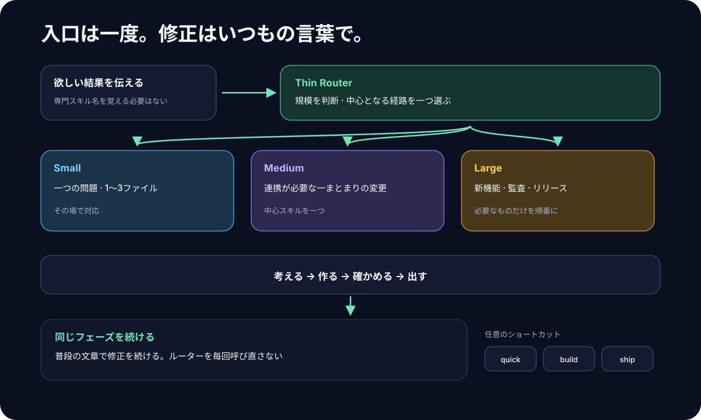
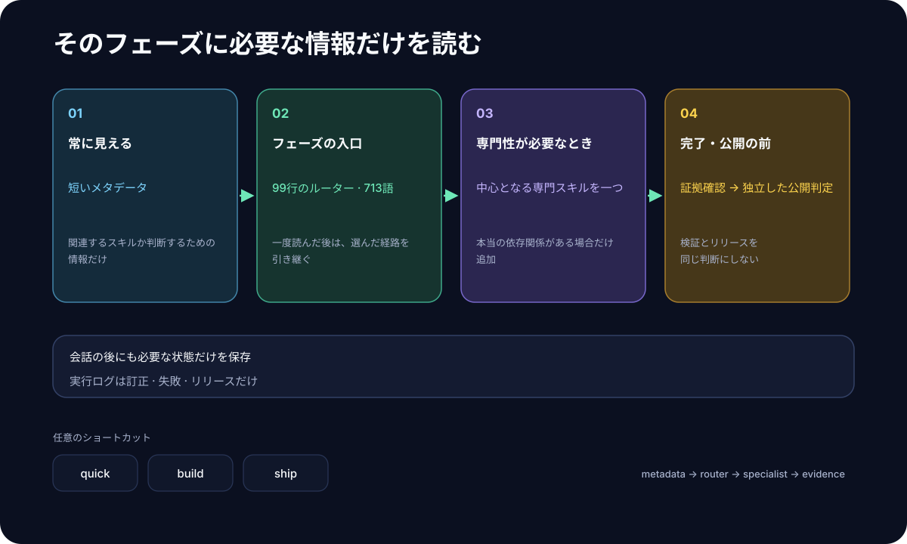

# superforge-skill

[English](./README.md) · **日本語** · [简体中文](./README.zh-CN.md) · [Español](./README.es.md) · [한국어](./README.ko.md)

**「◯◯を作りたい」と一言いうだけで、アイデア出しから出荷前チェックまでを、AIが順番どおりに進めてくれる13個のスキル集です。**

---

## これは何？（はじめての方へ）

「スキル」とは、Claude Code のような **AIツールに後から足せる"やり方の説明書"** のことです。フォルダを1つ置くだけで、AIがその手順どおりに動くようになります。

superforge は、その説明書を13枚まとめたものです。中心にいる `superforge` が **工房の受付係**の役をします。

> あなた：「近所のカフェ向けのアプリを作りたい」
> 受付：「まずアイデアを固めますね。`superforge-brain` に渡します。判断が要る作業なので Opus 5 を使います」
> — そして、作業が始まります。

受付係がやることは3つだけです。

1. **どの担当に渡すか決める**（考える／作る／試す／出す、の12人から選ぶ）
2. **どのAIモデルを使うか決める**（賢いモデルは高い。安い作業に高いモデルを使わない）
3. **結果を必ずファイルに残させる**（会話を消しても、決めたことが消えないように）

<p align="center">
  
</p>

---

## 何がうれしいのか

### 1. 「どこから手をつければいいか」を考えなくてよくなる

作りたいものが頭にあるのに、最初の一歩が分からないことがあります。superforge は一言受け取れば、「では、こういう順番で進めます」と宣言して、そのまま動きます。毎回こちらが指示を組み立てる必要がありません。

### 2. 安い作業に高いモデルを使わなくなる

AIには賢い（＝高い）モデルと、速くて安いモデルがあります。ふつうに使うと、**全部の作業が同じ高いモデルで動いてしまいます**。ファイル名の一括置換のような単純作業まで、設計判断と同じ料金で処理されるということです。

superforge は作業を始める前に「これは判断の仕事か、単純作業か」を4段階で仕分けし、それぞれに合ったモデルを割り当てます。しかも Claude だけでなく、Gemini・Codex・Kimi の各環境でも同じ考え方で対応表を持っています。

<p align="center">
  
</p>

いちばん下の **D（大量テキスト）** は、リポジトリを触る必要がない作業（翻訳、要約、バリエーションの量産など）です。これはローカルの `gemini` CLI に流すので、**Anthropic の使用量をまったく消費しません**。

### 3. 会話を消しても、決めたことが消えない

AIとの相談は、そのスレッドを消した瞬間に全部なくなります。翌日にはまた同じ説明からやり直しです。

superforge のスキルは、報告する前に必ず `docs/` の中にファイルを書きます。デザインを決めたら `docs/design.md`、価格を決めたら `docs/business-model.md`。だから `/clear` しても、モデルを乗り換えても、一週間空けても、**決まったことは読み直せます**。

---

## 13個のスキル

まん中の `superforge` が受付で、残りの12個が担当者です。もちろん `/superforge-ui` のように直接呼んでも構いません。

### 1. 考える — 何を作るか決める

| スキル | どんなとき | 残るファイル |
|---|---|---|
| [`superforge-brain`](./skills/superforge-brain/README.ja.md) | 作る価値のあるアイデアが欲しい。ありきたりじゃない案**も**、ありきたりだけど必要とされる案**も**（**BreakBias エンジン**、または軽い定番手法を選んでも良い） | `docs/product-idea.md`（徹底スイープ時は `.html` マップも） |
| [`superforge-biz`](./skills/superforge-biz/README.ja.md) | そもそもこの市場に入る価値があるか。その上で、いくらで売るか、どこから課金するか、どう顧客を獲得するか、価値をどう数字で語るか | `docs/business-model.md` |
| [`superforge-brand`](./skills/superforge-brand/README.ja.md) | 名前・色・世界観を決めて、画像や動画の生成指示まで欲しい | `docs/brand.md` |

### 2. 作る — 形にする

| スキル | どんなとき | 残るファイル |
|---|---|---|
| [`superforge-ui`](./skills/superforge-ui/README.ja.md) | 画面のデザイン。モデルの平均値からではなく実在の参照から方向性を取る。売るためのランディングページも、入った直後の30秒（初回起動）も。人が見て確認できるスタイルガイドも一緒に出る | `docs/design.md` + `docs/design.html` |
| [`superforge-dev`](./skills/superforge-dev/README.ja.md) | 実装。作業を分けて複数のAIに配り、それぞれに合うモデルを割り当てる | `docs/plan.md` |

### 3. 試す — 壊れていないか確かめる

| スキル | どんなとき | 残るファイル |
|---|---|---|
| [`superforge-test`](./skills/superforge-test/README.ja.md) | テストを先に書いて進めたい（Web / iOS / Android） | テスト本体 |
| [`superforge-debug`](./skills/superforge-debug/README.ja.md) | バグが出た。場当たり的に直さず、原因から潰したい | 原因を該当ドキュメントに追記 |
| [`superforge-a11y`](./skills/superforge-a11y/README.ja.md) | アクセシビリティをきちんと検査したい。ツール1本ではなく7つの検査で | `docs/accessibility.md` |

### 4. 出す — 世に出す準備をする

| スキル | どんなとき | 残るファイル |
|---|---|---|
| [`superforge-roast`](./skills/superforge-roast/README.ja.md) | 出す前に、忖度なしでダメ出ししてほしい | `docs/critique.md` |
| [`superforge-verify`](./skills/superforge-verify/README.ja.md) | 「できました」の前に、本当に動くか証拠つきで確認したい | `docs/verification.md` |
| [`superforge-ship`](./skills/superforge-ship/README.ja.md) | 動くのはわかった。では出していいのか。法務の義務・審査で落ちる理由・後から取れない計測 | `docs/ship-readiness.md` |
| [`superforge-handoff`](./skills/superforge-handoff/README.ja.md) | セッションを消す前・別のツールに乗り換える前に引き継ぎたい | `.handoff/` |

---

## インストール

必要なのは `git` と、スキルを読み込めるAIツール（Claude Code など）だけです。

### 全部まとめて入れる（おすすめ）

一度クローンして、インストーラを1回走らせるだけです。マシンの中にあるスキル用フォルダを全部探して、13個をまとめてリンクします。

```bash
git clone https://github.com/takaoumehara/superforge-skill
cd superforge-skill
./install.sh
```

`--dry-run` を付けると、何もせず「何が起きるか」だけ表示します。`--uninstall` で外せます。何度実行しても結果は同じで、自分が作ったリンク以外には触りません。`git pull` のたびに走らせて構いません。

対象になるフォルダはこの5つです。存在するものだけにリンクされます。

```
~/.claude/skills                    Claude Code
~/.agents/skills                    Codex CLI と Gemini CLI が共通で読む場所
~/.codex/skills                     Codex CLI
~/.gemini/skills                    Gemini CLI
~/.gemini/antigravity-ide/skills    Antigravity IDE
```

終わったらAIツールを再起動して、`/superforge` と打ってください。

### 1個だけ入れたい場合

```bash
git clone https://github.com/takaoumehara/superforge-skill ~/src/superforge-skill
ln -s ~/src/superforge-skill/skills/superforge-ui ~/.claude/skills/superforge-ui
```

`superforge-ui` の部分を入れたいスキル名に、`~/.claude/skills` の部分を使っているツールのフォルダに置き換えてください。

> **注意：** リポジトリごとスキルフォルダの中にクローンしないでください。AIツールはスキルを**1階層しか探しません**。好きな場所にクローンして、リンクを張るのが正しい入れ方です。

### claude.ai（ブラウザ）で使う

スキル1個分のフォルダを zip にして、Settings → Capabilities → Skills からアップロードします。ブラウザ版は一度に1個ずつです。

```bash
cd ~/src/superforge-skill/skills/superforge-ui
zip -r superforge-ui.zip .
```

### 毎回きちんと働かせる（おすすめ）

スキルは、AIが「今の相談に関係ありそうだ」と判断したときだけ自動で起動します。モデルの割り当てを絶対に飛ばしたくない場合は、使っているツールの**全プロジェクト共通の指示ファイル**に一文足してください。

| ツール | ファイル |
|---|---|
| Claude Code | `~/.claude/CLAUDE.md` |
| Codex CLI | `~/.codex/AGENTS.md` |
| Gemini CLI / Antigravity | `~/.gemini/GEMINI.md` |

```
サブエージェントを起動する前に superforge スキルを参照し、
作業ごとに適切なモデルを割り当てること。全部を同じモデルで動かさない。
```

---

## 動く環境

| 環境 | 対応 | 備考 |
|---|---|---|
| Claude Code（CLI、VS Code / JetBrains 拡張） | ✅ | スキルに標準対応 |
| Codex CLI | ✅ | `~/.agents/skills/` とプロジェクトの `AGENTS.md` を読む |
| Gemini CLI | ✅ | `~/.agents/skills/` を読む |
| Antigravity IDE | ✅ | 独自の `skills/` フォルダを読む |
| claude.ai（ブラウザ、Pro / Team / Enterprise） | ✅ | カスタムスキルとしてアップロード |
| 素のチャット画面（ツールなしの ChatGPT / Gemini web など） | ⚠️ | スキルを読み込む仕組みも、作業を分担させる仕組みもありません。`SKILL.md` の中身をカスタム指示として貼ることはできますが、モデルの割り当ては働きません |

---

## もう少し詳しく知りたい方へ

### 人が目で確認できるデザインシステム

`superforge-ui` は、**絶対にズレてはいけない2つのファイル**を出します。

- **`docs/design.md`** — 色やサイズの定義（AIが読む側）。オープン規格の [design.md](https://github.com/google-labs-code/design.md) 形式
- **`docs/design.html`** — ブラウザで開くだけで、全部の色・部品・状態が実物として並ぶ1枚のファイル。文字と背景のコントラスト比が実測値で出て、合否バッジが付きます

HTML側は `design.md` の値を**読み込んで**描画します。手で描き写すのではないので、「仕様書と実物が違う」という状態が構造的に起きません。

### アクセシビリティ検査が、ツールだけでは終わらない理由

自動チェックツールは数値を1つ出して、そこで黙ります。**その沈黙が合格に見えてしまう。** 業界標準の検査エンジンが WCAG レベル A・AA 向けに持つルールは **63件**。対して同レベルの達成基準は **55項目**あり、フォーカス順序、文脈の中でのリンクの目的、エラーの修正提案、ドラッグ操作の代替、アクセシブルな認証——このあたりには**自動ルールが1つも存在しません**。「意味が通っているか」の判断だからです。

`superforge-a11y` は残り6つの検査を実際に走らせます。キーボード、スクリーンリーダー、拡大とリフロー、色、動きと時間制限、フォームとエラー。そのうえで A・AA の全達成基準に `適合 / 不適合 / 該当なし / 未検証` を書き込んだ台帳を残します。**報告書に載っていない基準は「通った」と読まれる**——監査が静かに嘘になる、いちばん簡単な経路がそこだからです。

「未検証」が1つでも残っていれば適合とは書きません。指摘はルール番号ではなく**その不具合で詰まる人**で書きます。Web・iOS・Android に対応し、[欧州アクセシビリティ法 / EN 301 549、ADA Title II、Section 508、JIS X 8341-3](./skills/superforge-a11y/references/conformance-and-law.md) のうち自分に効いてくるものまで面倒を見ます。

### 夜に指示して、朝に結果を見る（自走）

目的は「判断の回数を減らす」ことではなく、**判断以外を全部消す**ことです。

無人で走らせてよいのは、AIが自分で進捗を証明できるときだけ。作業をチェックボックスで書き、1つ1つに「**これが完了した証拠になるコマンド**」を添え、失敗したら自分で直し、1タスク終わるごとにファイルに書き出す。迷ったら妥当な既定値で決めて記録し、止まりません。

止まるのは4つの場合だけです — 取り返しがつかない削除、お金が出ていく操作、認証情報がない、ゴール自体が間違っている。そのときも、それに関係ない作業は進め続けます。

詳細 → [`superforge-dev/references/autonomous-run.md`](./skills/superforge-dev/references/autonomous-run.md)

### なぜ13個入れてもAIが重くならないのか

常にAIの記憶に載っているのは、各スキルの**1行の説明文だけ**です。中身は必要になったときに読み込まれ、さらに深い知識は `references/` に分けてあります。

| 参照ファイル | 中身 |
|---|---|
| [`superforge/references/intake.md`](./skills/superforge/references/intake.md) | 質問攻めにせずに、依頼を要件にまとめる手順 |
| [`superforge/references/wiring.md`](./skills/superforge/references/wiring.md) | すでに入っている別のスキルに、どの工程を任せるか |
| [`superforge-brain/references/ideation-tools.md`](./skills/superforge-brain/references/ideation-tools.md) | 各技法を虱潰しにするサブ手法と、どの案を実際に作るか決める判定 |
| [`superforge-brain/references/classic-methods.md`](./skills/superforge-brain/references/classic-methods.md) | 徹底スイープの代わりに使う軽い手法——SCAMPER、シックスハット、Crazy 8s、How Might We ほか |
| [`superforge-brain/references/value-classification.md`](./skills/superforge-brain/references/value-classification.md) | 1つの点数が成立する事業を消してしまう理由——Hero / Workhorse / Lab / Discard の4象限、既出案の4つの勝ち筋、禁止案の再訪 |
| [`superforge-brain/references/talk-to-users.md`](./skills/superforge-brain/references/talk-to-users.md) | 「使いますか」ではなく「前回どうしましたか」を聞く。Hero と Workhorse では聞くことが正反対になる |
| [`superforge-brain/references/idea-map-output.md`](./skills/superforge-brain/references/idea-map-output.md) | `product-idea.html` の仕様——殺した案も含む全アイデアの可視化と、3種の優先度マップ |
| [`superforge-biz/references/market-sizing.md`](./skills/superforge-biz/references/market-sizing.md) | GO/NO-GO ゲート——TAMを両方向から計算する、数値ごとの確度、そもそも何人の顧客が必要なのか |
| [`superforge-biz/references/behavioral-frameworks.md`](./skills/superforge-biz/references/behavioral-frameworks.md) | アンカリング・損失回避・既定値、症状から引く索引、そしてそれぞれの倫理的な線引き |
| [`superforge-biz/references/customer-acquisition.md`](./skills/superforge-biz/references/customer-acquisition.md) | チャネル適合・リードマグネット・適合度×熱意の選別・CAC/LTV計算 |
| [`superforge-biz/references/value-pitch.md`](./skills/superforge-biz/references/value-pitch.md) | どんな機能も定量化し、論理→感情の順で語るビジネスピッチに変える |
| [`superforge-ui/references/design-process.md`](./skills/superforge-ui/references/design-process.md) | 設計の手順、4つのデータ状態、品質チェックリスト |
| [`superforge-ui/references/design-system-output.md`](./skills/superforge-ui/references/design-system-output.md) | `design.md` と `design.html` の仕様 |
| [`superforge-ui/references/design-sourcing.md`](./skills/superforge-ui/references/design-sourcing.md) | デザインの方向性をどこから取るか——6層の抽出、参照と模倣の線引き、他ツールで作った画面をシステムに変える手順 |
| [`superforge-ui/references/motion-system.md`](./skills/superforge-ui/references/motion-system.md) | 時間、動かすプロパティで選ぶ緩急、FLIP、スクロール同期、reduced-motion のランタイム停止 |
| [`superforge-ui/references/landing-page.md`](./skills/superforge-ui/references/landing-page.md) | 売るためのページの設計——セクション順、ファーストビュー、モバイルとデスクトップの違い |
| [`superforge-brand/references/case-study.md`](./skills/superforge-brand/references/case-study.md) | 作ったものを信じてもらえる形で書く——読者で層を分け、信用は「決定とその代償」で作り、判断が要った場面を残す |
| [`superforge-ui/references/slide-page.md`](./skills/superforge-ui/references/slide-page.md) | 流し読みに耐える長いページ——1画面に2層・1つの主張、形は内容の役割で選ぶ。意匠は一切持たない |
| [`superforge-ui/references/first-run.md`](./skills/superforge-ui/references/first-run.md) | 入った直後の30秒——説明せず最初の成果まで運ぶ、権限は使う瞬間に求める、あとで自分でテストできる形で完了を記録する |
| [`superforge-ship/references/legal-triggers.md`](./skills/superforge-ship/references/legal-triggers.md) | 製品の振る舞いがどの義務を発火させたか、どこでも概ね通用する4つの土台、そして弁護士が必須になる線 |
| [`superforge-ship/references/launch-metrics.md`](./skills/superforge-ship/references/launch-metrics.md) | 後から取れない計測、各指標が決めてよいこと、最初の4週間の回し方 |
| [`superforge-roast/references/evaluation-methods.md`](./skills/superforge-roast/references/evaluation-methods.md) | ヒューリスティック評価、a11y監査、認知負荷、ペルソナ模擬テスト |
| [`superforge-a11y/references/wcag22-ledger.md`](./skills/superforge-a11y/references/wcag22-ledger.md) | WCAG 2.2 の全86達成基準と、各基準で実際に何を見るか |
| [`superforge-a11y/references/audit-protocol.md`](./skills/superforge-a11y/references/audit-protocol.md) | 7つの検査の手順、合格ライン、残すべき根拠 |
| [`superforge-a11y/references/tooling.md`](./skills/superforge-a11y/references/tooling.md) | 各ツールが拾えるもの・拾えないことが確定しているもの、CI への組み込み |
| [`superforge-a11y/references/native-platforms.md`](./skills/superforge-a11y/references/native-platforms.md) | VoiceOver、Dynamic Type、TalkBack、Compose semantics、Switch Access |
| [`superforge-a11y/references/conformance-and-law.md`](./skills/superforge-a11y/references/conformance-and-law.md) | 欧州アクセシビリティ法 / EN 301 549、ADA Title II、Section 508、JIS X 8341-3、適合宣言 |
| [`superforge-dev/references/autonomous-run.md`](./skills/superforge-dev/references/autonomous-run.md) | 自走の前提条件、ループの回し方、独断で決めてよい範囲 |

---

## 由来とクレジット

このリポジトリのスキルは、8つの素材を読み込み、**自分の言葉で書き直したもの**です。第三者のコードも文章も、1バイトも含んでいません。

| 素材 | 出所 | ここから受け取ったもの |
|---|---|---|
| [BreakBias Studio](https://github.com/takaoumehara/breakbias-studio) | 自作 | `superforge-brain` の発想エンジン本体 |
| [cross-model-handoff](https://github.com/takaoumehara/cross-model-handoff) | 自作 | `superforge-handoff` の引き継ぎ形式 |
| [obra/superpowers](https://github.com/obra/superpowers) | MIT © Jesse Vincent | 複数エージェントに作業を配るという考え方 |
| [BMAD-METHOD](https://github.com/bmad-code-org/BMAD-METHOD) | MIT © BMad Code, LLC | 役割を分けたエージェント編成の型 |
| [vercel-labs/skills](https://github.com/vercel-labs/skills) | Vercel Labs | スキルを小さく分けて配布する形 |
| Gem_Ren_Pack | 自作 | 設計・評価まわりのフレームワーク |
| 自分で調べたインタラクション設計・モーションの調査ノート | 自作 | `motion-system.md` と `design-process.md` の土台——時間スケール、動かすプロパティで選ぶ緩急、FLIP、スクロールエンジンの同期、フォーム検証のタイミング、到達性とタッチ標的 |
| 譲り受けたアプリ開発系スキル一式 | 第三者・**読んだが流用していない** | **見つかった穴のほう**。市場サイジング、出荷時の法務義務、初回起動設計が、ここには揃って無かった。取ったのは分野の一般知識だけ（TAM/SAM/SOM、データ保護法の発火条件、権限の文脈的要求）で、ファイルはすべてゼロから書いている |

**最後の1行について。** 他人のスキル集を読むのは、自分に何が足りないかを知る良い方法で、その穴を埋める悪い方法です。見つかったのは3つの本物の穴で、いま [`market-sizing.md`](./skills/superforge-biz/references/market-sizing.md)、[`superforge-ship`](./skills/superforge-ship/README.ja.md)、[`first-run.md`](./skills/superforge-ui/references/first-run.md) が埋めています。どれも元とは似ていません。設計判断が逆方向に出たからです——**凍結された法律文面を置かない**、1年で古くなるプラットフォーム機能カタログを持たない、そして手順を運ぶスイートにコード雛形を入れない。

**`superforge-brain` の BreakBias エンジンについて** — 土台は SIT（Systematic Inventive Thinking）の2原則、Closed World（箱の外から要素を足さない）と Function Follows Form（ありえない形を先に作り、価値を後から逆算する）です。BreakBias はそこに独自の要素を足しています。

- 技法を **5つから8つへ**（Reverse / Shift / Repurpose を追加）
- **全要素にバイアスを命名**させる（機能性 / 構造性 / 関係性）
- **平凡3案を先に禁止**し、そこからの距離で新規性を採点する
- **要素 × 技法 × サブ手法**を1セルとして台帳化し、飛ばしたセルがないことを機械が検証できる
- **生成と審判をコンテキストごと分離**（審判役は、なぜそう考えたかを見ない）
- **市場判定を審判の後ろに隔離**（市場の常識が新規性の採点を汚さないように）

SITは人が集まって行うワークショップ手法です。BreakBias は、それを**機械が全数踏破できる形**に作り替えたものです。

---

## ライセンス

MIT — [LICENSE](./LICENSE) を参照してください。
