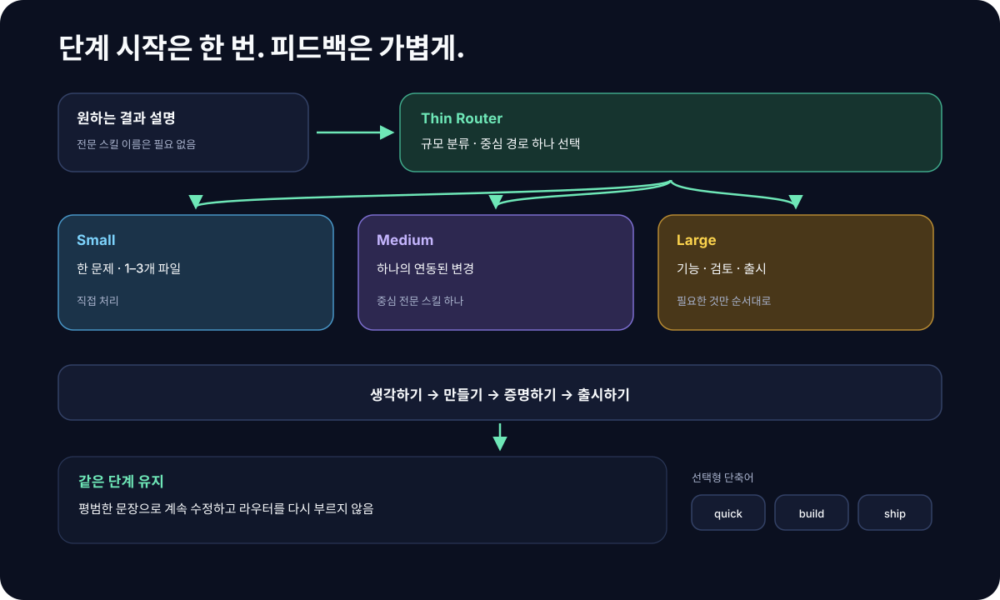
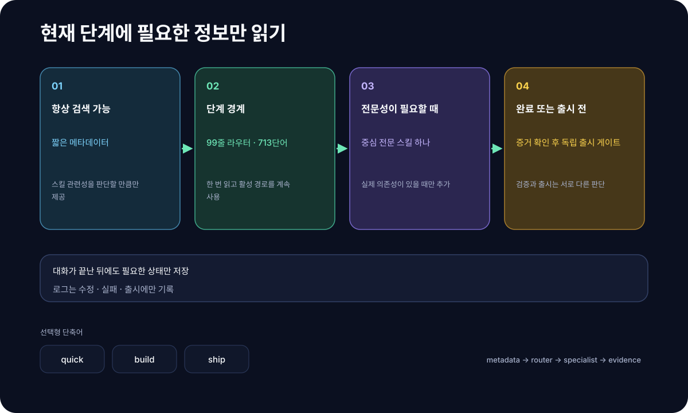

# superforge-skill

[English](./README.md) · [日本語](./README.ja.md) · [简体中文](./README.zh-CN.md) · [Español](./README.es.md) · **한국어**

**만들고 싶은 것을 한 문장으로 말하면, 열네 개의 스킬이 아이디어부터 출시 전 점검까지 올바른 순서로 끌고 갑니다.**

---

## 이게 뭔가요?

"스킬"이란 **Claude Code 같은 AI 도구에 나중에 추가할 수 있는 작업 설명서**입니다. 폴더 하나를 놓아 두면 AI가 그 절차대로 움직입니다.

superforge는 그런 설명서 열네 장입니다. 한가운데 있는 `superforge`가 **공방의 안내 데스크** 역할을 합니다.

> 당신: "동네 카페용 앱을 만들고 싶어요."
> 안내 데스크: "먼저 아이디어를 다듬죠. `superforge-brain`에 넘기겠습니다. 판단이 필요한 일이라 Opus 5로 돌립니다."
> — 그리고 작업이 시작됩니다.

안내 데스크가 하는 일은 딱 세 가지입니다.

1. **누구에게 넘길지 정합니다** — 생각한다 / 만든다 / 확인한다 / 내보낸다, 열네 개 중에서
2. **어떤 모델을 쓸지 정합니다** — 똑똑한 모델은 비싸니, 값싼 작업에 비싼 모델을 붙이지 않습니다
3. **결과가 반드시 파일로 남게 합니다** — 대화를 지워도 사라지지 않도록

<p align="center">
  
</p>

---

## 무엇이 좋은가요

### 1. "어디부터 손대지"를 고민하지 않아도 됩니다

만들고 싶은 것은 머릿속에 있는데 첫걸음이 떠오르지 않습니다. superforge는 한 문장을 받으면 어떤 순서로 진행할지 선언하고 바로 시작합니다. 매번 지시를 조립할 필요가 없습니다.

### 2. 값싼 작업이 비싼 모델 위에서 돌지 않습니다

AI 모델에는 똑똑하고 비싼 것과 빠르고 저렴한 것이 있습니다. 그냥 쓰면 **모든 작업이 같은 비싼 모델 위에서 돌아갑니다**. 파일 이름 일괄 변경 같은 단순 작업까지 설계 판단과 같은 값이 매겨진다는 뜻입니다.

superforge는 시작하기 전에 각 하위 작업을 네 등급으로 나누고 알맞은 모델을 배정합니다. Claude만이 아니라 Gemini, Codex, Kimi 환경에 대해서도 같은 방식의 대응표를 갖고 있습니다.

<p align="center">
  
</p>

맨 아래의 **D(대량 텍스트)** 는 저장소를 건드릴 필요가 없는 작업입니다. 번역, 요약, 변형 대량 생성 같은 것들이죠. 이건 로컬 `gemini` CLI로 보내므로 **Anthropic 사용량을 전혀 쓰지 않습니다**.

### 3. 정해진 것이 대화와 함께 사라지지 않습니다

AI와 상의한 내용은 스레드를 지우는 순간 전부 없어집니다. 다음 날이면 같은 설명을 처음부터 다시 해야 합니다.

superforge의 스킬은 보고하기 전에 반드시 `docs/` 안에 파일을 씁니다. 디자인을 정하면 `docs/design.md`, 가격을 정하면 `docs/business-model.md`. 그래서 `/clear`를 하든 모델을 바꾸든 일주일을 비우든 **정해진 것은 다시 읽을 수 있습니다**.

---

## 열네 개의 스킬

한가운데의 `superforge`가 안내 데스크이고 나머지 열두 개가 담당자입니다. 물론 `/superforge-ui`처럼 직접 불러도 됩니다.

### 1. 생각한다 — 무엇을 만들지 정하기

| 스킬 | 언제 | 남는 파일 |
|---|---|---|
| [`superforge-brain`](./skills/superforge-brain/README.ko.md) | 만들 가치가 있는 아이디어가 필요할 때 — 뻔하지 않은 것**과** 뻔하지만 진짜로 필요한 것 둘 다 (**BreakBias 엔진**, 또는 더 가벼운 정통 기법 중 선택) | `docs/product-idea.md` (전수 스윕이면 `.html` 지도도) |
| [`superforge-biz`](./skills/superforge-biz/README.ko.md) | 애초에 이 시장에 들어갈 가치가 있는지. 그다음 가격, 페이월 위치, 고객을 얻는 방법, 가치를 숫자로 말하는 법, 그리고 제품이 아니라 시간을 파는 경우의 산수 | `docs/business-model.md` |
| [`superforge-brand`](./skills/superforge-brand/README.ko.md) | 이름·색·톤과, 소재를 만들어 낼 프롬프트까지 | `docs/brand.md` |

### 2. 만든다 — 실제로 만들기

| 스킬 | 언제 | 남는 파일 |
|---|---|---|
| [`superforge-ui`](./skills/superforge-ui/README.ko.md) | 모델 자신의 평균이 아니라 실제 레퍼런스에서 방향을 가져오는 화면 설계. 팔기 위한 랜딩 페이지, 마음을 정한 직후의 30초(첫 실행)까지. 사람이 열어 확인하는 스타일 가이드도 함께 | `docs/design.md` + `docs/design.html` |
| [`superforge-dev`](./skills/superforge-dev/README.ko.md) | 구현. 병렬로 깨지지 않게 나눈 뒤 각자 맞는 모델에 배분 | `docs/plan.md` |

### 3. 확인한다 — 망가진 데가 없는지 보기

| 스킬 | 언제 | 남는 파일 |
|---|---|---|
| [`superforge-test`](./skills/superforge-test/README.ko.md) | 무엇이 테스트할 값어치가 있는지 정한 뒤, 테스트를 먼저 (Web / iOS / Android) | 테스트 자체 |
| [`superforge-debug`](./skills/superforge-debug/README.ko.md) | 버그가 났고, 임시방편이 아니라 원인을 잡고 싶을 때 — 재현되지 않는 것까지 | `docs/failforward.md` |
| [`superforge-a11y`](./skills/superforge-a11y/README.ko.md) | 접근성을 제대로 검사할 때 — 스캐너 하나가 아니라 일곱 개 검사로 | `docs/accessibility.md` |
| [`superforge-secure`](./skills/superforge-secure/README.ko.md) | 로그인한 평범한 사용자가 남의 데이터를 읽을 수 있는가. 일곱 개의 패스를 공격자가 무엇을 얻는지로 줄 세운다. 키가 이미 샌 뒤의 절차까지 | `docs/security.md` |

### 4. 내보낸다 — 내보낼 준비하기

| 스킬 | 언제 | 남는 파일 |
|---|---|---|
| [`superforge-roast`](./skills/superforge-roast/README.ko.md) | 사용자가 찾기 전에 결함을 듣고 싶을 때 | `docs/critique.md` |
| [`superforge-verify`](./skills/superforge-verify/README.ko.md) | "다 됐습니다"에 등급이 붙은 증거와 「확인하지 않은 것」을 함께 붙여야 할 때 | `docs/verification.md` |
| [`superforge-ship`](./skills/superforge-ship/README.ko.md) | 돌아가는 건 알겠고 — 출시해도 되는가? 법적 의무, 심사에서 거절되는 진짜 이유, 나중에 못 채우는 계측 | `docs/ship-readiness.md` |
| [`superforge-handoff`](./skills/superforge-handoff/README.ko.md) | 세션을 지우기 전, 도구를 바꾸기 전 | `.handoff/` |

---

## 설치

`git`과 스킬을 불러올 수 있는 AI 도구(예: Claude Code)만 있으면 됩니다.

### 한 번에 전부 (권장)

한 번 클론하고 설치 스크립트를 실행하면 됩니다. 이 머신의 모든 스킬 디렉터리를 찾아 열네 개를 링크합니다.

```bash
git clone https://github.com/takaoumehara/superforge-skill
cd superforge-skill
./install.sh
```

`--dry-run`은 무엇이 일어날지만 보여 주고 아무것도 바꾸지 않으며, `--uninstall`로 제거합니다. 여러 번 실행해도 결과가 같고 자기가 만든 심볼릭 링크만 건드리므로, `git pull` 뒤에 다시 실행해도 됩니다.

찾는 디렉터리는 다음과 같고, 실제로 존재하는 것만 링크됩니다.

```
~/.claude/skills                    Claude Code
~/.agents/skills                    Codex CLI와 Gemini CLI가 함께 읽는 곳
~/.codex/skills                     Codex CLI
~/.gemini/skills                    Gemini CLI
~/.gemini/antigravity-ide/skills    Antigravity IDE
```

AI 도구를 다시 시작한 뒤 `/superforge`를 입력하세요.

### 하나만 설치할 때

```bash
git clone https://github.com/takaoumehara/superforge-skill ~/src/superforge-skill
ln -s ~/src/superforge-skill/skills/superforge-ui ~/.claude/skills/superforge-ui
```

`superforge-ui` 자리에 원하는 스킬 이름을, `~/.claude/skills` 자리에 쓰는 도구의 디렉터리를 넣으면 됩니다.

> **주의:** 저장소를 스킬 디렉터리 *안에* 클론하지 마세요. 도구는 스킬을 **한 단계 아래까지만** 찾습니다. 아무 곳에나 클론한 뒤 링크하는 것이 올바른 방법입니다.

### claude.ai (브라우저)

스킬 하나의 폴더를 zip으로 묶어 Settings → Capabilities → Skills에서 업로드합니다. 브라우저는 한 번에 하나씩만 받습니다.

```bash
cd ~/src/superforge-skill/skills/superforge-ui
zip -r superforge-ui.zip .
```

### 항상 켜 두기 (권장)

스킬은 AI가 지금 요청과 관련 있다고 판단하면 **스스로 뜹니다**. 이름을 칠 필요가 없습니다. 못 박아 둘 가치가 있는 건 모델 배정 쪽인데, 어떤 스킬이 돌든 어느 프로젝트든 적용되기 때문입니다. 쓰는 도구의 **전 프로젝트 공통 지시 파일**에 넣으세요.

| 도구 | 파일 |
|---|---|
| Claude Code | `~/.claude/CLAUDE.md` |
| Codex CLI | `~/.codex/AGENTS.md` |
| Gemini CLI / Antigravity | `~/.gemini/GEMINI.md` |

```
서브에이전트를 띄우기 전에 superforge 스킬을 참조해서 작업마다 맞는
모델을 배정할 것. 전부 같은 모델로 두지 말 것.
쓰기 전에 작업 / 모델 / 이유를 표로 출력할 것.
```

**이것이 하지 않는 일 — 가장 흔한 오해입니다.** 이것은 **작은 요청을 싼 모델로 돌려 주지 않습니다.** 등급 배분이 걸리는 곳은 **AI가 띄우는 서브에이전트**이지, 당신이 타이핑하고 있는 세션이 아닙니다. 게다가 「오타 고쳐 줘」 같은 한 줄짜리는 **그냥 고치는 게 제일 쌉니다** — 따로 에이전트를 띄우면 띄우는 비용만큼 *더 비쌉니다*. 자기 세션의 모델을 바꾸려면 도구 자체의 설정(Claude Code라면 `/model`)을 쓰세요. 지시 파일로는 못 바꿉니다.

값을 하는 건 **나눌 만큼 큰 작업**입니다. 서브에이전트 다섯을 전부 제일 비싼 모델로 돌릴 것인가, 각자 맞는 다섯 등급에 태울 것인가 — 이 차이가 이 스위트의 존재 이유입니다.

---
## 하지 못하는 것

먼저 적어 둡니다. 도구가 약속하는 것과 실제로 하는 것 사이의 틈이 바로 신뢰가 새는 곳이므로.

- **당신의 세션 자체가 싸지지는 않습니다.** 모델 등급 배분이 걸리는 곳은 서브에이전트입니다. 세션은 도구에서 설정한 모델로 계속 돕니다.
- **알아서 코드를 완성해 주지 않습니다.** 이것은 AI가 읽는 지침서입니다. 일을 하는 것은 AI이고, AI는 틀릴 수 있습니다.
- **법률 자문이 아닙니다.** `superforge-ship`은 어떤 의무가 발생했는지, 어디서부터 변호사가 필수인지를 짚습니다. 약관 자체는 쓰지 않습니다.
- **제품이 안전하다고 절대 말하지 않습니다.** `superforge-secure`가 보고하는 것은 무엇을 확인했고 무엇을 확인하지 않았는지입니다. 그것은 다른, 그리고 정직한 주장입니다.
- **사용자와 이야기하는 것을 대신하지 못합니다.** `superforge-brain`은 묻는 법을 알려 주지만 답은 모릅니다.
- **판정은 입력의 질을 넘지 못합니다.** 모든 시장 숫자에 확신 등급이 붙어 있는 이유가 바로 이것입니다.

---

## 어디서 돌아가나요

| 환경 | 동작 | 비고 |
|---|---|---|
| Claude Code (CLI, VS Code / JetBrains 확장) | ✅ | 스킬을 기본 지원 |
| Codex CLI | ✅ | `~/.agents/skills/`와 프로젝트의 `AGENTS.md`를 읽음 |
| Gemini CLI | ✅ | `~/.agents/skills/`를 읽음 |
| Antigravity IDE | ✅ | 자체 `skills/` 디렉터리를 읽음 |
| claude.ai (브라우저, Pro / Team / Enterprise) | ✅ | 커스텀 스킬로 업로드 |
| 도구 없는 채팅 화면 (ChatGPT / Gemini 웹 등) | ⚠️ | 스킬을 불러오는 구조도, 작업을 다른 에이전트에 넘기는 구조도 없습니다. `SKILL.md` 내용을 커스텀 지시로 붙일 수는 있지만 모델 배정이 작용할 대상이 없습니다 |

---

## 조금 더 알고 싶다면

### 사람이 정말로 확인할 수 있는 디자인 시스템

`superforge-ui`는 **절대 어긋나서는 안 되는 두 개의 파일**을 냅니다.

- **`docs/design.md`** — 색과 크기의 정의로, 에이전트가 읽는 쪽입니다. 개방 규격 [design.md](https://github.com/google-labs-code/design.md) 형식
- **`docs/design.html`** — 브라우저로 열기만 하면 모든 색·컴포넌트·상태가 실제로 그려지는 파일. 실측 명도 대비와 통과·미통과 배지가 함께 붙습니다

HTML은 `design.md`의 값을 **읽어서** 그립니다. 손으로 옮겨 그리는 것이 아니므로 "명세와 실물이 다르다"는 상태가 구조적으로 생기지 않습니다.

### 접근성 검사가 도구만으로 끝나지 않는 이유

자동 검사 도구는 숫자 하나를 내놓고 조용해집니다. **그리고 그 침묵이 합격처럼 읽힙니다.** 업계 표준 검사 엔진이 WCAG A·AA 등급용으로 갖고 있는 규칙은 **63개**입니다. 같은 등급의 성공 기준은 **55개**이고, 초점 순서·맥락 속 링크 목적·오류 수정 제안·드래그의 대체 수단·접근 가능한 인증에는 **자동 규칙이 아예 없습니다**. 통과 여부가 "의미가 통하는가"에 대한 판단이기 때문입니다.

`superforge-a11y`는 나머지 여섯 검사를 실제로 돌립니다. 키보드, 스크린 리더, 확대와 리플로, 색, 움직임과 시간 제한, 폼과 오류. 그런 다음 A·AA 전 기준에 `적합 / 부적합 / 해당 없음 / 미검증`을 채운 대장을 남깁니다. **보고서에 없는 기준은 통과로 읽히기 때문**이고, 그게 감사가 조용히 거짓이 되는 가장 쉬운 길이기 때문입니다.

"미검증"이 하나라도 남아 있으면 적합이라고 쓰지 않습니다. 발견은 규칙 번호가 아니라 **막히는 사람**으로 적습니다. 웹·iOS·안드로이드를 다루고, 실제로 나에게 적용되는 기준까지 챙깁니다: [유럽 접근성법 / EN 301 549, ADA Title II, Section 508, JIS X 8341-3](./skills/superforge-a11y/references/conformance-and-law.md).

### 밤에 지시하고, 아침에 결과를 봅니다

목표는 결정을 덜 내리는 것이 아니라, 결정이 **아닌** 모든 것을 걷어내는 것입니다.

무인으로 진행해도 되는 것은 스스로 진척을 증명할 수 있을 때뿐입니다. 범위를 체크박스로 적고, 각 항목에 **완료를 증명하는 명령**을 붙이고, 실패하면 스스로 복구하고, 작업 하나가 끝날 때마다 상태를 디스크에 씁니다. 미해결 질문은 멈추는 대신 변론 가능한 기본값으로 정하고 기록합니다.

멈추는 경우는 네 가지뿐입니다 — 되돌릴 수 없는 삭제, 돈이 나가는 일, 자격 증명 부재, 목표 자체가 틀린 경우. 그때도 거기에 막히지 않은 작업은 계속 진행합니다.

전체 프로토콜 → [`superforge-dev/references/autonomous-run.md`](./skills/superforge-dev/references/autonomous-run.md)

### 열네 개를 넣어도 AI가 무거워지지 않는 이유

AI의 컨텍스트에 항상 올라가는 것은 **각 스킬의 한 줄 설명뿐**입니다. 본문은 필요할 때 불러오고, 더 깊은 내용은 `references/`에 나눠 두었다가 필요할 때만 읽습니다.

| 참고 문서 | 담고 있는 것 |
|---|---|
| [`superforge/references/intake.md`](./skills/superforge/references/intake.md) | 캐묻지 않고 요청을 문서화된 요건으로 바꾸는 절차 |
| [`superforge/references/wiring.md`](./skills/superforge/references/wiring.md) | 이미 설치된 다른 스킬에 어느 단계를 맡길지 |
| [`superforge-brain/references/ideation-tools.md`](./skills/superforge-brain/references/ideation-tools.md) | 각 기법을 빠짐없이 만드는 하위 방법, 폐기 판정, 심사 프로토콜, 시장 루브릭 |
| [`superforge-brain/references/classic-methods.md`](./skills/superforge-brain/references/classic-methods.md) | 전수 스윕 대신 쓰는 가벼운 기법 — SCAMPER, 여섯 모자, Crazy 8s, How Might We 등 |
| [`superforge-brain/references/value-classification.md`](./skills/superforge-brain/references/value-classification.md) | 점수 하나가 굴러가는 사업을 지워 버리는 이유 — Hero / Workhorse / Lab / Discard 사분면, 기존 아이디어의 네 가지 승부 경로, 금지 목록 재검토 |
| [`superforge-brain/references/talk-to-users.md`](./skills/superforge-brain/references/talk-to-users.md) | 「쓰시겠어요」가 아니라 「지난번엔 어떻게 하셨어요」를 묻기 — Hero와 Workhorse는 물어야 할 것이 정반대 |
| [`superforge-brain/references/idea-map-output.md`](./skills/superforge-brain/references/idea-map-output.md) | `product-idea.html` 명세 — 폐기안 포함 전 아이디어 시각화와 세 개의 우선순위 지도 |
| [`superforge-biz/references/market-sizing.md`](./skills/superforge-biz/references/market-sizing.md) | GO/NO-GO 관문 — TAM을 양방향으로 계산하기, 수치별 신뢰 등급, 애초에 고객이 몇 명 필요한가 |
| [`superforge-biz/references/behavioral-frameworks.md`](./skills/superforge-biz/references/behavioral-frameworks.md) | 앵커링·손실 회피·기본값, 증상으로 찾는 색인, 그리고 각각의 윤리적 선 |
| [`superforge-biz/references/customer-acquisition.md`](./skills/superforge-biz/references/customer-acquisition.md) | 채널 적합도, 리드 마그넷, 적합도×의도 선별, CAC/LTV 계산 |
| [`superforge-biz/references/service-business.md`](./skills/superforge-biz/references/service-business.md) | 제품이 아니라 시간을 파는 경우 — 산술로 정해지는 매출 상한, 범위가 곧 산출물, 범위 확장은 삼키지 말고 값을 매기기, 자문료, 고객 집중도 |
| [`superforge-biz/references/value-pitch.md`](./skills/superforge-biz/references/value-pitch.md) | 어떤 기능이든 정량화해 논리→감정 순서의 비즈니스 피치로 바꾸기 |
| [`superforge-ui/references/design-process.md`](./skills/superforge-ui/references/design-process.md) | 설계 단계, 네 가지 데이터 상태, 품질 체크리스트 |
| [`superforge-ui/references/design-system-output.md`](./skills/superforge-ui/references/design-system-output.md) | `design.md` + `design.html` 명세 |
| [`superforge-ui/references/design-sourcing.md`](./skills/superforge-ui/references/design-sourcing.md) | 디자인 방향은 어디서 오는가 — 여섯 층의 추출, 참조와 모방의 경계, 다른 도구로 만든 화면을 시스템으로 바꾸기 |
| [`superforge-ui/references/motion-system.md`](./skills/superforge-ui/references/motion-system.md) | 지속시간, 움직이는 속성에 따라 고르는 이징, FLIP, 스크롤 동기화, reduced-motion 런타임 정지 |
| [`superforge-ui/references/landing-page.md`](./skills/superforge-ui/references/landing-page.md) | 팔기 위한 페이지 설계 — 섹션 순서, 히어로 영역, 모바일과 데스크톱의 차이 |
| [`superforge-brand/references/case-study.md`](./skills/superforge-brand/references/case-study.md) | 만든 것을 믿게 쓰기 — 독자별로 층을 나누고, 신뢰는 「결정과 그 대가」로 만들고, 판단이 필요했던 순간을 남긴다 |
| [`superforge-ui/references/slide-page.md`](./skills/superforge-ui/references/slide-page.md) | 훑어보기를 견디는 긴 페이지 — 화면당 두 층·하나의 주장, 형태는 내용의 역할로 고른다. 자체 시각 언어는 없음 |
| [`superforge-ui/references/first-run.md`](./skills/superforge-ui/references/first-run.md) | 들어온 직후의 30초 — 설명하지 말고 첫 결과까지, 권한은 쓰는 순간에, 나중에도 테스트할 수 있는 완료 기록 |
| [`superforge-ship/references/legal-triggers.md`](./skills/superforge-ship/references/legal-triggers.md) | 제품의 동작이 어떤 의무를 발동시켰는가, 어디서나 대체로 통하는 네 가지 기본, 그리고 변호사가 필수가 되는 선 |
| [`superforge-ship/references/launch-metrics.md`](./skills/superforge-ship/references/launch-metrics.md) | 나중에 못 채우는 계측, 각 숫자가 결정해도 되는 것, 그리고 첫 4주 |
| [`superforge-roast/references/evaluation-methods.md`](./skills/superforge-roast/references/evaluation-methods.md) | 휴리스틱 평가, 접근성 감사, 인지 부하, 가상 페르소나 테스트 |
| [`superforge-a11y/references/wcag22-ledger.md`](./skills/superforge-a11y/references/wcag22-ledger.md) | WCAG 2.2의 86개 기준 전체와, 기준마다 실제로 무엇을 볼지 |
| [`superforge-a11y/references/audit-protocol.md`](./skills/superforge-a11y/references/audit-protocol.md) | 일곱 검사의 절차, 합격선, 각 검사가 남겨야 할 근거 |
| [`superforge-a11y/references/tooling.md`](./skills/superforge-a11y/references/tooling.md) | 각 도구가 잡는 것과 확실히 놓치는 것, 그리고 CI 연결 |
| [`superforge-a11y/references/native-platforms.md`](./skills/superforge-a11y/references/native-platforms.md) | VoiceOver, Dynamic Type, TalkBack, Compose semantics, Switch Access |
| [`superforge-a11y/references/conformance-and-law.md`](./skills/superforge-a11y/references/conformance-and-law.md) | 유럽 접근성법 / EN 301 549, ADA Title II, Section 508, JIS X 8341-3, 적합 선언 |
| [`superforge-dev/references/decomposition.md`](./skills/superforge-dev/references/decomposition.md) | 병렬로 깨지지 않게 나누는 법 — 작업 하나에 결과 하나와 증명 명령, 건드릴 파일 목록 규칙, 절대 병렬로 두면 안 되는 조합, 실패하면 먼저 되돌리기 |
| [`superforge-dev/references/autonomous-run.md`](./skills/superforge-dev/references/autonomous-run.md) | 무인 실행의 전제, 루프를 도는 방식, 혼자 정해도 되는 범위 |
| [`superforge-test/references/what-to-test.md`](./skills/superforge-test/references/what-to-test.md) | 무엇이 테스트할 값어치가 있고 무엇이 없는가. 단위/통합/E2E 비용 사다리, 목의 경계, 취약한 테스트의 증상, 테스트가 없는 코드에 넣는 순서 |
| [`superforge-verify/references/evidence.md`](./skills/superforge-verify/references/evidence.md) | 증거의 네 등급과, 보고서에 「단언」이 섞이면 안 되는 이유. 「됐다」와 「어쩌다 됐다」의 차이, 악의 없이 증거가 위조되는 일곱 가지 |
| [`superforge-debug/references/failforward.md`](./skills/superforge-debug/references/failforward.md) | 실패의 기억을 어디에 두는가, 값을 하는 건 `Looked like` 한 줄. 재현되지 않을 때의 절차, 「전에는 됐다」의 이분 탐색, 멈출 때 |
| [`superforge-secure/references/attack-surface.md`](./skills/superforge-secure/references/attack-surface.md) | 일곱 개 패스의 내용 — 키가 실제로 새는 자리, 한 시간이면 최악의 버그가 나오는 두 계정 테스트, 인젝션이 닿는 곳, 의존성과 빌드 시점의 위험, 바깥에서 보이는 면 청소 |
| [`superforge-secure/references/when-it-happens.md`](./skills/superforge-secure/references/when-it-happens.md) | 원인 파악보다 먼저 봉쇄 — 교체 순서, 남아 있지 않을 수도 있는 로그로 영향 범위를 재구성하기, 그리고 정직한 고지 |
| [`superforge-dev/references/data-design.md`](./skills/superforge-dev/references/data-design.md) | 권한 검사가 매번 타는 소유 관계, 지금은 싸고 나중은 비싼 결정들, 인덱스 누락 / N+1 / 상한 없는 읽기, 덧붙이는 방식의 마이그레이션, 그리고 「삭제」가 무엇을 뜻해야 하는가 |
| [`superforge-ui/references/aesthetic-direction.md`](./skills/superforge-ui/references/aesthetic-direction.md) | 참고가 하나도 없을 때 무엇을 할 것인가 — 이름 붙은 열 개의 방향, 미는 축은 하나뿐, 그리고 「기계가 만든 것」으로 읽히는 구체적인 기본값들 |
| [`superforge-ui/references/surface-and-scope.md`](./skills/superforge-ui/references/surface-and-scope.md) | 어떤 디자인 결정보다 먼저 오는 두 질문 — 이 화면에서 성공이란 무엇인가(그리고 그 모드가 무엇을 포기해도 되는가), 그리고 이것은 개선인가 재설계인가 조각인가 |
| [`superforge-ui/references/build-floor.md`](./skills/superforge-ui/references/build-floor.md) | 의도가 아니라 완성물에 대한 검사. 그리고 기본값을 「왜 나타났는가」로 분류 — 라이브러리가 뱉는 것, 벌지 않은 느낌의 지름길, 아무도 고르지 않은 값 |
| [`superforge-dev/references/dispatch-ledger.md`](./skills/superforge-dev/references/dispatch-ledger.md) | 어느 에이전트에 어느 모델을 배정했는지 쓰기 전에 표로 내고 쓴 뒤에 기록한다 — 이 스위트가 약속하는 등급 배분을 주장이 아니라 보이는 것으로 |
| [`superforge-ui/references/performance-budget.md`](./skills/superforge-ui/references/performance-budget.md) | 나중에 재는 게 아니라 디자인과 함께 정하는 세 개의 숫자. 무게가 어디서 오는가. 체감 속도는 디자인의 문제 |
| [`superforge-ui/references/internationalization.md`](./skills/superforge-ui/references/internationalization.md) | 글자는 늘어나고, 먼저 깨지는 건 버튼이다. 문장을 조각으로 조립하면 안 되는 이유, 로케일 의존 서식, 그리고 다국어로 갈지 말지의 판단 자체 |
| [`superforge-ship/references/operations.md`](./skills/superforge-ship/references/operations.md) | 알아챌 수 있는가 / 고칠 수 있는가 / 되찾을 수 있는가 / 얼마가 드는가 — 남길 가치가 있는 알림 하나, 실제로 해 본 롤백, 실제로 복원해 본 백업, 폭주 청구서의 임계값 |
| [`superforge-brand/references/media-production.md`](./skills/superforge-brand/references/media-production.md) | 생성 미디어의 실제 비용, 열두 번째가 첫 번째와 맞아떨어지게 하는 레시피, 그리고 내보내기 전에 끝내 두는 상업적 이용과 초상 문제 |

---

## 스킬이 실제로 돌리는 도구

모델이 추론으로 해서는 안 되는 결정적 계산 두 가지. 둘 다 읽기 전용이고, 실패 시 0이 아닌 값으로 끝나므로 CI 게이트로 쓸 수 있습니다.

| 스크립트 | 하는 일 |
|---|---|
| [`superforge-a11y/scripts/contrast.py`](./skills/superforge-a11y/scripts/contrast.py) | 토큰 파일에서 WCAG 대비를 계산. 상대 휘도는 구간별 감마 변환이라 조금만 어긋나도 합격선을 넘나드는데, 보기에는 전혀 틀려 보이지 않습니다. 알파가 있는 색은 추측하지 않고, 합성하지 않으면 UNKNOWN으로 보고합니다 |
| [`superforge-secure/scripts/scan-secrets.sh`](./skills/superforge-secure/scripts/scan-secrets.sh) | 보안 리뷰 1번 패스를 여섯 군데 전부에 대해 실행. **git 히스토리 포함** — 나중 커밋에서 지운 키는 거기 그대로 살아 있습니다. 쓸 수 있는 형태의 비밀은 절대 출력하지 않습니다 |

네 개의 스킬에는 `evals/evals.json`도 들어 있습니다. 발동해야 할/하지 말아야 할 프롬프트에 더해 **산출물에 대한** 어서션 — 「스킬이 떴는가」가 아니라 「`docs/design.md`에 Design DNA와 예산이 실제로 적혔는가」를 봅니다.

---

## 출처와 감사

여기 있는 스킬들은 여덟 가지 자료를 읽고 **제 언어로 다시 쓴 것**입니다. 제3자의 코드도 문장도 한 바이트도 들어 있지 않습니다.

| 자료 | 출처 | 받아 온 것 |
|---|---|---|
| [BreakBias Studio](https://github.com/takaoumehara/breakbias-studio) | 본인 | `superforge-brain`의 발상 엔진 |
| [cross-model-handoff](https://github.com/takaoumehara/cross-model-handoff) | 본인 | `superforge-handoff`의 인계 형식 |
| [obra/superpowers](https://github.com/obra/superpowers) | MIT © Jesse Vincent | 여러 에이전트에 작업을 나눠 준다는 발상 |
| [BMAD-METHOD](https://github.com/bmad-code-org/BMAD-METHOD) | MIT © BMad Code, LLC | 역할을 나눈 에이전트 편성 방식 |
| [vercel-labs/skills](https://github.com/vercel-labs/skills) | Vercel Labs | 스킬을 작게 나눠 배포하는 형태 |
| Gem_Ren_Pack | 본인 | 설계·평가 관련 프레임워크 |
| 직접 조사한 인터랙션 설계·모션 연구 노트 | 본인 | `motion-system.md`와 `design-process.md`의 토대 — 지속시간 스케일, 애니메이션되는 속성으로 고르는 이징, FLIP, 스크롤 엔진 동기화, 폼 검증 타이밍, 도달성과 터치 타깃 |
| 건네받은 앱 개발 스킬 모음 | 제3자, **읽었지만 가져다 쓰지 않음** | **드러난 구멍 쪽**. 시장 규모 산정, 출시 시점의 법적 의무, 첫 실행 설계가 여기엔 하나도 없었다. 가져온 것은 분야의 일반 지식뿐(TAM/SAM/SOM, 데이터 보호법의 발동 조건, 맥락에 맞춘 권한 요청)이고, 모든 파일은 처음부터 새로 썼다 |
| 받은 세 개의 디자인 스킬 모음(`impeccable`, `emil-design-engineering`, `animation-patterns`) | 제3자, **읽었지만 가져다 쓰지 않음** | **이 스위트에 없던 세 개념**. 전부 처음부터 다시 쓰고 확장했다 — 네 개의 서피스 모드와 「개선인가 재설계인가」의 경계(`surface-and-scope.md`. 무엇을 포기해도 되는지의 열과 「조각」인 경우를 추가), 의도가 아니라 완성물에 대해 재는 품질의 바닥(`build-floor.md`. 기본값이 **왜** 나타나는지로 다시 묶었다 — 이 분류는 두 출처 어디에도 없다), 그리고 애니메이션을 넣을지 말지를 빈도로 정하는 규칙 |

**마지막 줄에 대하여.** 남의 스킬 모음을 읽는 것은 내게 무엇이 없는지 알아내는 좋은 방법이고, 그 구멍을 메우는 나쁜 방법입니다. 드러난 것은 세 개의 진짜 구멍이었고, 지금은 [`market-sizing.md`](./skills/superforge-biz/references/market-sizing.md), [`superforge-ship`](./skills/superforge-ship/README.ko.md), [`first-run.md`](./skills/superforge-ui/references/first-run.md)가 메우고 있습니다. 어느 것도 원본과 닮지 않았습니다. 설계 판단이 반대 방향으로 갔기 때문입니다 — **얼어붙은 법률 문구를 두지 않는다**, 1년이면 낡는 플랫폼 기능 카탈로그를 담지 않는다, 그리고 절차를 나르는 스위트에 코드 템플릿을 넣지 않는다.

**`superforge-brain`의 BreakBias 엔진에 대하여** — 토대는 SIT(Systematic Inventive Thinking)의 두 원칙, Closed World(상자 밖에서 요소를 가져오지 않는다)와 Function Follows Form(먼저 불가능한 형태를 만들고 가치를 거꾸로 도출한다)입니다. BreakBias는 여기에 다음을 더했습니다.

- **기법을 다섯에서 여덟으로**(Reverse / Shift / Repurpose 추가)
- **모든 요소에 편향 이름을 붙이도록 의무화**(기능성 / 구조성 / 관계성)
- **뻔한 세 가지를 먼저 금지**하고, 그로부터의 거리로 참신함을 채점
- **요소 × 기법 × 하위 방법을 셀 원장으로 추적**해, 빠뜨린 셀이 없음을 기계가 검증
- **심사를 별도 컨텍스트에서** — 채점자는 그 아이디어에 어떻게 도달했는지 보지 못함
- **시장 판정을 심사 뒤로 격리**해, 시장 상식이 참신함 점수를 오염시키지 않게 함

SIT는 사람들이 모여서 하는 워크숍 방법입니다. BreakBias는 그것을 **기계가 전수 탐색하고, 탐색했음을 증명할 수 있는 형태**로 다시 만든 것입니다.

---

## 라이선스

MIT — [LICENSE](./LICENSE)를 참고하세요.
