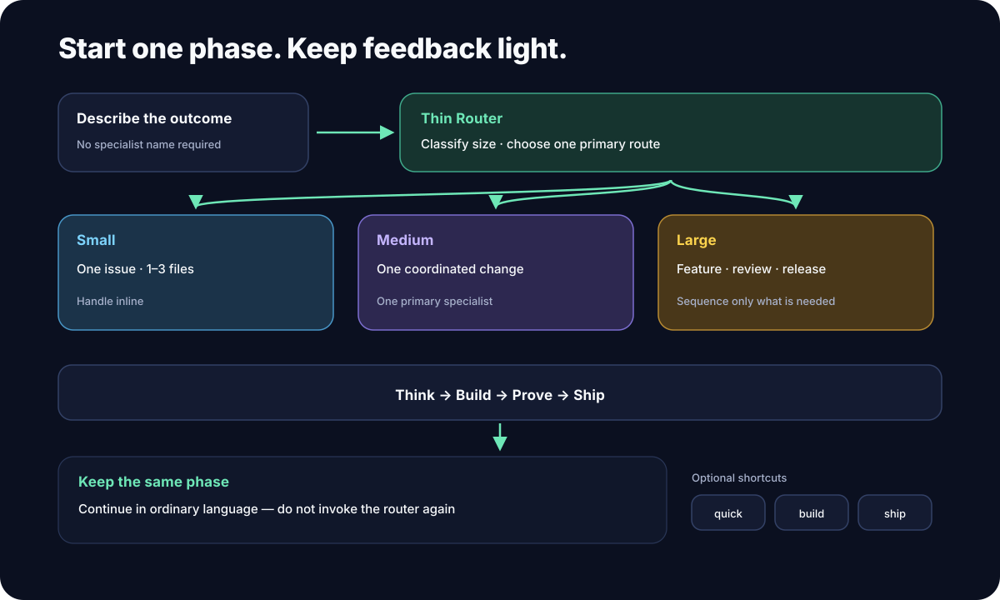
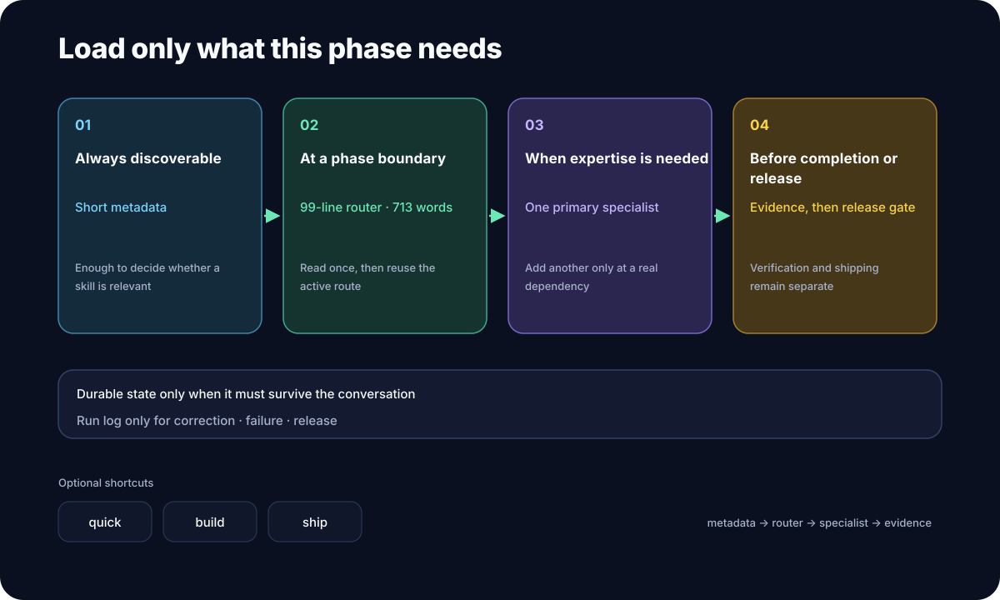

# superforge-skill

**English** · [日本語](./README.ja.md) · [简体中文](./README.zh-CN.md) · [Español](./README.es.md) · [한국어](./README.ko.md)

**Say what you want to build, in one sentence. Twelve skills take it from idea to pre-launch check, in the right order.**

---

## What is this?

A "skill" is **a set of instructions you can add to an AI tool** like Claude Code. You drop in a folder, and the AI starts following that procedure.

superforge is thirteen of them. The one in the middle, `superforge`, works like **the front desk of a workshop**.

> You: "I want to build an app for the café down the street."
> Front desk: "Let's shape the idea first — handing this to `superforge-brain`. It needs judgment, so it runs on Opus 5."
> — and the work starts.

The front desk does exactly three things.

1. **Picks who takes the job** — one of thirteen, across think / build / prove / ship
2. **Picks which AI model to use** — smart models cost more, so cheap work does not get an expensive model
3. **Makes sure the result lands in a file** — so nothing dies when the conversation is cleared

<p align="center">
  
</p>

---

## Why it helps

### 1. You stop having to work out where to begin

You know what you want to make, but not what the first step is. superforge takes one sentence, announces the order it will work in, and starts. You are not assembling the instructions every time.

### 2. Cheap work stops running on expensive models

AI models come in smart-and-expensive and fast-and-cheap. Left alone, **everything runs on the same expensive one** — a bulk rename gets billed at the same rate as an architecture decision.

superforge sorts each subtask into one of four tiers before starting, and assigns a model to match. Not only for Claude: it carries the equivalent mapping for the Gemini, Codex, and Kimi environments too.

<p align="center">
  
</p>

The bottom row, **D (bulk text)**, is work that never touches the repository — translation, summarising, generating variations. That goes to the local `gemini` CLI, so it **consumes no Anthropic usage at all**.

### 3. What you decided does not disappear with the conversation

Everything you work out with an AI vanishes the moment you clear the thread. Tomorrow you start the explanation again.

superforge skills write a file under `docs/` before they report back. Decide the design, you get `docs/design.md`. Decide the pricing, you get `docs/business-model.md`. So `/clear`, a model switch, or a week away all cost you nothing — **the decisions are still readable**.

---

## The thirteen skills

`superforge` is the front desk; the other twelve do the work. You can also call any of them directly, like `/superforge-ui`.

### 1. Think — decide what to make

| Skill | When | File it leaves |
|---|---|---|
| [`superforge-brain`](./skills/superforge-brain/README.md) | you want an idea worth building — the non-obvious one **and** the ordinary-but-needed one (**BreakBias engine**, or a faster classic method — your choice) | `docs/product-idea.md` (+ `.html` map for a full sweep) |
| [`superforge-biz`](./skills/superforge-biz/README.md) | is this market worth entering at all — then price, paywall, customers, and a pitch that quantifies the value | `docs/business-model.md` |
| [`superforge-brand`](./skills/superforge-brand/README.md) | name, colour, tone — plus prompts that generate the assets | `docs/brand.md` |

### 2. Build — make it real

| Skill | When | File it leaves |
|---|---|---|
| [`superforge-ui`](./skills/superforge-ui/README.md) | interface design that starts from a real reference instead of the model's own average, landing pages built to sell, and the first thirty seconds after someone commits — with a style guide a human can open and check | `docs/design.md` + `docs/design.html` |
| [`superforge-dev`](./skills/superforge-dev/README.md) | implementation: split the work across agents, each on a fitting model | `docs/plan.md` |

### 3. Prove — check nothing is broken

| Skill | When | File it leaves |
|---|---|---|
| [`superforge-test`](./skills/superforge-test/README.md) | write the test first (Web / iOS / Android) | the tests |
| [`superforge-debug`](./skills/superforge-debug/README.md) | a bug appeared and you want the cause, not a patch over it | root cause appended to the relevant doc |
| [`superforge-a11y`](./skills/superforge-a11y/README.md) | accessibility, checked properly — seven passes, not one scanner | `docs/accessibility.md` |

### 4. Ship — get it out the door

| Skill | When | File it leaves |
|---|---|---|
| [`superforge-roast`](./skills/superforge-roast/README.md) | you want the flaws named before your users find them | `docs/critique.md` |
| [`superforge-verify`](./skills/superforge-verify/README.md) | "it's done" needs evidence attached | `docs/verification.md` |
| [`superforge-ship`](./skills/superforge-ship/README.md) | it works — but are you allowed to release it? legal obligations, store rejections, measurement you cannot add later | `docs/ship-readiness.md` |
| [`superforge-handoff`](./skills/superforge-handoff/README.md) | before clearing a session or switching tools | `.handoff/` |

---

## Install

You need `git` and an AI tool that loads skills, such as Claude Code.

### All of them at once (recommended)

Clone once and run the installer. It finds every skills directory on your machine and links all thirteen.

```bash
git clone https://github.com/takaoumehara/superforge-skill
cd superforge-skill
./install.sh
```

`--dry-run` shows what would happen and changes nothing. `--uninstall` removes it. It is idempotent and only ever touches its own symlinks, so re-run it after every `git pull`.

These are the directories it looks for. Only the ones that exist get linked.

```
~/.claude/skills                    Claude Code
~/.agents/skills                    read by both Codex CLI and Gemini CLI
~/.codex/skills                     Codex CLI
~/.gemini/skills                    Gemini CLI
~/.gemini/antigravity-ide/skills    Antigravity IDE
```

Restart your AI tool, then type `/superforge`.

### Just one skill

```bash
git clone https://github.com/takaoumehara/superforge-skill ~/src/superforge-skill
ln -s ~/src/superforge-skill/skills/superforge-ui ~/.claude/skills/superforge-ui
```

Swap `superforge-ui` for the skill you want and `~/.claude/skills` for your tool's directory.

> **Careful:** do not clone the repository *into* a skills directory. Tools discover skills **one level deep only**. Clone it anywhere, then link.

### claude.ai (browser)

Zip one skill's folder and upload it under Settings → Capabilities → Skills. The browser takes one skill at a time.

```bash
cd ~/src/superforge-skill/skills/superforge-ui
zip -r superforge-ui.zip .
```

### Make it always-on (recommended)

Skills only fire when the AI judges them relevant to the request. To be sure the model assignment is never skipped, add one line to your tool's **global** instructions file — the one that applies to every project.

| Tool | File |
|---|---|
| Claude Code | `~/.claude/CLAUDE.md` |
| Codex CLI | `~/.codex/AGENTS.md` |
| Gemini CLI / Antigravity | `~/.gemini/GEMINI.md` |

```
Before dispatching subagents, consult the `superforge` skill to
assign the right model per subtask instead of defaulting every agent to the
same model.
```

---

## Where it runs

| Environment | Works? | Notes |
|---|---|---|
| Claude Code (CLI, VS Code / JetBrains extensions) | ✅ | native Skills support |
| Codex CLI | ✅ | reads `~/.agents/skills/` and the project's `AGENTS.md` |
| Gemini CLI | ✅ | reads `~/.agents/skills/` |
| Antigravity IDE | ✅ | reads its own `skills/` directory |
| claude.ai (browser, Pro / Team / Enterprise) | ✅ | upload as a custom skill |
| Plain chat UI (ChatGPT / Gemini web with no tools) | ⚠️ | there is no skill loading and no way to hand work to another agent. You can paste a `SKILL.md` in as custom instructions, but the model assignment has nothing to act on |

---

## Going deeper

### A design system a human can actually check

`superforge-ui` emits **two files that must never disagree**.

- **`docs/design.md`** — the colour and size definitions, for the agent to read. Open [design.md](https://github.com/google-labs-code/design.md) format
- **`docs/design.html`** — one file you open in a browser to see every colour, component, and state rendered for real, with measured contrast ratios and pass/fail badges

The HTML **consumes** the values from `design.md` rather than redrawing them by hand, so "the spec and the real thing disagree" cannot structurally happen.

### Accessibility, where a scanner stops being enough

Automated accessibility checking gives one number and then goes quiet, and the quiet reads like approval. The industry-standard engine ships **63 rules** for WCAG Level A and AA. That level has **55 success criteria**, and several of them — focus order, link purpose in context, error suggestion, dragging alternatives, accessible authentication — have **no automated rule at all**, because passing them is a judgment about meaning.

`superforge-a11y` runs the other six passes: keyboard, screen reader, zoom and reflow, colour, motion and time, forms and errors. Then it fills a ledger with every Level A and AA criterion marked `pass` / `fail` / `not present` / `not assessed` — because a criterion missing from a report reads as a pass, which is the easiest way for an audit to quietly become untrue.

It refuses to say "conformant" while anything is `not assessed`, and it names the blocked person on every finding rather than the rule ID. Web, iOS, and Android, with the legal standard that actually applies — [EAA / EN 301 549, ADA Title II, Section 508, JIS X 8341-3](./skills/superforge-a11y/references/conformance-and-law.md).

### Give an instruction at night, read the result in the morning

The goal is not to make fewer decisions. It is to remove everything that is **not** a decision.

A run may go unattended only when it can prove its own progress: scope written as checkboxes, each with **the command that proves it is done**, self-repair on failure, and state flushed to disk after every task. Open questions get a defensible default and a log entry, not a stop.

It stops for four things only — irreversible deletion, spending money, missing credentials, or the goal itself being wrong. Even then it keeps working on everything unaffected.

Full protocol → [`superforge-dev/references/autonomous-run.md`](./skills/superforge-dev/references/autonomous-run.md)

### Why thirteen skills do not slow the AI down

The only thing permanently in the AI's context is **each skill's one-line description**. The body loads when needed, and the deep material sits in `references/` and is read on demand.

| Reference | What it carries |
|---|---|
| [`superforge/references/intake.md`](./skills/superforge/references/intake.md) | turning a request into a written brief without interrogating anyone |
| [`superforge/references/wiring.md`](./skills/superforge/references/wiring.md) | when to hand a step to another skill you already have installed |
| [`superforge-brain/references/ideation-tools.md`](./skills/superforge-brain/references/ideation-tools.md) | the sub-methods that make each technique exhaustive, the kill tests, the judge protocol, the market rubric |
| [`superforge-brain/references/classic-methods.md`](./skills/superforge-brain/references/classic-methods.md) | the lighter alternative to a full sweep — SCAMPER, Six Hats, Crazy 8s, How Might We, and more |
| [`superforge-brain/references/value-classification.md`](./skills/superforge-brain/references/value-classification.md) | why a single score deletes working businesses — the Hero / Workhorse / Lab / Discard quadrants, the four win paths, the ban-list revisit |
| [`superforge-brain/references/talk-to-users.md`](./skills/superforge-brain/references/talk-to-users.md) | asking about what people already did, not what they would do — and why a Hero and a Workhorse need opposite interviews |
| [`superforge-brain/references/idea-map-output.md`](./skills/superforge-brain/references/idea-map-output.md) | the `product-idea.html` spec — every idea visualised, killed ones included, plus the three priority maps |
| [`superforge-biz/references/market-sizing.md`](./skills/superforge-biz/references/market-sizing.md) | the GO/NO-GO gate — TAM computed both ways, confidence tiers, how many customers this actually needs |
| [`superforge-biz/references/behavioral-frameworks.md`](./skills/superforge-biz/references/behavioral-frameworks.md) | anchoring, loss aversion, defaults, the symptom index, and the ethical line on each |
| [`superforge-biz/references/customer-acquisition.md`](./skills/superforge-biz/references/customer-acquisition.md) | channel-market fit, lead magnets, fit×intent qualification, CAC/LTV math, minimum viable scale per tactic |
| [`superforge-biz/references/value-pitch.md`](./skills/superforge-biz/references/value-pitch.md) | turning any feature into a quantified, logic-then-emotion business pitch |
| [`superforge-ui/references/design-process.md`](./skills/superforge-ui/references/design-process.md) | the design steps, the four data states, the quality checklist |
| [`superforge-ui/references/design-system-output.md`](./skills/superforge-ui/references/design-system-output.md) | the `design.md` + `design.html` spec |
| [`superforge-ui/references/design-sourcing.md`](./skills/superforge-ui/references/design-sourcing.md) | where the direction comes from — six extraction layers, reference vs. imitation, turning a design made elsewhere into a system |
| [`superforge-ui/references/motion-system.md`](./skills/superforge-ui/references/motion-system.md) | durations, easing chosen by the property being animated, FLIP, scroll sync, runtime reduced-motion |
| [`superforge-ui/references/landing-page.md`](./skills/superforge-ui/references/landing-page.md) | designing a page built to sell — section order, the hero, mobile vs. desktop |
| [`superforge-ui/references/first-run.md`](./skills/superforge-ui/references/first-run.md) | the first thirty seconds — reaching an outcome instead of explaining, permissions at the point of use, marking completion so you can still test it |
| [`superforge-ship/references/legal-triggers.md`](./skills/superforge-ship/references/legal-triggers.md) | which obligations the product's own behaviour fired, the universal four-part baseline, and where a lawyer becomes mandatory |
| [`superforge-ship/references/launch-metrics.md`](./skills/superforge-ship/references/launch-metrics.md) | the measurement that cannot be added later, what each number may decide, and the first four weeks |
| [`superforge-roast/references/evaluation-methods.md`](./skills/superforge-roast/references/evaluation-methods.md) | heuristic evaluation, a11y audit, cognitive load, persona simulation |
| [`superforge-a11y/references/wcag22-ledger.md`](./skills/superforge-a11y/references/wcag22-ledger.md) | all 86 WCAG 2.2 criteria, with what to look at for each |
| [`superforge-a11y/references/audit-protocol.md`](./skills/superforge-a11y/references/audit-protocol.md) | the seven passes, their acceptance bars, and the evidence each must leave |
| [`superforge-a11y/references/tooling.md`](./skills/superforge-a11y/references/tooling.md) | what each tool catches, what it provably misses, and the CI wiring |
| [`superforge-a11y/references/native-platforms.md`](./skills/superforge-a11y/references/native-platforms.md) | VoiceOver, Dynamic Type, TalkBack, Compose semantics, Switch Access |
| [`superforge-a11y/references/conformance-and-law.md`](./skills/superforge-a11y/references/conformance-and-law.md) | EAA / EN 301 549, ADA Title II, Section 508, JIS X 8341-3, conformance claims |
| [`superforge-dev/references/autonomous-run.md`](./skills/superforge-dev/references/autonomous-run.md) | preconditions, the loop, what may be decided alone |

---

## Credits & prior art

The skills here were distilled from eight sources and **rewritten in my own words**. No third-party code or text is included.

| Source | Origin | What it contributed |
|---|---|---|
| [BreakBias Studio](https://github.com/takaoumehara/breakbias-studio) | mine | the ideation engine behind `superforge-brain` |
| [cross-model-handoff](https://github.com/takaoumehara/cross-model-handoff) | mine | the capsule format behind `superforge-handoff` |
| [obra/superpowers](https://github.com/obra/superpowers) | MIT © Jesse Vincent | the idea of handing work to multiple agents |
| [BMAD-METHOD](https://github.com/bmad-code-org/BMAD-METHOD) | MIT © BMad Code, LLC | role-separated agent structures |
| [vercel-labs/skills](https://github.com/vercel-labs/skills) | Vercel Labs | packaging skills small and distributable |
| Gem_Ren_Pack | mine | design and evaluation frameworks |
| My own interaction-design and motion research notes | mine | the timing scale, easing chosen by animated property, FLIP, scroll-engine synchronisation, form-validation timing, and reach/target sizing behind `motion-system.md` and `design-process.md` |
| An app-development skill set I was sent | third party, reviewed not reused | **the gaps it exposed** — market sizing, release-time legal obligations, and first-run design were all missing here. Nothing was copied: only standard field knowledge (TAM/SAM/SOM, data-protection triggers, permission priming) was taken, and every file was written from scratch |

**On that last row.** Reading someone else's skill set is a good way to find out what yours is missing, and a bad way to fill the gap. What it surfaced were three real holes, now filled by [`market-sizing.md`](./skills/superforge-biz/references/market-sizing.md), [`superforge-ship`](./skills/superforge-ship/README.md), and [`first-run.md`](./skills/superforge-ui/references/first-run.md) — none of which resemble their counterparts, because the design decisions went the other way: no frozen legal boilerplate, no platform-specific feature catalogue that expires in a year, and no code templates in a suite that carries process rather than scaffolding.

**On the BreakBias engine in `superforge-brain`** — its floor is the two SIT (Systematic Inventive Thinking) constraints: Closed World (never import an element from outside the box) and Function Follows Form (build the impossible shape first, derive the value backwards). BreakBias adds to that:

- **eight techniques instead of five** (Reverse / Shift / Repurpose)
- **a named bias on every element** (functional / structural / relational)
- **the obvious three banned first**, with novelty then scored as distance from them
- **element × technique × sub-method as a tracked cell ledger**, so a machine can verify no cell was skipped
- **judgment in a separate context** — the judge never sees why the idea was reached
- **a market gate after judgment**, so market knowledge cannot contaminate the novelty score

SIT is a method for people in a room. BreakBias rebuilds it into something **a machine can sweep exhaustively, and prove it did**.

---

## License

MIT — see [LICENSE](./LICENSE).
