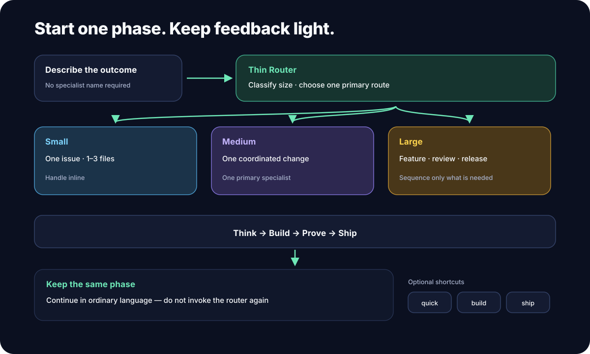
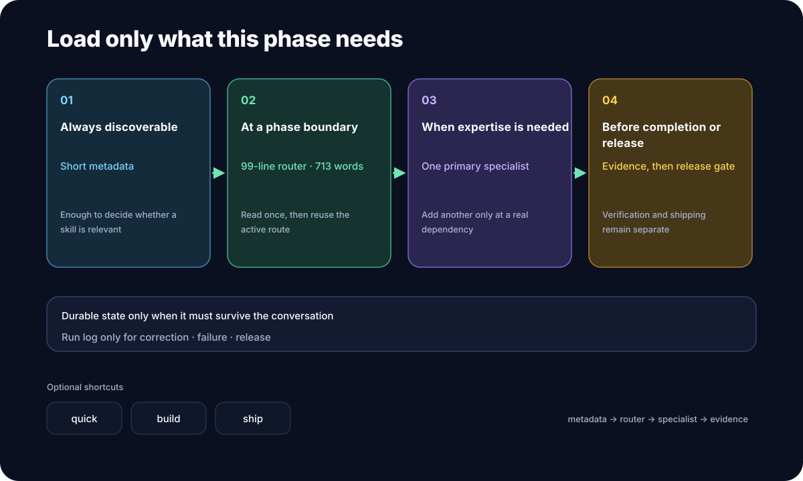

# superforge-skill

**English** · [日本語](./README.ja.md) · [简体中文](./README.zh-CN.md) · [Español](./README.es.md) · [한국어](./README.ko.md)

**One front door for making a product. Describe the outcome; the AI chooses the smallest useful route through strategy, design, implementation, proof, and release.**

<!-- superforge-contract: phase-once auto-route follow-up -->

<p align="center">
  
</p>

## The normal way to use it

At the start of a meaningful phase, say `superforge` and describe the result you want:

```text
superforge — Redesign onboarding so a first-time user can publish in three minutes.
```

You do **not** need to know the specialist names. The router reads the task, inspects the project, classifies its size, and selects the primary specialist. If another specialist becomes necessary, it adds it only at that boundary.

You also do not need to know which library makes an experience possible. Describe the outcome; in a substantial UI phase with the technique still open, Superforge checks the existing stack, scans current options from official sources once, explains the choice, and implements it. If the native platform is the better answer, it adds no dependency.

Keep giving normal feedback after that:

```text
Keep the previous conditions. Make the empty state clearer, then show one preview.
```

Do not repeat `superforge` while the goal and phase are unchanged. Start it again when you begin a different feature, a release review, or another substantial phase.

## Three optional modes

Plain `superforge` is enough. These explicit modes are shortcuts, not specialist names:

| Mode | Use it for | Default behavior |
|---|---|---|
| `superforge quick` | one bounded correction | handle inline; no orchestration or log by default |
| `superforge build` | a feature or multi-file change | plan, choose one primary specialist, implement, verify |
| `superforge ship` | release readiness | verify evidence first, then run the independent release gate |

## Small, Medium, and Large

| Size | Typical scope | Route |
|---|---|---|
| **Small** | one issue, usually 1–3 files | work inline; load no extra skill unless the task genuinely needs one |
| **Medium** | one UI flow, investigation, or coordinated multi-file change | load one primary specialist |
| **Large** | a new feature, broad redesign, security review, or release | sequence the minimum necessary specialists; verify before completion |

This is a **Thin Router**. It does not load the whole suite on every request.

<p align="center">
  
</p>

## Fourteen specialist routes

`superforge` is the concierge. These fourteen skills are the workshop it can route to:

| Phase | Specialist | Responsibility |
|---|---|---|
| Think | [`superforge-brain`](./skills/superforge-brain/README.md) | explore and judge product ideas |
| Think | [`superforge-biz`](./skills/superforge-biz/README.md) | market, pricing, business model, and value case |
| Think | [`superforge-brand`](./skills/superforge-brand/README.md) | brand direction, voice, and visual system |
| Think | [`superforge-roast`](./skills/superforge-roast/README.md) | expose weak assumptions before they reach users |
| Build | [`superforge-dev`](./skills/superforge-dev/README.md) | plan and implement multi-component features |
| Build | [`superforge-ui`](./skills/superforge-ui/README.md) | design and build Web, iOS, and Android interfaces |
| Build | [`superforge-scroll`](./skills/superforge-scroll/README.md) | cinematic scroll-driven experiences |
| Prove | [`superforge-a11y`](./skills/superforge-a11y/README.md) | WCAG, assistive technology, and platform accessibility |
| Prove | [`superforge-test`](./skills/superforge-test/README.md) | choose and implement valuable tests |
| Prove | [`superforge-debug`](./skills/superforge-debug/README.md) | root-cause debugging and failure memory |
| Prove | [`superforge-secure`](./skills/superforge-secure/README.md) | practical security review for small teams |
| Prove | [`superforge-verify`](./skills/superforge-verify/README.md) | attach evidence before any completion claim |
| Ship | [`superforge-ship`](./skills/superforge-ship/README.md) | decide whether a product may be released |
| Continue | [`superforge-handoff`](./skills/superforge-handoff/README.md) | preserve session state before switching tools or threads |

Direct invocation still works for experts, but it is optional.

## Why it uses less context

The saving comes from structure, not a promise about a particular vendor's price:

- only skill metadata is normally discoverable;
- the 99-line router loads at a phase boundary;
- Small work stays inline;
- Medium work loads one primary specialist;
- Large work loads specialists in sequence rather than all at once;
- follow-up feedback reuses the active phase instead of re-reading the router;
- model-specific guidance is read only when real agent dispatch is required;
- durable files and logs are written only when they will matter later.

Actual billing varies by tool, model, prompt caching, and task. See the measured design evidence in the [portfolio case study](./PORTFOLIO_CASE_STUDY.md) ([日本語の詳細版](./PORTFOLIO_CASE_STUDY.ja.md)).

## Evidence and memory

Superforge separates three concerns:

1. **Work** — the relevant specialist produces the result.
2. **Proof** — `superforge-verify` checks current evidence before “done.”
3. **Release** — `superforge-ship` independently decides whether the product is ready to expose to users.

It writes project state only when the decision must survive the conversation. It records the run log only for a correction, failure, or release. Small edits do not create ceremonial documentation.

## Install

### Claude Code plugin (recommended)

```text
/plugin marketplace add takaoumehara/superforge-skill
/plugin install superforge-skills@superforge
```

This installs the router, all fourteen specialists, and the optional dynamic workflows.

### Other local AI tools (Codex, Gemini CLI, …) or a manual Claude Code install

```bash
git clone https://github.com/takaoumehara/superforge-skill.git
cd superforge-skill
./install.sh
```

Windows PowerShell:

```powershell
git clone https://github.com/takaoumehara/superforge-skill.git
cd superforge-skill
.\install.ps1
```

The installer links every skill into the compatible tool directories already present on the machine, including `~/.agents/skills` and `~/.codex/skills`. Run `./install.sh --dry-run` to preview or `./install.sh --update` to pull and refresh Claude Code workflow copies. The installer also links into `~/.claude/skills` when that directory exists, so on a machine where the Claude Code plugin is installed the same skills would appear twice; use one path for Claude Code, not both.

### Claude.ai in the browser — one ZIP

Build one standalone upload containing the router and all fourteen specialist guides:

```bash
python3 scripts/package_skills.py --claude-web
```

In Claude.ai, enable **Code execution and file creation** under **Settings → Capabilities** if Skills is hidden. Then open **Customize → Skills**, click **+ → Create skill → Upload a skill**, and select `dist/superforge-claude-web.zip`. The bundle contains one top-level `superforge` skill, so one upload is enough. Claude Code dynamic workflows are not available in the browser; the bundle uses the complete prose fallback instead.

To create separate per-skill ZIPs, run `python3 scripts/package_skills.py` without the option.

## Compatibility and limits

| Environment | Support |
|---|---|
| Claude Code | skills plus optional dynamic workflows |
| Codex CLI / Codex app | skills through `~/.agents/skills` or `~/.codex/skills` |
| Gemini CLI / Antigravity IDE | skills through their discovered skill directories |
| Claude.ai | standalone ZIP; no dynamic workflow runtime |
| Plain chat without skill/file tools | paste-only guidance; no automatic dispatch |

Superforge does not make the active chat model cheaper, guarantee correctness, replace legal advice, or declare a system secure. It makes routing and evidence requirements explicit. The result is still limited by the available tools, credentials, source material, and human decisions.

## Repository map

```text
skills/superforge/            Thin Router
skills/superforge-*/          fourteen specialist skills
workflows/                    optional Claude Code workflow enforcement
scripts/                      packaging and deterministic checks
assets/                       localized public diagrams
.claude-plugin/               Claude Code plugin and marketplace manifests
PORTFOLIO_CASE_STUDY.md       portfolio case study (English summary)
PORTFOLIO_CASE_STUDY.ja.md    detailed portfolio source (Japanese)
SOURCES.md                    dated external claims
```

Start with [`skills/superforge/SKILL.md`](./skills/superforge/SKILL.md), its [`help`](./skills/superforge/references/help.md), the [source ledger](./SOURCES.md), or the [portfolio case study](./PORTFOLIO_CASE_STUDY.md) ([日本語](./PORTFOLIO_CASE_STUDY.ja.md)).

## Checks for contributors

These run on a fresh clone with only Python 3 and the Claude Code CLI, and are what CI runs:

```bash
claude plugin validate --strict .
python3 scripts/check_superforge_router.py
python3 scripts/check_library_discovery.py
python3 scripts/check_public_release.py --skip-zip
python3 scripts/validate_llms_txt.py skills/superforge-ship/assets/templates/llms.txt
```

Two checks fail on a fresh clone unless given generated input: `scripts/check_public_release.py` without `--skip-zip` needs `python3 scripts/package_skills.py --claude-web` first (creates `dist/superforge-claude-web.zip`, which is not committed), and `scripts/validate_llms_txt.py` defaults to `./llms.txt`, which this repository does not have — pass the path of the template above or of an `llms.txt` generated for your project.

## Credits and license

The suite was informed by the author's BreakBias and cross-model handoff work, plus openly documented agent and skill patterns from projects including [obra/superpowers](https://github.com/obra/superpowers), [BMAD-METHOD](https://github.com/bmad-code-org/BMAD-METHOD), and [Vercel Labs Skills](https://github.com/vercel-labs/skills). Those projects' text and code are not copied into this repository. One exception: `superforge-scroll` is derived from [oso95/scroll-world](https://github.com/oso95/scroll-world) (MIT) and redistributes three of its files unmodified, with the upstream license reproduced in [`skills/superforge-scroll/NOTICE.md`](./skills/superforge-scroll/NOTICE.md). See the specialist provenance files and [`SOURCES.md`](./SOURCES.md) for details.

MIT — see [LICENSE](./LICENSE).
