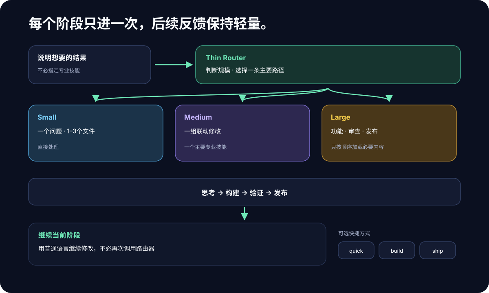
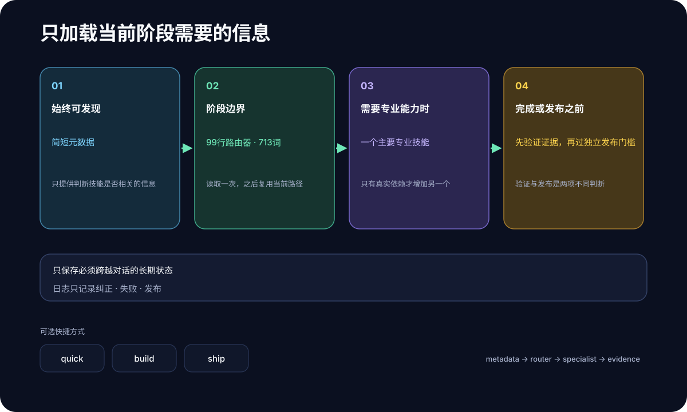

# superforge-skill

[English](./README.md) · [日本語](./README.ja.md) · **简体中文** · [Español](./README.es.md) · [한국어](./README.ko.md)

**用一句话说出你想做什么，十四个技能就按正确的顺序，从想点子一直带到上线前的检查。**

---

## 这是什么？

「技能」就是**可以加进 Claude Code 这类 AI 工具的一份操作说明**。放进去一个文件夹，AI 就照着那套步骤干活。

superforge 是这样的十四份。站在正中间的 `superforge` 扮演**工坊前台**。

> 你：「我想给街角那家咖啡馆做个 App。」
> 前台：「先把点子理清楚，交给 `superforge-brain`。这活儿需要判断力，用 Opus 5。」
> —— 然后就开工了。

前台只做三件事。

1. **决定交给谁**：想 / 做 / 验 / 出，十四个里挑一个
2. **决定用哪个模型**：聪明的模型贵，便宜的活儿不该用贵模型
3. **确保结果落成文件**：这样清掉对话，东西也不会跟着没

<p align="center">
  
</p>

---

## 好在哪里

### 1. 不用再纠结「从哪儿开始」

想做的东西在脑子里，第一步却迈不出去。superforge 接过一句话，先说清打算按什么顺序推进，然后直接开始。你不用每次自己拼指令。

### 2. 便宜的活儿不再跑在贵模型上

AI 模型分聪明但贵的和快而便宜的。默认情况下，**所有活儿都跑在同一个贵模型上**——批量改个文件名，和做架构决策同价。

superforge 在动手之前先把每个子任务分成四档，各配对应的模型。而且不只 Claude：Gemini、Codex、Kimi 环境都有对应的分级表。

<p align="center">
  
</p>

最下面的 **D（大量文本）** 是完全不碰仓库的活儿——翻译、摘要、量产变体。这些交给本机的 `gemini` CLI，**完全不占用 Anthropic 用量**。

### 3. 定下来的事，不会跟着对话一起消失

和 AI 聊出来的东西，清掉线程的那一刻就全没了。第二天又要从头解释一遍。

superforge 的技能在汇报之前一定先往 `docs/` 里写文件。定了设计就有 `docs/design.md`，定了定价就有 `docs/business-model.md`。所以 `/clear`、换模型、隔一周再来，**已经定下的事都还读得到**。

---

## 十四个技能

正中间的 `superforge` 是前台，其余十二个是干活的。当然也可以像 `/superforge-ui` 这样直接叫。

### 1. 想 —— 决定做什么

| 技能 | 什么时候用 | 留下的文件 |
|---|---|---|
| [`superforge-brain`](./skills/superforge-brain/README.zh-CN.md) | 想要值得做的点子——不落俗套的**和**平凡但被真正需要的（**BreakBias 引擎**，也可以选更轻的经典方法） | `docs/product-idea.md`（彻底扫描时还有 `.html` 地图） |
| [`superforge-biz`](./skills/superforge-biz/README.zh-CN.md) | 这个市场究竟值不值得进；然后是定价、付费墙位置、怎么获客、把价值讲成数字，以及卖产能而非产品时的那笔账 | `docs/business-model.md` |
| [`superforge-brand`](./skills/superforge-brand/README.zh-CN.md) | 名字、配色、语气，外加生成素材的提示词 | `docs/brand.md` |

### 2. 做 —— 把它做出来

| 技能 | 什么时候用 | 留下的文件 |
|---|---|---|
| [`superforge-ui`](./skills/superforge-ui/README.zh-CN.md) | 界面设计——方向来自真实参考而不是模型自己的平均值；也包括卖货型落地页，以及用户下定决心后的头三十秒（首次启动），附带一份人能打开核对的样式指南 | `docs/design.md` + `docs/design.html` |
| [`superforge-dev`](./skills/superforge-dev/README.zh-CN.md) | 实现：先拆得让并行不会出事，再把每块分给合适的模型 | `docs/plan.md` |

### 3. 验 —— 确认没坏

| 技能 | 什么时候用 | 留下的文件 |
|---|---|---|
| [`superforge-test`](./skills/superforge-test/README.zh-CN.md) | 先定什么值得测，再先写测试（Web / iOS / Android） | 测试本身 |
| [`superforge-debug`](./skills/superforge-debug/README.zh-CN.md) | 出了 bug，想找根因而不是打补丁，包括复现不了的那些 | `docs/failforward.md` |
| [`superforge-a11y`](./skills/superforge-a11y/README.zh-CN.md) | 认真做无障碍检查——七道检查，不是一个扫描器 | `docs/accessibility.md` |
| [`superforge-secure`](./skills/superforge-secure/README.zh-CN.md) | 一个已登录的普通用户，能不能读到别人的数据？七道检查，按攻击者能拿到什么来排；也包括密钥已经泄漏之后怎么办 | `docs/security.md` |

### 4. 出 —— 准备见人

| 技能 | 什么时候用 | 留下的文件 |
|---|---|---|
| [`superforge-roast`](./skills/superforge-roast/README.zh-CN.md) | 想在用户发现之前，先听到毛病 | `docs/critique.md` |
| [`superforge-verify`](./skills/superforge-verify/README.zh-CN.md) | 「做完了」需要带上分级的证据，以及诚实写下没查什么 | `docs/verification.md` |
| [`superforge-ship`](./skills/superforge-ship/README.zh-CN.md) | 能跑了——但可以发布吗？法律义务、审核被拒的真正原因、事后补不回来的度量 | `docs/ship-readiness.md` |
| [`superforge-handoff`](./skills/superforge-handoff/README.zh-CN.md) | 清掉会话或换工具之前 | `.handoff/` |

---

## 安装

只需要 `git`，以及一个能加载技能的 AI 工具，比如 Claude Code。

### 一次全装好（推荐）

克隆一次，跑一遍安装脚本。它会找出本机所有技能目录，把十四个一次性链接进去。

```bash
git clone https://github.com/takaoumehara/superforge-skill
cd superforge-skill
./install.sh
```

`--dry-run` 只显示会发生什么、不做改动，`--uninstall` 可以卸载。脚本可重复执行，只碰自己创建的符号链接，所以每次 `git pull` 之后再跑一遍就行。

它会查看这几个目录，只链接实际存在的：

```
~/.claude/skills                    Claude Code
~/.agents/skills                    Codex CLI 和 Gemini CLI 共用
~/.codex/skills                     Codex CLI
~/.gemini/skills                    Gemini CLI
~/.gemini/antigravity-ide/skills    Antigravity IDE
```

重启 AI 工具，然后输入 `/superforge`。

### 只要装一个

```bash
git clone https://github.com/takaoumehara/superforge-skill ~/src/superforge-skill
ln -s ~/src/superforge-skill/skills/superforge-ui ~/.claude/skills/superforge-ui
```

把 `superforge-ui` 换成你要的技能名，`~/.claude/skills` 换成你用的工具目录。

> **注意：** 不要把仓库整个克隆*进*技能目录。工具只会**向下找一层**。克隆到任意位置再做链接才是对的。

### claude.ai（浏览器）

把一个技能的文件夹打成 zip，在 Settings → Capabilities → Skills 里上传。浏览器端一次只收一个。

```bash
cd ~/src/superforge-skill/skills/superforge-ui
zip -r superforge-ui.zip .
```

### 让它常驻生效（推荐）

技能在 AI 判断与当前请求相关时会**自己起来**，你不需要打它的名字。真正值得钉死的是模型分配，因为不管哪个技能在跑、在哪个项目里，它都适用。把这段加进你所用工具的**全局指令文件**：

| 工具 | 文件 |
|---|---|
| Claude Code | `~/.claude/CLAUDE.md` |
| Codex CLI | `~/.codex/AGENTS.md` |
| Gemini CLI / Antigravity | `~/.gemini/GEMINI.md` |

```
派发子 agent 之前，先参考 superforge 技能，按任务分配合适的模型，
不要把所有 agent 都留在同一个模型上。开销发生前先把
任务 / 模型 / 理由 打印出来。
```

**它不会做什么——这是最常见的误读。** 它**不会把小请求转到便宜的模型上**。分级作用于 **AI 派发出去的子 agent**，而不是你正在输入的这个会话；而且像「改个错别字」这种一行的活，**直接改才最便宜**——专门起一个 agent 反而*更贵*，因为多了一次启动。要改自己会话用的模型，用工具自身的设置（Claude Code 里是 `/model`），指令文件覆盖不了它。

真正划算的是**大到需要拆分的任务**：五个子 agent 全用最贵的模型，还是各自落在合适的五个档位上——这就是这套东西存在的理由。

---
## 语言只在第一次问一遍

技能本身是用英文写的。你不必是。

在一个项目里第一次跑起来时，它会问一个问题——**答案已经根据你刚才的输入猜好了**——之后再也不问:

```
对话: 中文   ← 根据你的写法推测
docs/ 里的文件: 中文

[1] 两边都用英文   [2] 对话用中文，文件用英文   [3] 换一种语言
```

**这两项是故意分开的。** 用中文工作、但仓库要和国外的人共享，通常想要中文回复加英文文件——而几乎没人会主动提这个要求。

答案存在 `docs/superforge.md` 里，`/clear` 之后还在，会跟着交接胶囊一起走，你随时说一句就能改。如果你直接无视这个问题、上来就说事，它会采用猜测然后开始干活。

---

## 不知道从哪开始?

说一句 **`/superforge help`**（或者「怎么用」）。它会给一段简短的总览和一个编号菜单，然后停下来等你选——一次只出一节，不是一堵墙:

`[1]` 十四个技能 · `[2]` **钱到底省在哪** · `[3]` 它做不到什么 · `[4]` 常见误解 · `[5]` 进阶用法

### 钱到底省在哪

省不省，取决于**token 在哪儿被处理**，而不是跑了几个 agent。

| 你说的话 | 实际发生什么 | 更便宜吗? |
|---|---|---|
| 「改个错别字」 | 你自己的会话直接改 | **不。而且这已经是最便宜的**——专门起 agent 反而更贵 |
| 「把这 2000 行日志总结一下」 | **一个**便宜档位的 agent | **会，而且省很多**——大头在便宜模型上烧，回来的只有结果 |
| 「把这个功能做出来」（拆成五个任务） | 每个任务各配一档 | **会。这才是主战场** |
| 「定一下架构」 | 最好的模型，不外包 | 不会，而且这里本来就不该省 |

所以要不要把**单个**任务派出去，判断标准不是「有没有两个以上任务」，而是**「这活会不会吃掉大量 token，却不太需要判断力」**。

---

## 它做不到的事

先写在前面——工具承诺的和它实际做到的之间那道缝，正是信任流失的地方。

- **它不会让你自己的会话变便宜。** 模型分级作用于子 agent。你的会话跑在你自己设定的模型上。
- **它不会替你把代码写完。** 这些是给 AI 读的说明书。干活的还是 AI，而 AI 会出错。
- **它不是法律意见。** `superforge-ship` 指出触发了哪些义务、从哪一步开始必须找律师，但它不会替你起草条款。
- **它绝不会说产品「是安全的」。** `superforge-secure` 报告的是查了什么、没查什么——那是另一种、也更诚实的说法。
- **它替代不了去和用户聊。** `superforge-brain` 教你怎么问，但它不知道答案。
- **结论不会好过输入。** 每个市场数字都带着置信等级，正是因为这个。

---

## 能在哪儿跑

| 环境 | 支持 | 说明 |
|---|---|---|
| Claude Code（CLI、VS Code / JetBrains 扩展） | ✅ | 原生支持技能 |
| Codex CLI | ✅ | 读取 `~/.agents/skills/` 和项目里的 `AGENTS.md` |
| Gemini CLI | ✅ | 读取 `~/.agents/skills/` |
| Antigravity IDE | ✅ | 读取它自己的 `skills/` 目录 |
| claude.ai（浏览器，Pro / Team / Enterprise） | ✅ | 作为自定义技能上传 |
| 纯聊天界面（没有工具的 ChatGPT / Gemini 网页版） | ⚠️ | 那里既不能加载技能，也没法把活儿交给别的 agent。你可以把 `SKILL.md` 粘进自定义指令，但模型分配没有作用对象 |

---

## 想再了解一点

### 人能真正核对的设计系统

`superforge-ui` 会产出**两份绝不能互相矛盾的文件**。

- **`docs/design.md`** —— 颜色和尺寸的定义，供 agent 读取。采用开放的 [design.md](https://github.com/google-labs-code/design.md) 格式
- **`docs/design.html`** —— 一份用浏览器打开就能看到全部颜色、组件、状态真实渲染的文件，带实测对比度和通过/未通过徽章

HTML 是**读取** `design.md` 的值来渲染的，而不是照着重画一遍，所以「文档和实物对不上」在结构上不可能发生。

### 无障碍检查为什么不能只靠工具

自动检测工具给出一个数字，然后就沉默了。**而这份沉默看起来很像通过。** 行业标准的检测引擎针对 WCAG A 级和 AA 级共有 **63 条规则**，而同一级别有 **55 条成功准则**——焦点顺序、上下文中的链接目的、错误纠正建议、拖拽的替代方式、无障碍身份验证，这些**根本没有任何自动规则**，因为它们考的是「意思对不对」。

`superforge-a11y` 会把剩下六道检查真正跑一遍：键盘、屏幕阅读器、缩放与重排、颜色、动效与时限、表单与错误。然后留下一份台账，A 级和 AA 级每条准则都标上 `通过 / 不通过 / 不适用 / 未验证`——因为**报告里没出现的准则，读的人一律当作通过**，那是审计悄悄变成假话最省事的一条路。

只要还有一条「未验证」，它就不会写「合规」。问题按**被挡住的人**来写，而不是规则编号。覆盖 Web、iOS、Android，以及真正落到你头上的那套标准：[欧盟无障碍法案 / EN 301 549、ADA Title II、Section 508、JIS X 8341-3](./skills/superforge-a11y/references/conformance-and-law.md)。

### 晚上下指令，早上看结果

目标不是让你少做决定，而是把**一切不属于决定的事**清掉。

只有当一次运行能自己证明进度时，才允许它无人值守地跑：范围写成勾选框，每条都配上**能证明它做完的那条命令**，失败时自我修复，每完成一个任务就把状态刷到磁盘。悬而未决的问题用一个站得住脚的默认值解决并记录，而不是停下来。

它只在四种情况下停：不可逆的删除、要花钱、缺凭据、目标本身就错了。即便如此，不受影响的部分也会继续推进。

完整协议 → [`superforge-dev/references/autonomous-run.md`](./skills/superforge-dev/references/autonomous-run.md)

### 为什么装十四个也不会拖慢 AI

常驻在 AI 上下文里的只有**每个技能那一行描述**。正文按需加载，更深的材料放在 `references/` 里，用到才读。

| 参考文档 | 内容 |
|---|---|
| [`superforge/references/intake.md`](./skills/superforge/references/intake.md) | 不靠盘问，把一个请求变成书面需求 |
| [`superforge/references/wiring.md`](./skills/superforge/references/wiring.md) | 什么时候把某一步交给你已装好的其他技能 |
| [`superforge-brain/references/ideation-tools.md`](./skills/superforge-brain/references/ideation-tools.md) | 让每种技法穷尽的子方法、kill 判定、审判协议、市场评估表 |
| [`superforge-brain/references/classic-methods.md`](./skills/superforge-brain/references/classic-methods.md) | 代替彻底扫描的轻量方法——SCAMPER、六顶思考帽、Crazy 8s、How Might We 等 |
| [`superforge-brain/references/value-classification.md`](./skills/superforge-brain/references/value-classification.md) | 单一分数为什么会删掉能赚钱的生意——Hero / Workhorse / Lab / Discard 四象限、既有点子的四条取胜路径、禁用清单的复审 |
| [`superforge-brain/references/talk-to-users.md`](./skills/superforge-brain/references/talk-to-users.md) | 问「上次你是怎么做的」而不是「你会用吗」；Hero 和 Workhorse 要问的问题正好相反 |
| [`superforge-brain/references/idea-map-output.md`](./skills/superforge-brain/references/idea-map-output.md) | `product-idea.html` 的规格——含淘汰项的全部点子可视化，加三张优先级地图 |
| [`superforge-biz/references/market-sizing.md`](./skills/superforge-biz/references/market-sizing.md) | GO/NO-GO 闸门——TAM 双向计算、每个数字的可信度分级、到底需要多少客户 |
| [`superforge-biz/references/behavioral-frameworks.md`](./skills/superforge-biz/references/behavioral-frameworks.md) | 锚定、损失厌恶、默认选项、按症状查的索引，以及各自的伦理边界 |
| [`superforge-biz/references/customer-acquisition.md`](./skills/superforge-biz/references/customer-acquisition.md) | 渠道契合、引流磁石、匹配度×意向度筛选、CAC/LTV 算法 |
| [`superforge-biz/references/service-business.md`](./skills/superforge-biz/references/service-business.md) | 当卖的是产能而非产品 — 由工时算出的收入天花板、范围就是交付物、范围蔓延要标价而不是自己吞、顾问费、客户集中度 |
| [`superforge-biz/references/value-pitch.md`](./skills/superforge-biz/references/value-pitch.md) | 把任何功能变成量化的、先数字后情感的商业话术 |
| [`superforge-ui/references/design-process.md`](./skills/superforge-ui/references/design-process.md) | 设计步骤、四种数据状态、质量清单 |
| [`superforge-ui/references/design-system-output.md`](./skills/superforge-ui/references/design-system-output.md) | `design.md` + `design.html` 的规格 |
| [`superforge-ui/references/design-sourcing.md`](./skills/superforge-ui/references/design-sourcing.md) | 设计方向从哪里来——六层提取、参考与抄袭的界线、把别处做好的设计变成系统 |
| [`superforge-ui/references/motion-system.md`](./skills/superforge-ui/references/motion-system.md) | 时长、按动画属性选缓动、FLIP、滚动同步、reduced-motion 的运行时停止 |
| [`superforge-ui/references/landing-page.md`](./skills/superforge-ui/references/landing-page.md) | 卖货页面的设计——版块顺序、首屏、移动端和桌面端的区别 |
| [`superforge-brand/references/case-study.md`](./skills/superforge-brand/references/case-study.md) | 把做过的事写成别人会信的东西——按读者分层，可信度靠「决定和它的代价」，再写下需要你判断的那一刻 |
| [`superforge-ui/references/slide-page.md`](./skills/superforge-ui/references/slide-page.md) | 经得起快速浏览的长页面——每屏两层、一个观点，形态按内容的作用来选；本身不带任何视觉语言 |
| [`superforge-ui/references/first-run.md`](./skills/superforge-ui/references/first-run.md) | 进来后的头三十秒——不解释，直接抵达第一个成果；权限在用到时才要；完成标记要让你事后还能测 |
| [`superforge-ship/references/legal-triggers.md`](./skills/superforge-ship/references/legal-triggers.md) | 产品行为触发了哪些义务、四条到处大体通用的基线，以及必须请律师的那条线 |
| [`superforge-ship/references/launch-metrics.md`](./skills/superforge-ship/references/launch-metrics.md) | 事后补不回来的度量、每个数字能决定什么，以及最初四周怎么走 |
| [`superforge-roast/references/evaluation-methods.md`](./skills/superforge-roast/references/evaluation-methods.md) | 启发式评估、无障碍审计、认知负荷、模拟人物测试 |
| [`superforge-a11y/references/wcag22-ledger.md`](./skills/superforge-a11y/references/wcag22-ledger.md) | WCAG 2.2 全部 86 条准则，以及每条实际该看什么 |
| [`superforge-a11y/references/audit-protocol.md`](./skills/superforge-a11y/references/audit-protocol.md) | 七道检查的步骤、合格线，以及各自要留下的证据 |
| [`superforge-a11y/references/tooling.md`](./skills/superforge-a11y/references/tooling.md) | 各工具能查到什么、确定查不到什么，以及 CI 接法 |
| [`superforge-a11y/references/native-platforms.md`](./skills/superforge-a11y/references/native-platforms.md) | VoiceOver、Dynamic Type、TalkBack、Compose semantics、Switch Access |
| [`superforge-a11y/references/conformance-and-law.md`](./skills/superforge-a11y/references/conformance-and-law.md) | 欧盟无障碍法案 / EN 301 549、ADA Title II、Section 508、JIS X 8341-3、合规声明 |
| [`superforge-dev/references/decomposition.md`](./skills/superforge-dev/references/decomposition.md) | 怎样拆分才能安全并行 — 每个任务一个结果加一条验证命令、列出会写入的文件、绝不可并行的组合、失败先回滚再重试 |
| [`superforge-dev/references/autonomous-run.md`](./skills/superforge-dev/references/autonomous-run.md) | 无人值守的前提、循环方式、可以自行拍板的范围 |
| [`superforge-test/references/what-to-test.md`](./skills/superforge-test/references/what-to-test.md) | 什么值得测、什么不值得。单元/集成/E2E 的成本阶梯、mock 的边界、脆弱测试的症状、给没有测试的代码补测试 |
| [`superforge-verify/references/evidence.md`](./skills/superforge-verify/references/evidence.md) | 证据的四个等级，以及报告里为何不能出现「断言」。「能用」和「碰巧能用」的区别，七种无意间造假的证据 |
| [`superforge-debug/references/failforward.md`](./skills/superforge-debug/references/failforward.md) | 失败记忆放在哪里，真正有价值的是 `Looked like` 那一行。复现不了时怎么办、用二分查找定位「以前是好的」、何时该停 |
| [`superforge-secure/references/attack-surface.md`](./skills/superforge-secure/references/attack-surface.md) | 七道检查的细节——密钥真正泄漏的地方、一小时能挖出最严重 bug 的双账号测试、注入的落点、依赖与构建期风险、对外暴露面的清扫 |
| [`superforge-secure/references/when-it-happens.md`](./skills/superforge-secure/references/when-it-happens.md) | 先止血，再查因——轮换顺序、从可能压根没留的日志里重建影响范围、以及一封诚实的通知 |
| [`superforge-dev/references/data-design.md`](./skills/superforge-dev/references/data-design.md) | 每次鉴权都要走的归属链、现在便宜以后昂贵的那些决定、缺索引 / N+1 / 无上限读取、增量式迁移，以及「删除」必须意味着什么 |
| [`superforge-ui/references/aesthetic-direction.md`](./skills/superforge-ui/references/aesthetic-direction.md) | 一个参考都没有时怎么办——十个有名字的方向、只推一根轴，以及那些一看就是「机器做的」的具体默认值 |
| [`superforge-ui/references/surface-and-scope.md`](./skills/superforge-ui/references/surface-and-scope.md) | 任何设计决定之前的两个问题——在这个界面上「成功」是什么样（以及那个模式可以牺牲什么），以及这是改良、重做，还是一个片段 |
| [`superforge-ui/references/build-floor.md`](./skills/superforge-ui/references/build-floor.md) | 对成品而非对意图的检查。以及按「为什么会出现」给默认值分组——库自带的、没挣来的感觉的近路、没人选过的数值 |
| [`superforge-ui/references/heavy-visuals.md`](./skills/superforge-ui/references/heavy-visuals.md) | 着色器、3D、GPU 绘制——成本档位、电量与发热、底线机型、屏幕阅读器与 reduced-motion 的义务，以及为什么这些适合放在发布页、几乎不适合放进每天用的工具里。故意不写库名 |
| [`superforge-ui/references/sound.md`](./skills/superforge-ui/references/sound.md) | 最少被用到的表现维度，也是用错时最招人烦的那一个——不是用户触发的声音一律不响，任何信息都不能只靠声音传达，而把生成的音高约束在音阶上，能把「哪儿不对劲」变成「这是设计过的」 |
| [`superforge-ui/references/effect-vocabulary.md`](./skills/superforge-ui/references/effect-vocabulary.md) | 提案时需要的那份菜单——横跨图形、声音与原生端的约三十种效果，按**感觉**而不是按哪个库来命名，所以不会过期。没有菜单，「做得酷一点」换来的就是一层渐变 |
| [`superforge-dev/references/dispatch-ledger.md`](./skills/superforge-dev/references/dispatch-ledger.md) | 每个 agent 分到哪个模型，花钱之前先列表、跑完之后再记录——让这套东西承诺的分级变成看得见的，而不是一句声明 |
| [`superforge-ui/references/performance-budget.md`](./skills/superforge-ui/references/performance-budget.md) | 不是事后测，而是和设计一起定的三个数字。重量到底从哪来。体感速度是设计问题 |
| [`superforge-ui/references/internationalization.md`](./skills/superforge-ui/references/internationalization.md) | 文字会变长，最先坏的是按钮。为什么句子绝不能拼接、依赖 locale 的格式，以及要不要做多语言这件事本身 |
| [`superforge-ship/references/operations.md`](./skills/superforge-ship/references/operations.md) | 能不能发现 / 能不能修 / 能不能找回 / 要花多少——一条值得留的告警、演练过的回滚、真正恢复过的备份、失控账单的阈值 |
| [`superforge-brand/references/media-production.md`](./skills/superforge-brand/references/media-production.md) | 生成媒体的真实成本、让第十二张和第一张对得上的配方，以及在发布前就答完的商用授权与肖像问题 |

---

## 技能真正会去跑的工具

两件不该靠推理去做的确定性计算。都是只读，失败时返回非零，可以拿来卡 CI。

| 脚本 | 做什么 |
|---|---|
| [`superforge-a11y/scripts/contrast.py`](./skills/superforge-a11y/scripts/contrast.py) | 从 token 文件算 WCAG 对比度。相对亮度是分段 gamma 变换，差一点就跨过合格线，而看上去一点都不像错。带 alpha 的颜色不猜，不合成就报 UNKNOWN |
| [`superforge-secure/scripts/scan-secrets.sh`](./skills/superforge-secure/scripts/scan-secrets.sh) | 把安全评审的第 1 道跑遍全部六个地方，**包括 git 历史**——后来那次提交删掉的密钥，还在那儿。绝不打印可用的密钥 |

四个技能还带了 `evals/evals.json`：该触发和不该触发的提示词，外加对**产物**的断言——不只是「技能有没有起来」，而是「`docs/design.md` 里到底有没有 Design DNA 和预算」。

---

## 来源与致谢

这里的技能是从八份材料中提炼、并**用我自己的话重写**的。不含任何第三方代码或文本。

| 材料 | 出处 | 提供了什么 |
|---|---|---|
| [BreakBias Studio](https://github.com/takaoumehara/breakbias-studio) | 本人 | `superforge-brain` 的发想引擎 |
| [cross-model-handoff](https://github.com/takaoumehara/cross-model-handoff) | 本人 | `superforge-handoff` 的交接格式 |
| [obra/superpowers](https://github.com/obra/superpowers) | MIT © Jesse Vincent | 把活儿分给多个 agent 的思路 |
| [BMAD-METHOD](https://github.com/bmad-code-org/BMAD-METHOD) | MIT © BMad Code, LLC | 按角色分工的 agent 编排范式 |
| [vercel-labs/skills](https://github.com/vercel-labs/skills) | Vercel Labs | 把技能拆小、便于分发的形态 |
| Gem_Ren_Pack | 本人 | 设计与评估相关的框架 |
| 我自己整理的交互设计与动效研究笔记 | 本人 | `motion-system.md` 与 `design-process.md` 的底子——时长分级、按动画属性选缓动、FLIP、滚动引擎同步、表单校验时机、可达性与点击目标 |
| 别人给我的一套应用开发技能 | 第三方，**读过但未沿用** | **它暴露出来的缺口**。市场测算、发布时的法律义务、首次启动设计，这里原本一样都没有。只取了行业通识（TAM/SAM/SOM、数据保护法的触发条件、权限的情境化请求），每个文件都是从零写的 |
| 别人发我的三套设计技能（`impeccable`、`emil-design-engineering`、`animation-patterns`） | 第三方，**读过但未沿用** | **这套东西缺的三个概念**，全部从零重写并扩展：四种界面模式与「改良还是重做」的分界（`surface-and-scope.md`，加了「可以牺牲什么」这一列和「片段」这种情况）、对成品而不是对意图去测的质量底线（`build-floor.md`，按默认值**为什么**出现来重新分组——这个分法两个来源都没有）、以及用使用频率来决定要不要做动画 |

**关于最后一行。** 读别人的技能集，是发现自己缺什么的好办法，却是填补缺口的坏办法。它暴露出三个真实的缺口，现在由 [`market-sizing.md`](./skills/superforge-biz/references/market-sizing.md)、[`superforge-ship`](./skills/superforge-ship/README.zh-CN.md)、[`first-run.md`](./skills/superforge-ui/references/first-run.md) 填上。它们和原件都不像，因为设计判断走了相反的方向——**不放冻结的法律文本**、不收录一年就过期的平台功能目录、也不在一套承载流程的技能里塞代码模板。

**关于 `superforge-brain` 里的 BreakBias 引擎** —— 它的地基是 SIT（Systematic Inventive Thinking）的两条约束：Closed World（不从盒子外面拿东西）和 Function Follows Form（先造出不可能的形态，价值再倒推）。BreakBias 在此之上加了：

- **技法从五种扩到八种**（Reverse / Shift / Repurpose）
- **强制给每个要素命名偏见**（功能性 / 结构性 / 关系性）
- **先封禁三个平庸方案**，再以「离它们多远」来打新颖度
- **要素 × 技法 × 子方法作为可追踪的单元格台账**，机器能验证没有漏掉任何一格
- **审判放在独立上下文**，评审者看不到这个点子是怎么想出来的
- **市场判定排在审判之后**，避免市场常识污染新颖度评分

SIT 是给一屋子人开会用的方法。BreakBias 把它重建成**机器能穷尽扫描、而且能证明自己扫完了**的东西。

---

## 许可证

MIT —— 见 [LICENSE](./LICENSE)。
