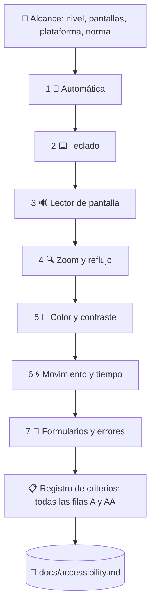

# ♿ superforge-a11y

[](https://opensource.org/licenses/MIT)
[](https://claude.com/claude-code)
[](https://github.com/takaoumehara/superforge-skill)

[English](README.md) · [日本語](README.ja.md) · [简体中文](README.zh-CN.md) · **Español** · [한국어](README.ko.md)

> **Que la puntuación de accesibilidad salga verde no es un aprobado. Es la primera de siete comprobaciones, y la única que puede hacer una máquina.**

---

## 🔰 ¿Qué es esto?

Todas las herramientas de accesibilidad informan de lo mismo: los fallos mecánicos. Falta el `alt`, el ARIA está mal, el contraste es bajo. Después se callan — **y ese silencio se lee como aprobación.**

No lo es. El motor estándar del sector incluye **63 reglas** para los niveles A y AA de WCAG. Ese nivel tiene **55 criterios de conformidad**, y para buena parte de ellos **no existe ninguna regla automática**: orden del foco, propósito del enlace en su contexto, sugerencia de corrección de errores, alternativas al arrastre, autenticación accesible. Todos son juicios sobre el significado, y un escáner no juzga.

Esta skill ejecuta las otras seis comprobaciones, deja una fila por criterio y nombra **a quién bloquea cada fallo**.

---

## 📐 Arquitectura



Cada comprobación existe porque las anteriores, por su propia estructura, no pueden encontrar lo que ella encuentra.

---

## ✨ Puntos clave

### 🚫 De un escáner no sale una declaración de conformidad
Si alguna comprobación no se ejecutó, la skill no declara conformidad. «Sin evaluar» es un resultado honesto y aparece en el informe tal cual. Lo que nunca hará es deducir el verde de la ausencia de errores — que es exactamente por donde una declaración de accesibilidad se convierte en un problema legal.

### 📋 Cada criterio tiene su fila, también los que pasan
Los 31 criterios de nivel A y los 24 de nivel AA de WCAG 2.2 aparecen en el registro con `cumple` / `no cumple` / `no aplica` / `sin evaluar` y su evidencia. **Un criterio que falta en un informe se lee como aprobado**, y esa es la forma más fácil de que una auditoría se vuelva falsa sin que nadie mienta explícitamente.

### 🧑 La gravedad se escribe con la persona bloqueada, no con el número de regla
«Infracción de 4.1.2 ×12» no mueve a nadie. «Quien use lector de pantalla no puede enviar este formulario: el botón no tiene nombre» se arregla esta semana. Los hallazgos se agrupan por causa: doce botones de icono sin etiqueta que vienen de una sola prop de componente son **un** trabajo, no doce.

### 📱 Web, iOS y Android, con las cifras que no coinciden
WCAG dice 24×24 px. Apple dice 44×44 pt. Material dice 48×48 dp. La skill lleva la mecánica de cada plataforma — traits de VoiceOver, Dynamic Type, TalkBack, semantics de Compose, Switch Access — y las herramientas que automatizan cada una.

### ⚖️ Qué norma te aplica de verdad
EN 301 549 y la Ley Europea de Accesibilidad, el Title II de la ADA con sus plazos ampliados a 2027 y 2028, la Section 508 y el VPAT, la japonesa JIS X 8341-3:2016 y la publicación del resultado de la prueba. **Una sola auditoría a WCAG 2.2 AA las satisface todas.** Y WCAG 3.0 es un borrador de trabajo que hoy no exige nada, diga lo que diga un proveedor.

---

## 🔄 Antes / Después

| | Antes | Después |
|---|---|---|
| Qué significaba «accesible» | axe no reportó infracciones | Siete comprobaciones, cada una con su evidencia |
| Cobertura | Hasta donde llegue el escáner | Todos los criterios A y AA, con resultado declarado |
| Teclado y lector de pantalla | Se daba por hecho que funcionaban | Flujo principal completado solo con teclado, y luego solo escuchando |
| Cómo se leen los hallazgos | `4.1.2 name-role-value ×12` | Una causa, doce instancias, y a quién bloquea |
| Modo oscuro y estados de error | Nunca se escanearon | Comprobaciones aparte — ahí es donde están los fallos |
| Conformidad | Declarada desde una puntuación verde | Declarada solo cuando no queda nada «sin evaluar» |

---

## 🚀 Instalación y uso

### 🖥️ Instala las catorce skills (una sola vez)

Clona el repositorio y ejecuta el instalador. Enlaza las catorce skills en todos los directorios de skills de tu máquina (Claude Code, Codex CLI, Gemini CLI, Antigravity).

```bash
git clone https://github.com/takaoumehara/superforge-skill
cd superforge-skill
./install.sh
```

Todas las opciones, la instalación de una sola skill y la vía de subida a claude.ai están en el [README de la suite](../../README.es.md).

### ⌨️ Invócala

```
/superforge-a11y
```

Apúntala a una URL, un componente, una pantalla, un sistema de diseño o un repositorio entero. El veredicto queda en `docs/accessibility.md`. Dile «arréglalo» y repara por causa, vuelve a ejecutar la comprobación que detectó el fallo y añade la prueba de regresión.

---

## 📄 Licencia

MIT — consulta [LICENSE](../../LICENSE). El cuerpo de la skill está en [SKILL.md](SKILL.md); el registro de criterios en [references/wcag22-ledger.md](references/wcag22-ledger.md), las siete comprobaciones en [references/audit-protocol.md](references/audit-protocol.md), los límites de cobertura de las herramientas en [references/tooling.md](references/tooling.md), iOS y Android en [references/native-platforms.md](references/native-platforms.md), y las normas legales en [references/conformance-and-law.md](references/conformance-and-law.md). Visión general de la suite: [superforge-skill](../../README.es.md).
