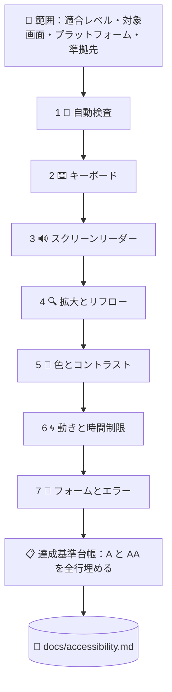

# ♿ superforge-a11y

[](https://opensource.org/licenses/MIT)
[](https://claude.com/claude-code)
[](https://github.com/takaoumehara/superforge-skill)

[English](README.md) · **日本語** · [简体中文](README.zh-CN.md) · [Español](README.es.md) · [한국어](README.ko.md)

> **アクセシビリティのスコアが緑になっても、合格ではありません。7つある検査の1つ目が終わっただけ——しかも機械に回せるのはその1つだけです。**

---

## 🔰 これは何？

アクセシビリティのツールは、どれも同じところまでしか教えてくれません。alt 属性の欠落、ARIA の誤り、コントラスト不足。機械的な失敗を出し切ると、そこで黙ります。**その沈黙が、合格に見えてしまう。**

合格ではありません。業界標準の検査エンジンが WCAG レベル A・AA 向けに持つルールは **63 件**。対してレベル AA の達成基準は **55 項目**あり、そのうち相当数には**自動ルールが1つも存在しません**——フォーカス順序、文脈の中でのリンクの目的、エラーの修正提案、ドラッグ操作の代替手段、アクセシブルな認証。いずれも「意味が通っているか」の判断であり、スキャナは判断をしません。

このスキルは、残り6つの検査を実際に走らせ、全達成基準を1行ずつ埋め、**その不具合で誰が詰まるのか**を名指しします。

---

## 📐 システム概念図



7つの検査は順番に意味があります。後の検査は、前の検査では**構造上見つけられないもの**を見つけるために存在します。

---

## ✨ 5つの強み

### 🚫 スキャナの結果から「準拠」とは言わせない
実行していない検査が1つでもあれば、このスキルは適合を報告しません。「未検証」は正直な結果であり、報告書にもそのまま「未検証」と書きます。やらないのは、エラーが出なかったことを緑と解釈することです。アクセシビリティ方針が、そのまま責任問題に変わるのがこの経路です。

### 📋 通った基準も含めて、全項目に1行
WCAG 2.2 のレベル A 31項目・レベル AA 24項目すべてが台帳に並び、`適合 / 不適合 / 該当なし / 未検証` と根拠が入ります。**報告書に載っていない基準は、読む側には「通った」と読まれます。**監査が静かに嘘になる、いちばん簡単な経路がこれです。

### 🧑 深刻度は、ルール番号ではなく「詰まる人」で書く
「4.1.2 違反 ×12件」では誰も動きません。「スクリーンリーダー利用者はこのフォームを送信できない——ボタンに名前がない」なら今週直ります。指摘は原因単位でまとめるので、コンポーネントの props 1つに起因する12個の無名アイコンボタンは、12件ではなく**1件の作業**です。

### 📱 Web・iOS・Android、そして食い違う数値
WCAG は 24×24 px、Apple は 44×44 pt、Material は 48×48 dp と言います。VoiceOver のトレイト、Dynamic Type、TalkBack、Compose の semantics、Switch Access——プラットフォーム固有の作法と、それぞれを自動化する手段まで持っています。

### ⚖️ 自分に効いてくる基準はどれか
EN 301 549 と欧州アクセシビリティ法、期限が2027年・2028年に延長された ADA Title II、Section 508 と VPAT、JIS X 8341-3:2016 と試験結果の公開。**WCAG 2.2 AA で1回監査すれば、これら全部を満たします。**そして WCAG 3.0 は作業草案であり、現時点で何も要求していません——ベンダーに何を言われたかに関わらず。

---

## 🔄 導入前 / 導入後

| | 導入前 | 導入後 |
|---|---|---|
| 「アクセシブル」の中身 | axe に違反が出なかった | 7つの検査それぞれに根拠が付いている |
| 対象範囲 | スキャナが到達した所まで | A・AA 全基準に結果が入っている |
| キーボードと読み上げ | 動くはずだと思っていた | 主要フローをキーボードだけで、次に音だけで完走 |
| 指摘の書かれ方 | `4.1.2 name-role-value ×12` | 原因1つ・実例12箇所・詰まる利用者は誰か |
| ダークモードとエラー状態 | 一度も検査していない | 別の検査として実施。不具合はそこにある |
| 適合の宣言 | 緑のスコアを根拠に | 「未検証」が1つも残っていないときだけ |

---

## 🚀 インストールと使い方

### 🖥️ 12個まとめて入れる（最初の1回だけ）

クローンしてインストーラを走らせるだけです。マシンの中にあるスキル用フォルダを全部探して、12個をまとめてリンクします（Claude Code / Codex CLI / Gemini CLI / Antigravity）。

```bash
git clone https://github.com/takaoumehara/superforge-skill
cd superforge-skill
./install.sh
```

オプション、1個だけ入れる方法、claude.ai へのアップロード手順は [スイート全体の README](../../README.ja.md) にあります。

### ⌨️ 呼び出す

```
/superforge-a11y
```

URL でも、コンポーネント1つでも、画面でも、デザインシステムでも、リポジトリ全体でも対象にできます。結論は `docs/accessibility.md` に残ります。「直して」と言えば、原因単位で修正し、検出した検査を再実行し、再発防止のテストまで足します。

---

## 📄 ライセンス

MIT — [LICENSE](../../LICENSE) を参照してください。スキル本体は [SKILL.md](SKILL.md)、達成基準の台帳は [references/wcag22-ledger.md](references/wcag22-ledger.md)、7つの検査手順は [references/audit-protocol.md](references/audit-protocol.md)、ツールの守備範囲と限界は [references/tooling.md](references/tooling.md)、iOS と Android は [references/native-platforms.md](references/native-platforms.md)、法令・規格まわりは [references/conformance-and-law.md](references/conformance-and-law.md) にあります。スイート全体の説明は [superforge-skill](../../README.ja.md) へ。
