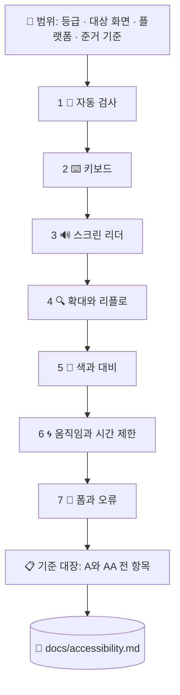

# ♿ superforge-a11y

[](https://opensource.org/licenses/MIT)
[](https://claude.com/claude-code)
[](https://github.com/takaoumehara/superforge-skill)

[English](README.md) · [日本語](README.ja.md) · [简体中文](README.zh-CN.md) · [Español](README.es.md) · **한국어**

> **접근성 점수가 초록이 되어도 합격이 아닙니다. 일곱 개 검사 중 첫 번째가 끝났을 뿐이고, 기계가 돌릴 수 있는 것도 그 하나뿐입니다.**

---

## 🔰 이게 뭔가요?

접근성 도구는 어느 것이든 같은 데까지만 알려 줍니다. 빠진 alt, 잘못된 ARIA, 부족한 대비. 기계적인 실패를 다 뱉고 나면 조용해집니다. **그리고 그 침묵이 합격처럼 읽힙니다.**

아닙니다. 업계 표준 검사 엔진이 WCAG A·AA 등급용으로 갖고 있는 규칙은 **63개**입니다. 반면 AA 등급의 성공 기준은 **55개**이고, 그중 상당수에는 **자동 규칙이 아예 없습니다** — 초점 순서, 맥락 속에서의 링크 목적, 오류 수정 제안, 드래그 동작의 대체 수단, 접근 가능한 인증. 전부 "의미가 통하는가"에 대한 판단이고, 스캐너는 판단하지 않습니다.

이 스킬은 나머지 여섯 개 검사를 실제로 돌리고, 기준마다 한 줄씩 채우고, **그 결함에 막히는 사람이 누구인지** 지목합니다.

---

## 📐 시스템 구조



일곱 검사의 순서에는 이유가 있습니다. 뒤의 검사는 앞의 검사가 **구조적으로 찾을 수 없는 것**을 찾기 위해 있습니다.

---

## ✨ 다섯 가지 강점

### 🚫 스캐너 결과로는 적합을 선언하지 않습니다
검사 중 하나라도 실제로 실행되지 않았다면 이 스킬은 적합을 보고하지 않습니다. "미검증"은 정직한 결과이고, 보고서에도 그대로 "미검증"으로 적힙니다. 절대 하지 않는 것은 오류가 없다는 사실에서 초록을 추론하는 일입니다. 접근성 선언문이 그대로 법적 책임으로 바뀌는 경로가 정확히 이것입니다.

### 📋 통과한 기준까지, 전 항목에 한 줄씩
WCAG 2.2의 A 등급 31개와 AA 등급 24개가 모두 대장에 오르고 `적합 / 부적합 / 해당 없음 / 미검증`과 근거가 들어갑니다. **보고서에 없는 기준은 읽는 쪽에서 통과로 읽습니다.** 감사가 조용히 거짓이 되는 가장 쉬운 길입니다.

### 🧑 심각도는 규칙 번호가 아니라 "막힌 사람"으로 씁니다
"4.1.2 위반 ×12건"으로는 아무도 움직이지 않습니다. "스크린 리더 사용자는 이 폼을 제출할 수 없습니다 — 버튼에 이름이 없습니다"는 이번 주에 고쳐집니다. 발견은 원인 단위로 묶이므로, 컴포넌트 prop 하나에서 나온 이름 없는 아이콘 버튼 12개는 12건이 아니라 **한 건의 작업**입니다.

### 📱 웹, iOS, 안드로이드 — 그리고 서로 다른 숫자들
WCAG는 24×24 px, Apple은 44×44 pt, Material은 48×48 dp를 말합니다. VoiceOver traits, Dynamic Type, TalkBack, Compose semantics, Switch Access — 플랫폼별 메커니즘과 각각을 자동화하는 수단까지 들고 있습니다.

### ⚖️ 나에게 실제로 적용되는 기준은 무엇인가
EN 301 549와 유럽 접근성법, 기한이 2027년·2028년으로 연장된 ADA Title II, Section 508과 VPAT, 일본 JIS X 8341-3:2016과 시험 결과 공개. **WCAG 2.2 AA로 한 번 감사하면 전부 충족됩니다.** 그리고 WCAG 3.0은 작업 초안이며 지금은 아무것도 요구하지 않습니다 — 벤더가 뭐라고 했든.

---

## 🔄 도입 전 / 도입 후

| | 도입 전 | 도입 후 |
|---|---|---|
| "접근 가능"의 내용 | axe에 위반이 안 떴다 | 일곱 검사 각각에 근거가 붙어 있다 |
| 범위 | 스캐너가 닿은 데까지 | A·AA 전 기준에 결과가 들어 있다 |
| 키보드와 읽어주기 | 당연히 되는 줄 알았다 | 주요 흐름을 키보드만으로, 다시 소리만으로 완주 |
| 발견이 적히는 방식 | `4.1.2 name-role-value ×12` | 원인 하나 · 실례 열두 곳 · 막히는 사용자는 누구 |
| 다크 모드와 오류 상태 | 한 번도 검사한 적 없음 | 별도 검사로 수행 — 결함은 거기 있다 |
| 적합 선언 | 초록 점수를 근거로 | "미검증"이 하나도 남지 않았을 때만 |

---

## 🚀 설치 및 사용법

### 🖥️ 열세 개를 한 번에 설치 (처음 한 번만)

저장소를 클론하고 설치 스크립트를 실행하면 됩니다. 이 머신의 모든 스킬 디렉터리를 찾아 열세 개를 한 번에 링크합니다(Claude Code / Codex CLI / Gemini CLI / Antigravity).

```bash
git clone https://github.com/takaoumehara/superforge-skill
cd superforge-skill
./install.sh
```

옵션 전체와 스킬 하나만 설치하는 방법, claude.ai 업로드 절차는 [스위트 README](../../README.ko.md)에 있습니다.

### ⌨️ 호출하기

```
/superforge-a11y
```

URL 하나, 컴포넌트 하나, 화면 하나, 디자인 시스템, 저장소 전체 무엇이든 대상으로 삼을 수 있습니다. 결론은 `docs/accessibility.md`에 남습니다. "고쳐"라고 하면 원인 단위로 수정하고, 문제를 잡아낸 검사를 다시 돌리고, 재발 방지 테스트까지 붙입니다.

---

## 📄 라이선스

MIT — [LICENSE](../../LICENSE)를 참고하세요. 스킬 본문은 [SKILL.md](SKILL.md)에 있고, 기준 대장은 [references/wcag22-ledger.md](references/wcag22-ledger.md), 일곱 검사 절차는 [references/audit-protocol.md](references/audit-protocol.md), 도구의 커버리지 한계는 [references/tooling.md](references/tooling.md), iOS와 안드로이드는 [references/native-platforms.md](references/native-platforms.md), 법·규격은 [references/conformance-and-law.md](references/conformance-and-law.md)에 있습니다. 스위트 전체 소개는 [superforge-skill](../../README.ko.md)을 보세요.
