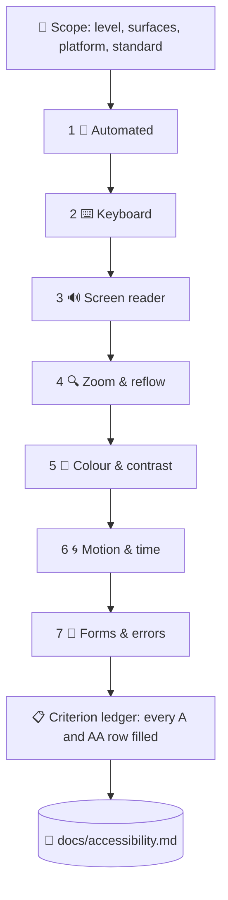

# ♿ superforge-a11y

[](https://opensource.org/licenses/MIT)
[](https://claude.com/claude-code)
[](https://github.com/takaoumehara/superforge-skill)

**English** · [日本語](README.ja.md) · [简体中文](README.zh-CN.md) · [Español](README.es.md) · [한국어](README.ko.md)

> **A green accessibility score is not a pass. It is the first of seven checks, and the only one a machine can run.**

---

## 🔰 What is this?

Every accessibility tool you have used reports the same thing: the mechanical failures. Missing alt text, bad ARIA, low contrast. Then it goes quiet — and the quiet reads like approval.

It is not. The industry-standard engine ships **63 rules** for WCAG Level A and AA. That level has **55 success criteria**, and for a substantial number of them there is **no automated rule at all** — focus order, link purpose in context, error suggestion, dragging alternatives, accessible authentication. Passing them is a judgment about meaning, and no scanner makes judgments.

This skill runs the other six passes, checks every criterion, and names the person each failure blocks.

---

## 📐 Architecture



Each pass exists because the ones before it structurally cannot find what it finds.

---

## ✨ Features

### 🚫 A conformance claim cannot be made from a scanner
The skill refuses to report conformance when any pass was not executed. `Not assessed` is a real, honest result and appears in the report as one. What it will never do is infer green from an absence of errors — which is exactly how an accessibility statement becomes a liability.

### 📋 Every criterion gets a row, including the ones that pass
All 31 Level A and 24 Level AA criteria of WCAG 2.2 appear in the ledger with `pass` / `fail` / `not present` / `not assessed` and the evidence. A criterion that is missing from a report reads as a pass — which is the easiest way for an audit to quietly become untrue.

### 🧑 Severity is a blocked person, not a rule ID
"4.1.2 violation ×12" motivates nobody. "A screen reader user cannot submit this form — the button has no name" gets fixed this week. Findings group by cause, so twelve unlabelled icon buttons from one component prop are one item of work.

### 📱 Web, iOS, and Android, with the numbers that differ
WCAG says 24×24 px. Apple says 44×44 pt. Material says 48×48 dp. The skill carries the platform mechanics — VoiceOver traits, Dynamic Type, TalkBack, Compose semantics, Switch Access — and the tooling that automates each one.

### ⚖️ The standard that actually applies to you
EN 301 549 and the EU Accessibility Act, ADA Title II with its extended 2027/2028 dates, Section 508 and the VPAT, JIS X 8341-3:2016 and 試験結果の公開. One audit at WCAG 2.2 AA satisfies all of them — and WCAG 3.0 is a Working Draft that requires nothing, whatever a vendor told you.

---

## 🔄 Before / After

| | Before | After |
|---|---|---|
| What "accessible" meant | axe reported no violations | Seven passes, each with evidence attached |
| Coverage | Whatever the scanner reaches | Every A and AA criterion, with a stated result |
| Keyboard and screen reader | Assumed to work | The primary flow completed by keyboard, then by listening |
| How findings read | `4.1.2 name-role-value ×12` | One cause, twelve instances, and the user it blocks |
| Dark mode and error states | Never scanned | Separate passes — that is where the failures live |
| Conformance | Claimed from a green score | Claimed only when nothing is `not assessed` |

---

## 🚀 Install & Usage

### 🖥️ Install all twelve skills (once)

Clone the repository and run the installer. It links every skill into every skills directory it finds on this machine — Claude Code, Codex CLI, Gemini CLI, Antigravity.

```bash
git clone https://github.com/takaoumehara/superforge-skill
cd superforge-skill
./install.sh
```

Full options, single-skill installs, and the claude.ai upload route are in the [suite README](../../README.md).

### ⌨️ Call it

```
/superforge-a11y
```

Point it at a URL, a component, a screen, a design system, or a whole repository. The verdict lands in `docs/accessibility.md`. Say "fix it" and it repairs by cause, re-runs the pass that caught the problem, and adds the regression test.

---

## 📄 License

MIT — see [LICENSE](../../LICENSE). The skill body is in [SKILL.md](SKILL.md); the criterion ledger is in [references/wcag22-ledger.md](references/wcag22-ledger.md), the seven passes in [references/audit-protocol.md](references/audit-protocol.md), tool coverage limits in [references/tooling.md](references/tooling.md), iOS and Android in [references/native-platforms.md](references/native-platforms.md), and the legal standards in [references/conformance-and-law.md](references/conformance-and-law.md). Suite overview: [superforge-skill](../../README.md).
