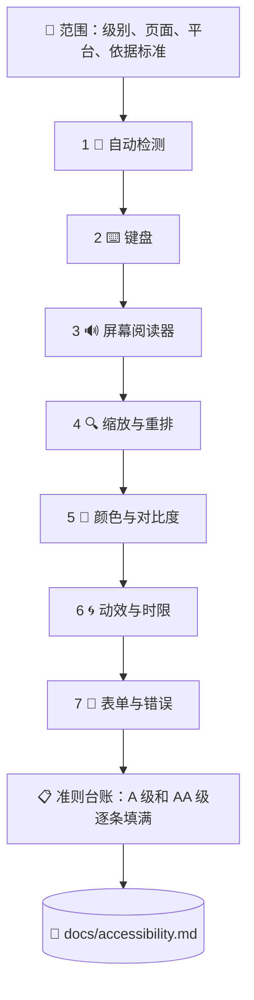

# ♿ superforge-a11y

[](https://opensource.org/licenses/MIT)
[](https://claude.com/claude-code)
[](https://github.com/takaoumehara/superforge-skill)

[English](README.md) · [日本語](README.ja.md) · **简体中文** · [Español](README.es.md) · [한국어](README.ko.md)

> **无障碍评分变绿不等于通过。那只是七道检查里的第一道，也是唯一一道机器能跑的。**

---

## 🔰 这是什么？

所有无障碍工具报出来的都是同一类东西：机械性的失败。缺 alt、ARIA 写错、对比度不足。报完就沉默了——**而这份沉默看起来很像通过。**

它不是。行业标准的检测引擎针对 WCAG A 级和 AA 级共有 **63 条规则**，而 AA 级有 **55 条成功准则**，其中相当一部分**根本没有任何自动规则**——焦点顺序、上下文中的链接目的、错误纠正建议、拖拽操作的替代方式、无障碍身份验证。这些都是关于「意思对不对」的判断，而扫描器不做判断。

这个技能跑完剩下的六道检查，把每一条准则都填上结果，并指名**每个问题挡住的是谁**。

---

## 📐 系统结构



七道检查的顺序是有讲究的：后一道要找的，正是前一道在结构上**找不到**的东西。

---

## ✨ 五个特点

### 🚫 扫描结果不能拿来宣称合规
只要有任何一道检查没有真正执行，这个技能就不会报出合规结论。「未验证」是一个诚实的结果，报告里就照实写「未验证」。它绝不做的是：把「没报错」当成绿灯——无障碍声明变成法律风险，通常就是从这里开始的。

### 📋 每条准则都有一行，包括通过的那些
WCAG 2.2 的 31 条 A 级和 24 条 AA 级全部列进台账，写明 `通过 / 不通过 / 不适用 / 未验证` 以及依据。**报告里没有出现的准则，读的人一律当作通过。**审计悄悄变成假话，这是最省事的一条路。

### 🧑 严重程度按「被挡住的人」写，不按规则编号
「4.1.2 违规 ×12」推动不了任何人。「屏幕阅读器用户无法提交这个表单——按钮没有名称」这周就会被修。发现按成因归并，所以同一个组件属性导致的 12 个无名图标按钮，是**一件事**，不是十二件。

### 📱 Web、iOS、Android，以及那些对不上的数字
WCAG 说 24×24 px，Apple 说 44×44 pt，Material 说 48×48 dp。VoiceOver 的 traits、Dynamic Type、TalkBack、Compose semantics、Switch Access——各平台的机制和对应的自动化手段都在里面。

### ⚖️ 真正落到你头上的是哪套标准
EN 301 549 与欧盟无障碍法案、期限已延至 2027/2028 的 ADA Title II、Section 508 与 VPAT、日本 JIS X 8341-3:2016 与试验结果公开。**按 WCAG 2.2 AA 审一次，以上全部覆盖。**而 WCAG 3.0 目前是工作草案，不构成任何要求——不管供应商怎么说。

---

## 🔄 使用前 / 使用后

| | 使用前 | 使用后 |
|---|---|---|
| 「无障碍」指什么 | axe 没报违规 | 七道检查，每道都附证据 |
| 覆盖范围 | 扫描器爬到哪算哪 | A 级和 AA 级逐条都有结论 |
| 键盘与屏幕阅读器 | 默认它能用 | 只用键盘走通主流程，再只靠听走通一遍 |
| 问题怎么写 | `4.1.2 name-role-value ×12` | 一个成因、十二处实例、以及被挡住的用户 |
| 深色模式与错误态 | 从来没扫过 | 单独检查——问题恰恰都在那里 |
| 合规结论 | 拿绿色评分当依据 | 只有在没有任何「未验证」时才给 |

---

## 🚀 安装与使用

### 🖥️ 一次装好全部 13 个技能（只需一次）

克隆仓库并运行安装脚本。它会找出本机所有技能目录，把 13 个技能一次性链接进去（Claude Code / Codex CLI / Gemini CLI / Antigravity）。

```bash
git clone https://github.com/takaoumehara/superforge-skill
cd superforge-skill
./install.sh
```

完整选项、只装单个技能的方法，以及 claude.ai 上传流程，见[套件 README](../../README.zh-CN.md)。

### ⌨️ 调用

```
/superforge-a11y
```

对象可以是一个网址、一个组件、一个界面、一套设计系统，或者整个仓库。结论落在 `docs/accessibility.md`。说一句「修」，它就按成因修复、重跑发现问题的那道检查，并补上防回归的测试。

---

## 📄 许可证

MIT — 见 [LICENSE](../../LICENSE)。技能正文在 [SKILL.md](SKILL.md)；准则台账在 [references/wcag22-ledger.md](references/wcag22-ledger.md)，七道检查在 [references/audit-protocol.md](references/audit-protocol.md)，工具覆盖边界在 [references/tooling.md](references/tooling.md)，iOS 与 Android 在 [references/native-platforms.md](references/native-platforms.md)，法规与标准在 [references/conformance-and-law.md](references/conformance-and-law.md)。套件总览：[superforge-skill](../../README.zh-CN.md)。
