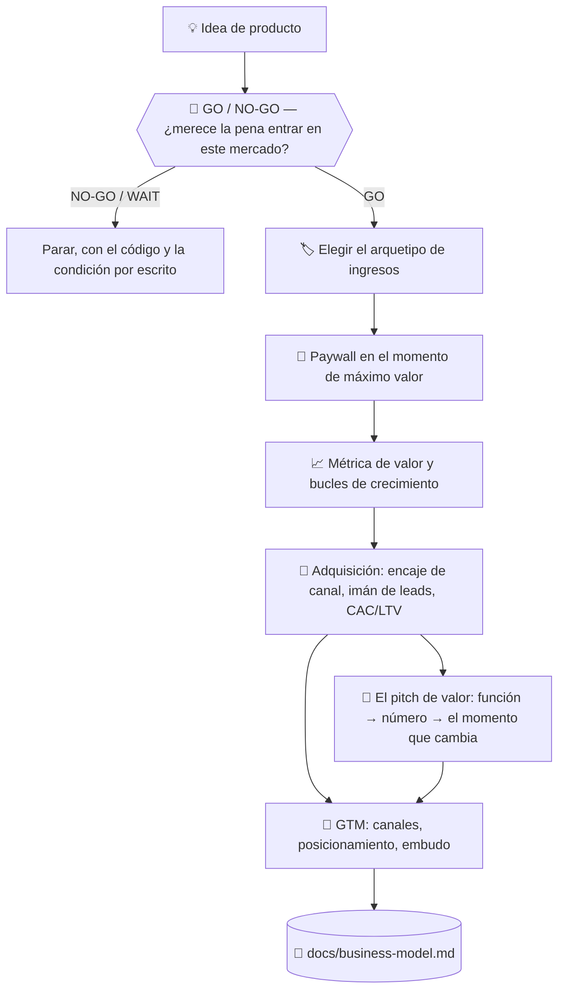

# 💰 superforge-biz

[](https://opensource.org/licenses/MIT)
[](https://claude.com/claude-code)
[](https://github.com/takaoumehara/superforge-skill)

[English](README.md) · [日本語](README.ja.md) · [简体中文](README.zh-CN.md) · **Español** · [한국어](README.ko.md)

> **Convierte una idea de producto en un negocio con precio, con puerta de pago y con un camino hasta los primeros clientes.**

---

## 🔰 ¿Qué es esto?

Quien abre una tienda decide tres cosas: qué puede tocar cualquiera, qué va detrás del mostrador y dónde se coloca ese mostrador. Demasiado cerca de la puerta y nadie mira; demasiado lejos y nadie paga.

Esta skill toma esas decisiones para software. Elige un arquetipo de monetización, coloca el paywall justo después de que el producto haya demostrado su valor y reduce a una sola la métrica que crece cuando el cliente obtiene más valor.

---

## 📐 Arquitectura



El arquetipo se deduce de la forma del producto, nunca al revés.

---

## ✨ 3 puntos clave

### 🚦 Una puerta antes de la página de precios
Antes de todo esto, una pregunta: ¿este mercado sostiene el negocio siquiera? El TAM se calcula **siempre en las dos direcciones**, de arriba abajo y de abajo arriba, porque un número calculado en un solo sentido no puede verse equivocado, y **la diferencia entre ambos es el hallazgo**. Cada dato lleva su nivel de confianza (medido / publicado / derivado / supuesto), y una conclusión apoyada en un supuesto se etiqueta como hipótesis en vez de presentarse como resultado.

Y luego el cálculo que de verdad decide: `ingresos necesarios ÷ (precio × retención) = clientes necesarios`, seguido de la única pregunta que importa: **¿puedes llegar realmente a esa cantidad de gente?** Un mercado de 10.000 millones da igual si tu plan necesita 10.000 clientes y tu único canal alcanza a 50. Termina en un código, nunca en prosa: `GO` / `GO/NARROW` / `NO-GO/TOO-SMALL` / `NO-GO/NO-PATH` / `NO-GO/LOCKED` / `WAIT` — y un `WAIT` lleva la frase que lo cambiaría.

### 🏷️ Cuatro arquetipos, uno elegido con motivo
Freemium con funciones bloqueadas, suscripción por niveles, cobro por uso o licencia B2B enterprise. El producto se evalúa contra los cuatro y uno se nombra motor principal, con el motivo escrito.

### 🚪 El paywall va donde hay entusiasmo, no en la entrada
La puerta se coloca justo después de que la persona haya generado un resultado real, con el beneficio expuesto antes que el precio y una prueba sin fricción antes del límite duro. Las rutas de bajada de plan y de recuperación también se diseñan, en vez de dejarlas al abandono.

### ⚖️ Persuasión con la línea ética trazada
El anclaje, la aversión a la pérdida y las opciones por defecto funcionan, y cada uno tiene un punto a partir del cual se convierte en un patrón oscuro. Dónde está ese punto no se deja al gusto: está escrito en la referencia.

### 💬 «Buena automatización» se convierte en un número, y luego en un momento
Todo argumento de valor se reduce a una de cuatro palancas — tiempo ahorrado, coste evitado, ingresos recuperados, riesgo reducido — cada una con una fórmula que convierte la función en *el número del propio cliente*, antes de mostrar el precio. «2 horas menos a la semana» por sí solo es una ficha técnica; junto con «ya no tiene que quedarse hasta tarde los viernes» se convierte en un motivo para comprar.

### 📏 Tácticas para las que eres demasiado pequeño, dichas como tal
Un test A/B con 200 sesiones al mes no rinde poco: **no devuelve ningún resultado interpretable**, tras semanas de espera. Igual con campañas de recuperación con 12 bajas, o con publicidad de pago antes de conocer la tasa de conversión. Cada táctica lleva su escala mínima viable y qué hacer por debajo de ella, porque «a tu escala esto no funciona» forma parte del consejo, no es una forma de no darlo.

### 🎯 Llegar a los primeros clientes, no solo hacer crecer a los que ya hay
Encaje canal-mercado (una venta B2B enterprise y una app de consumo autoservicio necesitan canales completamente distintos), qué hace que un imán de leads convierta en vez de ser ignorado, la cualificación por ajuste × intención para que el número de leads deje de ser una métrica de vanidad, y las cuentas rápidas de CAC/LTV que detectan un canal que pierde dinero antes de escalarlo.

---

## 🔄 Antes / Después

| | Antes | Después |
|---|---|---|
| Precio | Un número que parecía razonable | Un arquetipo elegido entre cuatro |
| Posición del paywall | Donde era fácil de añadir | En el momento en que se prueba el valor |
| Crecimiento | «Ya haremos marketing luego» | Bucles y canales dentro del artefacto |
| Tácticas de persuasión | Copiadas de quien más convierte | Usadas con su límite ético declarado |
| El pitch | «Buena automatización, funciones potentes» | Un número (horas/€ ahorrados) más el momento concreto que cambia |
| Qué canal usar | El que esté de moda | Ajustado al precio y al ciclo de venta, probando uno antes de añadir otro |
| Número de leads | Los que sea que llegaron | Separados por ajuste × intención, con el CAC comprobado contra el LTV |

---

## 🚀 Instalación y uso

### 🖥️ Instala las trece skills (una sola vez)

Clona el repositorio y ejecuta el instalador. Enlaza las trece skills en todos los directorios de skills de tu máquina (Claude Code, Codex CLI, Gemini CLI, Antigravity).

```bash
git clone https://github.com/takaoumehara/superforge-skill
cd superforge-skill
./install.sh
```

Todas las opciones, la instalación de una sola skill y la ruta de subida a claude.ai están en el [README de la suite](../../README.es.md).

### ⌨️ Invócala

```
/superforge-biz
```

Si existen `docs/product-idea.md` y `docs/brief.md`, los lee antes de empezar.

---

## 📄 Licencia

MIT — consulta [LICENSE](../../LICENSE). El cuerpo de la skill está en [SKILL.md](SKILL.md); la puerta GO/NO-GO, el cálculo del TAM en ambas direcciones, los niveles de confianza y las etapas de madurez están en [references/market-sizing.md](references/market-sizing.md); el anclaje, la aversión a la pérdida, las opciones por defecto y su línea ética están en [references/behavioral-frameworks.md](references/behavioral-frameworks.md); el encaje canal-mercado, los imanes de leads, la cualificación y las cuentas de CAC/LTV están en [references/customer-acquisition.md](references/customer-acquisition.md); las cuatro palancas de valor y la fórmula del pitch lógica-luego-emoción están en [references/value-pitch.md](references/value-pitch.md). Visión general de la suite: [superforge-skill](../../README.es.md).
