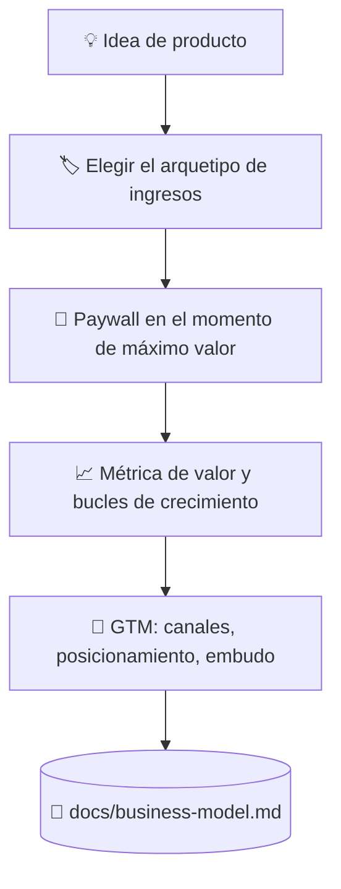

# 💰 superforge-biz

[](https://opensource.org/licenses/MIT)
[](https://claude.com/claude-code)
[](https://github.com/takaoumehara/superforge-skill)

[English](README.md) · [日本語](README.ja.md) · [简体中文](README.zh-CN.md) · **Español** · [한국어](README.ko.md)

> **Convierte una idea de producto en un negocio con precio, con puerta de pago y con un camino hasta los primeros clientes.**

---

## 🔰 ¿Qué es esto?

Quien abre una tienda decide tres cosas: qué puede tocar cualquiera, qué va detrás del mostrador y dónde se coloca ese mostrador. Demasiado cerca de la puerta y nadie mira; demasiado lejos y nadie paga.

Esta skill toma esas decisiones para software. Elige un arquetipo de monetización, coloca el paywall justo después de que el producto haya demostrado su valor y reduce a una sola la métrica que crece cuando el cliente obtiene más valor.

---

## 📐 Arquitectura



El arquetipo se deduce de la forma del producto, nunca al revés.

---

## ✨ 3 puntos clave

### 🏷️ Cuatro arquetipos, uno elegido con motivo
Freemium con funciones bloqueadas, suscripción por niveles, cobro por uso o licencia B2B enterprise. El producto se evalúa contra los cuatro y uno se nombra motor principal, con el motivo escrito.

### 🚪 El paywall va donde hay entusiasmo, no en la entrada
La puerta se coloca justo después de que la persona haya generado un resultado real, con el beneficio expuesto antes que el precio y una prueba sin fricción antes del límite duro. Las rutas de bajada de plan y de recuperación también se diseñan, en vez de dejarlas al abandono.

### ⚖️ Persuasión con la línea ética trazada
El anclaje, la aversión a la pérdida y las opciones por defecto funcionan, y cada uno tiene un punto a partir del cual se convierte en un patrón oscuro. Dónde está ese punto no se deja al gusto: está escrito en la referencia.

---

## 🔄 Antes / Después

| | Antes | Después |
|---|---|---|
| Precio | Un número que parecía razonable | Un arquetipo elegido entre cuatro |
| Posición del paywall | Donde era fácil de añadir | En el momento en que se prueba el valor |
| Crecimiento | «Ya haremos marketing luego» | Bucles y canales dentro del artefacto |
| Tácticas de persuasión | Copiadas de quien más convierte | Usadas con su límite ético declarado |

---

## 🚀 Instalación y uso

### 🖥️ Instala las doce skills (una sola vez)

Clona el repositorio y ejecuta el instalador. Enlaza las doce skills en todos los directorios de skills de tu máquina (Claude Code, Codex CLI, Gemini CLI, Antigravity).

```bash
git clone https://github.com/takaoumehara/superforge-skill
cd superforge-skill
./install.sh
```

Todas las opciones, la instalación de una sola skill y la ruta de subida a claude.ai están en el [README de la suite](../../README.es.md).

### ⌨️ Invócala

```
/superforge-biz
```

Si existen `docs/product-idea.md` y `docs/brief.md`, los lee antes de empezar.

---

## 📄 Licencia

MIT — consulta [LICENSE](../../LICENSE). El cuerpo de la skill está en [SKILL.md](SKILL.md); el anclaje, la aversión a la pérdida, las opciones por defecto y su línea ética están en [references/behavioral-frameworks.md](references/behavioral-frameworks.md). Visión general de la suite: [superforge-skill](../../README.es.md).
