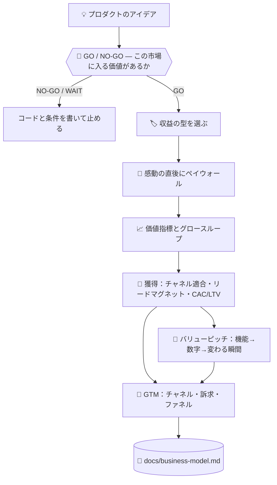

# 💰 superforge-biz

[](https://opensource.org/licenses/MIT)
[](https://claude.com/claude-code)
[](https://github.com/takaoumehara/superforge-skill)

[English](README.md) · **日本語** · [简体中文](README.zh-CN.md) · [Español](README.es.md) · [한국어](README.ko.md)

> **プロダクトのアイデアを、価格と課金の境界と最初の顧客への届け方を持つ「事業」に変える。**

---

## 🔰 これは何？

店を開く人は3つ決めなければなりません。無料で触っていいものは何か、カウンターの向こうに置くものは何か、そしてカウンターをどこに立てるか。入口に近すぎれば誰も見て回らず、遠すぎれば誰も払いません。

このスキルはそれをソフトウェアで決めます。マネタイズの型を選び、プロダクトが価値を証明した直後にペイウォールを置き、顧客の価値が増えるにつれて伸びる指標を1つに絞ります。

---

## 📐 システム概念図



型はプロダクトの形から導きます。逆順にはしません。

---

## ✨ 3つの強み

### 🚦 価格表の前に、ゲートを1枚
その前にひとつ。この市場は、そもそもこの事業を支えられるのか。TAM は**必ず両方向から**計算します——トップダウンとボトムアップ。1方向だけの数字は「間違っていることが目に見えない」からで、**2つの乖離こそが発見**です。すべての入力に確度（実測／報告／導出／仮定）を付け、仮定の上に立つ結論は「結果」ではなく「仮説」と明記します。

そして実際に判断を決めるのはこの式です：`必要な年間売上 ÷ (価格 × 継続率) = 必要な顧客数`。続けて問うのは1つだけ——**その人数に、現実的に届くのか**。1兆円の市場も、計画が1万人を必要としていて、届くチャネルが50人分しかないなら無意味です。出力は文章ではなくコード：`GO` / `GO/NARROW` / `NO-GO/TOO-SMALL` / `NO-GO/NO-PATH` / `NO-GO/LOCKED` / `WAIT`。`WAIT` には、それを覆す条件が1文で付きます。

### 🏷️ 4つの型から、理由を書いて1つ選ぶ
機能ゲート型フリーミアム、階層型サブスク、従量課金、B2Bエンタープライズ。4つすべてに当てて評価し、主軸となる1つを理由とともに明記します。

### 🚪 ペイウォールは入口ではなく「感動の直後」に置く
ユーザーが実際に成果物を1つ作れた直後にゲートを置き、価格より先に得られる価値を示し、ハードな上限の前に摩擦ゼロのトライアルを挟みます。ダウングレードと復帰の導線も、解約任せにせず設計します。

### ⚖️ 説得の技法には倫理的な線を引く
アンカリング、損失回避、デフォルト設定は確かに効きます。そして、それぞれに「ここを越えるとダークパターン」という地点があります。その線がどこかは好みに委ねず、リファレンスに書き出してあります。

### 💬 「良いオートメーション」を、数字に、そして瞬間に変える
あらゆる価値の主張は4つのレバー——時間削減・コスト回避・売上獲得・リスク低減——のどれかに帰着し、それぞれに「機能を顧客自身の数字に変換する式」があります。価格を見せる前に、まず数字。「週2時間の削減」だけでは仕様書ですが、「金曜の夕方に残業しなくて良くなる」という具体的な瞬間とセットになって初めて買う理由になります。

### 📏 「その規模では効かない施策」を、正直にそう言う
月200セッションでの A/B テストは、成績が悪いのではありません。**判定可能な結果が1つも出ない**まま数週間が過ぎるのです。解約者12人へのウィンバックも、転換率が分かる前の広告出稿も同じ。すべての施策に最低規模の目安と、それを下回るときに代わりにやることが付いています。「その規模ではこれは効きません」と言うことは、助言の放棄ではなく助言の一部だからです。

### 🎯 既存顧客を伸ばすだけでなく、最初の顧客に届く
チャネル適合（B2Bエンタープライズとセルフサーブの消費者アプリでは、必要なチャネルがまったく違います）、無視されずに変換されるリードマグネットの作り方、リード件数が虚栄の指標にならないための適合度×熱意の選別、そしてチャネルが知らぬ間に赤字化するのを防ぐ CAC/LTV の概算。

---

## 🔄 導入前 / 導入後

| | 導入前 | 導入後 |
|---|---|---|
| 価格 | なんとなく妥当そうな数字 | 4つの型と比べて選んだ型 |
| ペイウォールの位置 | 実装しやすい場所 | 価値が証明された瞬間 |
| グロース | 「集客は後で考える」 | ループとチャネルを成果物に明記 |
| 説得の技法 | 成功事例の見よう見まね | 倫理的な限界とセットで使う |
| ピッチ | 「良いオートメーション、強力な機能」 | 数字（時間・円）＋変わる具体的な瞬間 |
| 使うチャネル | 今年流行っているもの | 価格帯と商談期間に合わせ、1つ実証してから次へ |
| リード件数 | 集まった件数そのまま | 適合度×熱意で分け、CAC を LTV と照合 |

---

## 🚀 インストールと使い方

### 🖥️ 12個まとめて入れる（最初の1回だけ）

クローンしてインストーラを走らせるだけです。マシンの中にあるスキル用フォルダを全部探して、13個をまとめてリンクします（Claude Code / Codex CLI / Gemini CLI / Antigravity）。

```bash
git clone https://github.com/takaoumehara/superforge-skill
cd superforge-skill
./install.sh
```

オプション、1個だけ入れる方法、claude.ai へのアップロード手順は [スイート全体の README](../../README.ja.md) にあります。

### ⌨️ 呼び出す

```
/superforge-biz
```

`docs/product-idea.md` と `docs/brief.md` があれば、まずそれを読みます。

---

## 📄 ライセンス

MIT — [LICENSE](../../LICENSE) を参照してください。スキル本体は [SKILL.md](SKILL.md)、GO/NO-GO ゲート・両方向のTAM計算・数値の確度・成熟度判定は [references/market-sizing.md](references/market-sizing.md)、アンカリング・損失回避・デフォルト設定と、それぞれの倫理的な線は [references/behavioral-frameworks.md](references/behavioral-frameworks.md)、チャネル適合・リードマグネット・選別・CAC/LTV の計算は [references/customer-acquisition.md](references/customer-acquisition.md)、4つの価値レバーと論理→感情のピッチの型は [references/value-pitch.md](references/value-pitch.md) にあります。スイート全体の説明は [superforge-skill](../../README.ja.md) へ。
