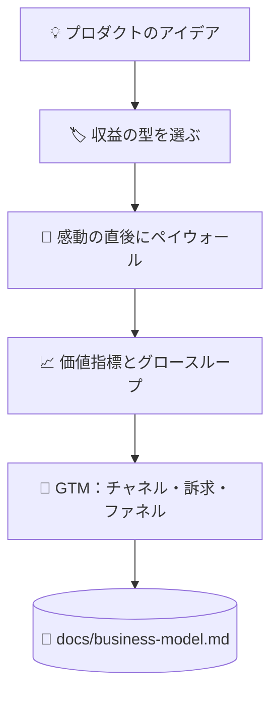

# 💰 superforge-biz

[](https://opensource.org/licenses/MIT)
[](https://claude.com/claude-code)
[](https://github.com/takaoumehara/superforge-skill)

[English](README.md) · **日本語** · [简体中文](README.zh-CN.md) · [Español](README.es.md) · [한국어](README.ko.md)

> **プロダクトのアイデアを、価格と課金の境界と最初の顧客への届け方を持つ「事業」に変える。**

---

## 🔰 これは何？

店を開く人は3つ決めなければなりません。無料で触っていいものは何か、カウンターの向こうに置くものは何か、そしてカウンターをどこに立てるか。入口に近すぎれば誰も見て回らず、遠すぎれば誰も払いません。

このスキルはそれをソフトウェアで決めます。マネタイズの型を選び、プロダクトが価値を証明した直後にペイウォールを置き、顧客の価値が増えるにつれて伸びる指標を1つに絞ります。

---

## 📐 システム概念図



型はプロダクトの形から導きます。逆順にはしません。

---

## ✨ 3つの強み

### 🏷️ 4つの型から、理由を書いて1つ選ぶ
機能ゲート型フリーミアム、階層型サブスク、従量課金、B2Bエンタープライズ。4つすべてに当てて評価し、主軸となる1つを理由とともに明記します。

### 🚪 ペイウォールは入口ではなく「感動の直後」に置く
ユーザーが実際に成果物を1つ作れた直後にゲートを置き、価格より先に得られる価値を示し、ハードな上限の前に摩擦ゼロのトライアルを挟みます。ダウングレードと復帰の導線も、解約任せにせず設計します。

### ⚖️ 説得の技法には倫理的な線を引く
アンカリング、損失回避、デフォルト設定は確かに効きます。そして、それぞれに「ここを越えるとダークパターン」という地点があります。その線がどこかは好みに委ねず、リファレンスに書き出してあります。

---

## 🔄 導入前 / 導入後

| | 導入前 | 導入後 |
|---|---|---|
| 価格 | なんとなく妥当そうな数字 | 4つの型と比べて選んだ型 |
| ペイウォールの位置 | 実装しやすい場所 | 価値が証明された瞬間 |
| グロース | 「集客は後で考える」 | ループとチャネルを成果物に明記 |
| 説得の技法 | 成功事例の見よう見まね | 倫理的な限界とセットで使う |

---

## 🚀 インストールと使い方

必要なのは `git` と、ディレクトリからスキルを読み込む AI ツールだけです。

### 🖥️ Claude Code（CLI）

好きな場所にスイート全体をクローンし、このスキルだけをリンクします。

```bash
git clone https://github.com/takaoumehara/superforge-skill ~/src/superforge-skill
ln -s ~/src/superforge-skill/skills/superforge-biz ~/.claude/skills/superforge-biz
```

Claude Code を再起動して呼び出します。

```
/superforge-biz
```

`docs/product-idea.md` と `docs/brief.md` があれば、まずそれを読みます。

### 🔗 Codex CLI / Gemini CLI / Antigravity

リンク先のディレクトリを変えるだけです。インストーラーに任せれば、このマシンにあるスキルディレクトリをすべて探して11個を一括でリンクします。

```bash
cd ~/src/superforge-skill
./install.sh
```

何度実行しても結果は同じで、自分が作ったシンボリックリンク以外には触れません。`--dry-run` で確認、`--uninstall` で削除できます。

### 🌐 claude.ai（ブラウザ）

このスキルのフォルダを zip にまとめ、アカウントのスキル設定からアップロードします。

```bash
cd ~/src/superforge-skill/skills/superforge-biz
zip -r superforge-biz.zip .
```

ブラウザ版は一度に1スキルずつなので、入れたい数だけ繰り返してください。

---

## 📄 ライセンス

MIT — [LICENSE](../../LICENSE) を参照してください。スキル本体は [SKILL.md](SKILL.md)、アンカリング・損失回避・デフォルト設定と、それぞれの倫理的な線は [references/behavioral-frameworks.md](references/behavioral-frameworks.md) にあります。スイート全体の説明は [superforge-skill](../../README.ja.md) へ。
