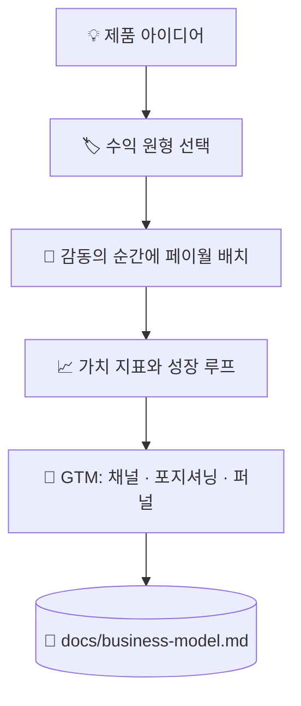

# 💰 superforge-biz

[](https://opensource.org/licenses/MIT)
[](https://claude.com/claude-code)
[](https://github.com/takaoumehara/superforge-skill)

[English](README.md) · [日本語](README.ja.md) · [简体中文](README.zh-CN.md) · [Español](README.es.md) · **한국어**

> **제품 아이디어를 가격과 결제 경계, 그리고 첫 고객에게 닿는 경로를 갖춘 사업으로 바꿉니다.**

---

## 🔰 이게 뭔가요?

가게를 여는 사람은 세 가지를 정해야 합니다. 무엇을 마음껏 만져 보게 할지, 무엇을 카운터 뒤에 둘지, 그리고 카운터를 어디에 세울지. 입구에 너무 가까우면 아무도 둘러보지 않고, 너무 멀면 아무도 지갑을 열지 않습니다.

이 스킬은 그 결정을 소프트웨어에서 내립니다. 수익화 원형을 고르고, 제품이 막 가치를 증명한 순간에 페이월을 놓고, 고객이 더 큰 가치를 얻을수록 함께 커지는 지표를 하나로 좁힙니다.

---

## 📐 시스템 구조



원형은 제품의 형태에서 도출합니다. 반대 순서로는 하지 않습니다.

---

## ✨ 3가지 강점

### 🏷️ 네 가지 원형 중 이유를 적고 하나를 고릅니다
기능 잠금형 프리미엄, 계층형 구독, 사용량 과금, B2B 엔터프라이즈 라이선스. 제품을 네 가지 모두에 대어 평가한 뒤 주된 동력 하나를 이유와 함께 명시합니다.

### 🚪 페이월은 입구가 아니라 감동 직후에 둡니다
사용자가 실제 결과물을 하나 만들어 낸 직후에 문턱을 세우고, 가격보다 먼저 얻는 가치를 보여 주며, 하드 리밋 앞에 마찰 없는 체험을 끼웁니다. 다운그레이드와 복귀 경로도 이탈에 맡기지 않고 함께 설계합니다.

### ⚖️ 설득 기법에는 윤리적 선을 긋습니다
앵커링, 손실 회피, 기본값은 분명히 효과가 있고, 각각에는 넘는 순간 다크 패턴이 되는 지점이 있습니다. 그 선이 어디인지는 취향에 맡기지 않고 참고 문서에 적어 두었습니다.

---

## 🔄 도입 전 / 도입 후

| | 도입 전 | 도입 후 |
|---|---|---|
| 가격 | 그럴듯해 보이는 숫자 | 네 가지 원형과 견줘 고른 모델 |
| 페이월 위치 | 붙이기 쉬운 자리 | 가치가 증명된 순간 |
| 성장 | "마케팅은 나중에" | 루프와 채널을 산출물에 명시 |
| 설득 기법 | 전환율 높은 곳을 그대로 모방 | 윤리적 한계와 함께 사용 |

---

## 🚀 설치 및 사용법

### 🖥️ 열한 개를 한 번에 설치 (처음 한 번만)

저장소를 클론하고 설치 스크립트를 실행하면 됩니다. 이 머신의 모든 스킬 디렉터리를 찾아 열한 개를 한 번에 링크합니다(Claude Code / Codex CLI / Gemini CLI / Antigravity).

```bash
git clone https://github.com/takaoumehara/superforge-skill
cd superforge-skill
./install.sh
```

옵션 전체와 스킬 하나만 설치하는 방법, claude.ai 업로드 절차는 [스위트 README](../../README.ko.md)에 있습니다.

### ⌨️ 호출하기

```
/superforge-biz
```

`docs/product-idea.md`와 `docs/brief.md`가 있으면 먼저 읽습니다.

---

## 📄 라이선스

MIT — [LICENSE](../../LICENSE)를 참고하세요. 스킬 본문은 [SKILL.md](SKILL.md)에 있고, 앵커링·손실 회피·기본값과 각각의 윤리적 선은 [references/behavioral-frameworks.md](references/behavioral-frameworks.md)에 있습니다. 스위트 전체 소개는 [superforge-skill](../../README.ko.md)을 보세요.
