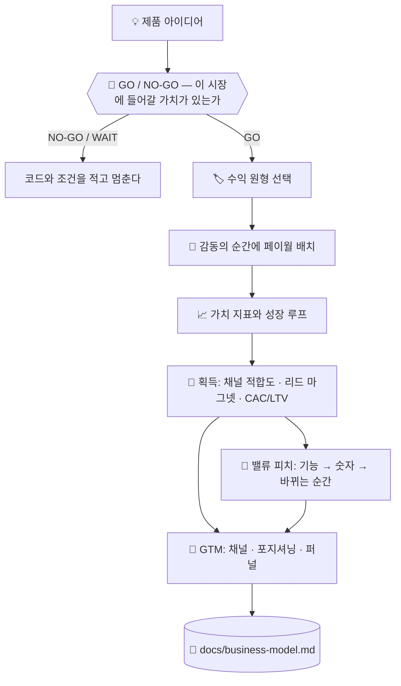

# 💰 superforge-biz

[](https://opensource.org/licenses/MIT)
[](https://claude.com/claude-code)
[](https://github.com/takaoumehara/superforge-skill)

[English](README.md) · [日本語](README.ja.md) · [简体中文](README.zh-CN.md) · [Español](README.es.md) · **한국어**

> **제품 아이디어를 가격과 결제 경계, 그리고 첫 고객에게 닿는 경로를 갖춘 사업으로 바꿉니다.**

---

## 🔰 이게 뭔가요?

가게를 여는 사람은 세 가지를 정해야 합니다. 무엇을 마음껏 만져 보게 할지, 무엇을 카운터 뒤에 둘지, 그리고 카운터를 어디에 세울지. 입구에 너무 가까우면 아무도 둘러보지 않고, 너무 멀면 아무도 지갑을 열지 않습니다.

이 스킬은 그 결정을 소프트웨어에서 내립니다. 수익화 원형을 고르고, 제품이 막 가치를 증명한 순간에 페이월을 놓고, 고객이 더 큰 가치를 얻을수록 함께 커지는 지표를 하나로 좁힙니다.

---

## 📐 시스템 구조



원형은 제품의 형태에서 도출합니다. 반대 순서로는 하지 않습니다.

---

## ✨ 강점

### ⏳ 파는 것이 시간이라면, 천장은 산수로 나온다
제품의 천장은 시장이지만, 서비스업의 천장은 투입 가능 시간 × 단가 × 가동률이고 체감보다 낮다. 그리고 실제 산출물은 범위를 적은 그 한 문장이다 — 산출물, 수정 횟수, 포함되지 않는 것, **그리고 끝나는 조건**. 끝이 정의되지 않은 프로젝트는 끝나지 않기 때문이다. 손실의 최대 원인은 싸게 판 것이 아니라 범위 확장이고, 매출의 50%를 넘는 한 곳은 고객이 아니라 고용주다.

### 🚦 가격표 앞에 관문 하나
그 전에 하나. 이 시장이 애초에 이 사업을 지탱하는가? TAM은 **반드시 양방향으로** 계산합니다 — 톱다운과 보텀업. 한 방향으로만 낸 숫자는 「틀려도 눈에 보이지 않기」 때문이고, **둘의 차이 자체가 발견**입니다. 모든 입력에 신뢰 등급(실측／보도／도출／가정)을 붙이고, 가정 위에 선 결론은 결과가 아니라 가설로 표시합니다.

그리고 실제로 판단을 가르는 건 이 식입니다: `필요한 연매출 ÷ (가격 × 유지율) = 필요한 고객 수`. 이어서 묻는 건 하나뿐 — **그 인원에 현실적으로 닿을 수 있는가**. 10조 원 시장도, 계획이 1만 명을 요구하는데 유일한 채널이 50명에게만 닿는다면 무의미합니다. 결과는 서술문이 아니라 코드입니다: `GO` / `GO/NARROW` / `NO-GO/TOO-SMALL` / `NO-GO/NO-PATH` / `NO-GO/LOCKED` / `WAIT`. `WAIT`에는 그것을 뒤집을 조건이 한 문장 붙습니다.

### 🏷️ 네 가지 원형 중 이유를 적고 하나를 고릅니다
기능 잠금형 프리미엄, 계층형 구독, 사용량 과금, B2B 엔터프라이즈 라이선스. 제품을 네 가지 모두에 대어 평가한 뒤 주된 동력 하나를 이유와 함께 명시합니다.

### 🚪 페이월은 입구가 아니라 감동 직후에 둡니다
사용자가 실제 결과물을 하나 만들어 낸 직후에 문턱을 세우고, 가격보다 먼저 얻는 가치를 보여 주며, 하드 리밋 앞에 마찰 없는 체험을 끼웁니다. 다운그레이드와 복귀 경로도 이탈에 맡기지 않고 함께 설계합니다.

### ⚖️ 설득 기법에는 윤리적 선을 긋습니다
앵커링, 손실 회피, 기본값은 분명히 효과가 있고, 각각에는 넘는 순간 다크 패턴이 되는 지점이 있습니다. 그 선이 어디인지는 취향에 맡기지 않고 참고 문서에 적어 두었습니다.

### 💬 "좋은 자동화"를 숫자로, 그다음 순간으로 바꿉니다
모든 가치 주장은 네 가지 레버 — 시간 절감, 비용 회피, 매출 회수, 리스크 감소 — 중 하나로 환원되고, 각각에는 기능을 **고객 자신의 숫자**로 바꾸는 공식이 있습니다. 가격을 보여주기 전에 숫자가 먼저입니다. "주 2시간 절감"만으로는 스펙 시트지만, "금요일 저녁에 야근하지 않아도 된다"는 구체적인 순간과 짝을 이루면 비로소 살 이유가 됩니다.

### 📏 「그 규모에선 안 먹히는 전술」을 솔직히 그렇게 말합니다
월 200세션에서의 A/B 테스트는 성적이 나쁜 게 아닙니다. **해석 가능한 결과가 하나도 안 나온 채** 몇 주가 흘러갑니다. 이탈자 12명 대상 윈백도, 전환율을 모르는 상태의 유료 광고도 마찬가지입니다. 모든 전술에 최소 가용 규모와, 그 아래에서 대신 할 일이 붙어 있습니다. 「지금 규모에선 이건 안 먹힙니다」라고 말하는 것은 조언의 포기가 아니라 조언의 일부이기 때문입니다.

### 🎯 기존 고객만 키우는 게 아니라 첫 고객에게 닿습니다
채널 적합도(B2B 엔터프라이즈 영업과 셀프서브 소비자 앱은 완전히 다른 채널이 필요합니다), 무시당하지 않고 전환되는 리드 마그넷을 만드는 법, 리드 수가 허영 지표가 되지 않도록 적합도×의도로 선별하기, 그리고 채널이 조용히 손해를 보기 전에 잡아내는 CAC/LTV 개략 계산.

---

## 🔄 도입 전 / 도입 후

| | 도입 전 | 도입 후 |
|---|---|---|
| 가격 | 그럴듯해 보이는 숫자 | 네 가지 원형과 견줘 고른 모델 |
| 페이월 위치 | 붙이기 쉬운 자리 | 가치가 증명된 순간 |
| 성장 | "마케팅은 나중에" | 루프와 채널을 산출물에 명시 |
| 설득 기법 | 전환율 높은 곳을 그대로 모방 | 윤리적 한계와 함께 사용 |
| 피치 | "좋은 자동화, 강력한 기능" | 숫자(시간/원) + 바뀌는 구체적인 순간 |
| 쓰는 채널 | 올해 유행하는 것 | 가격대와 영업 주기에 맞춰, 하나 검증 후 다음으로 |
| 리드 수 | 모인 만큼 그대로 | 적합도×의도로 나누고, CAC를 LTV와 대조 |

---

## 🚀 설치 및 사용법

### 🖥️ 열네 개를 한 번에 설치 (처음 한 번만)

저장소를 클론하고 설치 스크립트를 실행하면 됩니다. 이 머신의 모든 스킬 디렉터리를 찾아 열네 개를 한 번에 링크합니다(Claude Code / Codex CLI / Gemini CLI / Antigravity).

```bash
git clone https://github.com/takaoumehara/superforge-skill
cd superforge-skill
./install.sh
```

옵션 전체와 스킬 하나만 설치하는 방법, claude.ai 업로드 절차는 [스위트 README](../../README.ko.md)에 있습니다.

### ⌨️ 호출하기

```
/superforge-biz
```

`docs/product-idea.md`와 `docs/brief.md`가 있으면 먼저 읽습니다.

---

## 📄 라이선스

MIT — [LICENSE](../../LICENSE)를 참고하세요. 스킬 본문은 [SKILL.md](SKILL.md)에 있고, GO/NO-GO 관문·양방향 TAM 계산·수치 신뢰 등급·성숙도 판정은 [references/market-sizing.md](references/market-sizing.md)에, 앵커링·손실 회피·기본값과 각각의 윤리적 선은 [references/behavioral-frameworks.md](references/behavioral-frameworks.md)에, 채널 적합도·리드 마그넷·선별·CAC/LTV 계산은 [references/customer-acquisition.md](references/customer-acquisition.md)에, 네 가지 가치 레버와 논리→감정 피치 공식은 [references/value-pitch.md](references/value-pitch.md)에 있습니다. 스위트 전체 소개는 [superforge-skill](../../README.ko.md)을 보세요.
