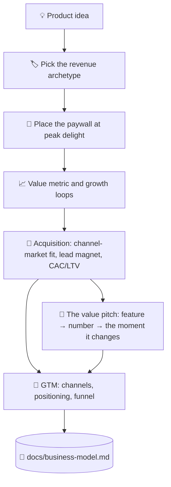

# 💰 superforge-biz

[](https://opensource.org/licenses/MIT)
[](https://claude.com/claude-code)
[](https://github.com/takaoumehara/superforge-skill)

**English** · [日本語](README.ja.md) · [简体中文](README.zh-CN.md) · [Español](README.es.md) · [한국어](README.ko.md)

> **Turn a product idea into a business with a price, a gate, and a way to reach the first customers.**

---

## 🔰 What is this?

A shop owner has to decide three things: what visitors may touch for free, what sits behind the counter, and where the counter stands. Put it too close to the door and nobody browses; put it too far and nobody pays.

This skill makes those decisions for software. It picks a monetization archetype, places the paywall at the moment the product has just proved its worth, and works out which single metric grows as the customer gets more value.

---

## 📐 Architecture



The archetype follows from the shape of the product, never the other way round.

---

## ✨ Features

### 🏷️ Four archetypes, one chosen on purpose
Freemium with feature gates, tiered subscription, usage-based metering, or B2B enterprise licensing. The product is evaluated against all four and one is named the primary driver, with the reason written down.

### 🚪 Paywalls placed at delight, not at the door
The gate goes right after the user has generated a real result, with the ROI stated before the price and a zero-friction trial ahead of the hard limit. Downgrade and win-back paths are specified too, not left to churn.

### ⚖️ Persuasion with the ethical line drawn
Anchoring, loss aversion, and defaults work — and each one has a point past which it becomes a dark pattern. Where that line sits for every mechanism is written out in the reference, not left to taste.

### 💬 "Good automation" becomes a number, then a moment
Every value claim reduces to one of four levers — time saved, cost avoided, revenue captured, risk reduced — each with a formula that turns the feature into *the customer's own number* before the price is shown. The number comes first, then the one specific person or moment it changes: "週2時間の削減" on its own is a spec; paired with "金曜の夕方に残業しなくて良くなる" it's a reason to buy.

### 🎯 Getting to the first customers, not just growing the existing ones
Channel-market fit (a B2B enterprise sale and a self-serve consumer app need entirely different channels), what makes a lead magnet convert instead of being ignored, fit×intent qualification so a lead count stops being a vanity metric, and the back-of-envelope CAC/LTV math that catches a channel quietly losing money before it scales.

---

## 🔄 Before / After

| | Before | After |
|---|---|---|
| Pricing | A number that felt right | An archetype chosen against four |
| Paywall position | Wherever it was easy to add | At the moment value is proven |
| Growth | "We'll do marketing later" | Loops and channels in the artifact |
| Persuasion tactics | Copied from whoever converts | Used with the ethical limit stated |
| The pitch | "Good automation, powerful features" | A number (hours/¥ saved) plus the specific moment it changes |
| Which channel to use | Whatever's popular this year | Matched to price point and sales cycle, one proven before adding a second |
| Lead count | However many filled the form | Split by fit × intent, with CAC checked against LTV |

---

## 🚀 Install & Usage

### 🖥️ Install all twelve skills (once)

Clone the repository and run the installer. It links every skill into every skills directory it finds on this machine — Claude Code, Codex CLI, Gemini CLI, Antigravity.

```bash
git clone https://github.com/takaoumehara/superforge-skill
cd superforge-skill
./install.sh
```

Full options, single-skill installs, and the claude.ai upload route are in the [suite README](../../README.md).

### ⌨️ Call it

```
/superforge-biz
```

It reads `docs/product-idea.md` and `docs/brief.md` first when they exist.

---

## 📄 License

MIT — see [LICENSE](../../LICENSE). The full skill body is in [SKILL.md](SKILL.md); anchoring, loss aversion, defaults, and the ethical line on each are in [references/behavioral-frameworks.md](references/behavioral-frameworks.md); channel-market fit, lead magnets, qualification, and CAC/LTV math are in [references/customer-acquisition.md](references/customer-acquisition.md); the four value levers and the logic-then-emotion pitch formula are in [references/value-pitch.md](references/value-pitch.md). Suite overview: [superforge-skill](../../README.md).
