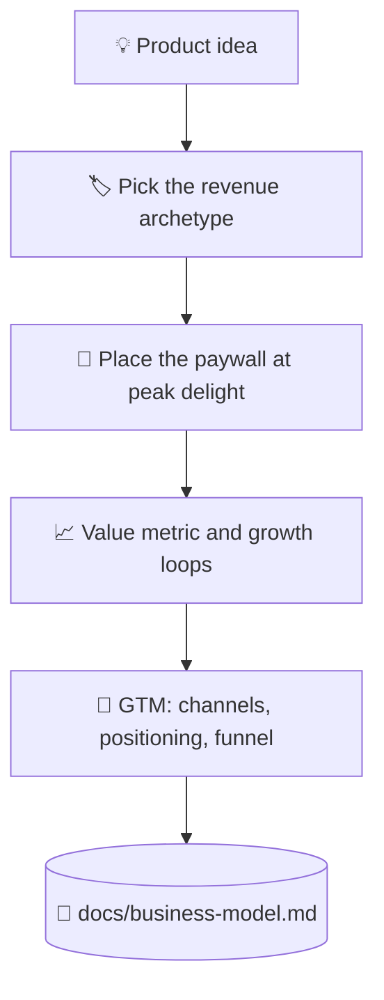

# 💰 superforge-biz

[](https://opensource.org/licenses/MIT)
[](https://claude.com/claude-code)
[](https://github.com/takaoumehara/superforge-skill)

**English** · [日本語](README.ja.md) · [简体中文](README.zh-CN.md) · [Español](README.es.md) · [한국어](README.ko.md)

> **Turn a product idea into a business with a price, a gate, and a way to reach the first customers.**

---

## 🔰 What is this?

A shop owner has to decide three things: what visitors may touch for free, what sits behind the counter, and where the counter stands. Put it too close to the door and nobody browses; put it too far and nobody pays.

This skill makes those decisions for software. It picks a monetization archetype, places the paywall at the moment the product has just proved its worth, and works out which single metric grows as the customer gets more value.

---

## 📐 Architecture



The archetype follows from the shape of the product, never the other way round.

---

## ✨ Features

### 🏷️ Four archetypes, one chosen on purpose
Freemium with feature gates, tiered subscription, usage-based metering, or B2B enterprise licensing. The product is evaluated against all four and one is named the primary driver, with the reason written down.

### 🚪 Paywalls placed at delight, not at the door
The gate goes right after the user has generated a real result, with the ROI stated before the price and a zero-friction trial ahead of the hard limit. Downgrade and win-back paths are specified too, not left to churn.

### ⚖️ Persuasion with the ethical line drawn
Anchoring, loss aversion, and defaults work — and each one has a point past which it becomes a dark pattern. Where that line sits for every mechanism is written out in the reference, not left to taste.

---

## 🔄 Before / After

| | Before | After |
|---|---|---|
| Pricing | A number that felt right | An archetype chosen against four |
| Paywall position | Wherever it was easy to add | At the moment value is proven |
| Growth | "We'll do marketing later" | Loops and channels in the artifact |
| Persuasion tactics | Copied from whoever converts | Used with the ethical limit stated |

---

## 🚀 Install & Usage

You need `git` and an AI tool that loads skills from a directory.

### 🖥️ Claude Code (CLI)

Clone the suite anywhere, then link this one skill:

```bash
git clone https://github.com/takaoumehara/superforge-skill ~/src/superforge-skill
ln -s ~/src/superforge-skill/skills/superforge-biz ~/.claude/skills/superforge-biz
```

Restart Claude Code, then invoke it:

```
/superforge-biz
```

It reads `docs/product-idea.md` and `docs/brief.md` first when they exist.

### 🔗 Codex CLI / Gemini CLI / Antigravity

The same link, a different directory. Or let the installer find every skills directory on this machine and link all eleven skills at once:

```bash
cd ~/src/superforge-skill
./install.sh
```

It is idempotent, touches only its own symlinks, and accepts `--dry-run` and `--uninstall`.

### 🌐 claude.ai (browser)

Zip this skill's folder and upload it in your account's skill settings:

```bash
cd ~/src/superforge-skill/skills/superforge-biz
zip -r superforge-biz.zip .
```

The browser UI takes one skill at a time, so repeat it for each skill you want.

---

## 📄 License

MIT — see [LICENSE](../../LICENSE). The full skill body is in [SKILL.md](SKILL.md); anchoring, loss aversion, defaults, and the ethical line on each are in [references/behavioral-frameworks.md](references/behavioral-frameworks.md). Suite overview: [superforge-skill](../../README.md).
