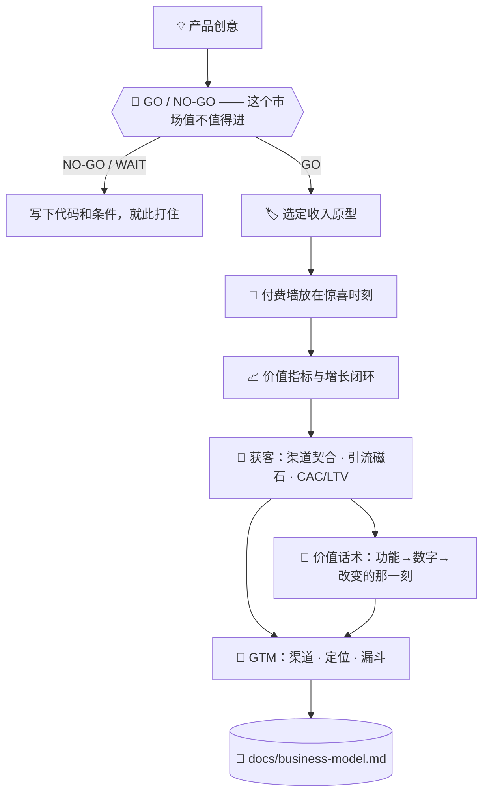

# 💰 superforge-biz

[](https://opensource.org/licenses/MIT)
[](https://claude.com/claude-code)
[](https://github.com/takaoumehara/superforge-skill)

[English](README.md) · [日本語](README.ja.md) · **简体中文** · [Español](README.es.md) · [한국어](README.ko.md)

> **把一个产品创意变成有定价、有付费边界、也有第一批客户获取路径的生意。**

---

## 🔰 这是什么？

开店的人要定三件事：哪些东西可以随便试，哪些放在柜台后面，以及柜台摆在哪里。柜台离门太近没人逛，离门太远没人掏钱。

这个技能就是替软件做这三个决定。它先选定商业模式原型，把付费墙放在产品刚刚证明了自己价值的那一刻，再把"客户价值越大就越增长"的那个指标收敛成一个。

---

## 📐 系统架构



原型由产品形态推导出来，绝不反过来。

---

## ✨ 亮点

### ⏳ 卖的是产能时，天花板是算出来的
产品的天花板是市场，服务业的天花板是 可投入工时 × 单价 × 稼动率，而且比感觉低。真正的交付物是写下范围的那句话——交付物、修改次数、不包含什么，**以及结束的条件**，因为没有定义结束的项目不会结束。最大的亏损来源不是报价低，而是范围蔓延；占营收超过 50% 的那一家不是客户，是雇主。

### 🚦 定价页之前，先过一道闸
在这一切之前先问一句：这个市场撑得起这门生意吗？TAM **必须双向计算**——自上而下和自下而上。单向算出来的数字「错了也看不出来」，而**两者的差距本身就是发现**。每个输入都带可信度分级（实测／引用／推导／假设），建立在假设之上的结论只能标为假说，不能当成结论汇报。

真正定生死的是这道式子：`所需年收入 ÷ (价格 × 留存率) = 需要多少客户`。接着只问一件事——**你现实中够得到那么多人吗？** 一个百亿美元的市场毫无意义，如果计划需要一万个客户，而你唯一的渠道只能触达五十个。输出是代码而不是说辞：`GO` / `GO/NARROW` / `NO-GO/TOO-SMALL` / `NO-GO/NO-PATH` / `NO-GO/LOCKED` / `WAIT`，其中 `WAIT` 必须附上一句能推翻它的条件。

### 🏷️ 四种原型里，带着理由选一种
功能门槛式 freemium、分层订阅、按用量计费、B2B 企业授权。产品会被逐一对照这四种评估，最终指定一个主驱动，并写下选它的理由。

### 🚪 付费墙放在惊喜处，而不是门口
门槛设在用户刚刚产出一个真实结果之后，价格之前先摆出收益，硬性上限之前先给零摩擦试用。降级和赢回路径也一并设计，而不是交给流失。

### ⚖️ 说服手法配一条伦理红线
锚定、损失厌恶、默认选项确实有效，而每一种都有一个"越过就是暗黑模式"的位置。红线画在哪里不靠感觉，而是写在参考文档里。

### 💬 把「很棒的自动化」变成数字，再变成一个瞬间
任何价值主张都能归到四个杠杆之一——省时间、免成本、抢回营收、降风险——每个都有一条把功能换算成**客户自己的数字**的公式，且要在报价之前说出口。「每周省2小时」单独看是规格书；配上「周五傍晚不用再加班了」这个具体瞬间，才变成购买的理由。

### 📏 规模不够的打法，直说规模不够
每月两百次会话还做 A/B 测试，不是效果差——是**等上几周也拿不到任何能解读的结果**。只有 12 个流失用户就做召回、转化率还没摸清就投广告，都是一样。每个打法都标了最低可行规模，以及低于它时该做什么。「你现在这个体量，这招不管用」是建议的一部分，不是不给建议。

### 🎯 不只是让老客户增长，更是够到第一批客户
渠道契合度（B2B 企业客户和自助式消费者应用需要完全不同的渠道）、能真正转化而不是被无视的引流磁石、按"匹配度×意向度"筛选让获客数不再是虚荣指标，以及在渠道悄悄亏钱之前发现问题的 CAC/LTV 粗算。

---

## 🔄 使用前 / 使用后

| | 使用前 | 使用后 |
|---|---|---|
| 定价 | 一个看着顺眼的数字 | 对照四种原型选出的模式 |
| 付费墙位置 | 哪里好加就加在哪 | 价值被证明的那一刻 |
| 增长 | "获客以后再说" | 闭环和渠道都写进产物 |
| 说服手法 | 照抄转化率高的同行 | 连同伦理边界一起使用 |
| 话术 | "很棒的自动化，强大的功能" | 一个数字（时间/金额）加上它改变的具体瞬间 |
| 用哪个渠道 | 今年流行什么用什么 | 按价位和决策周期匹配，先验证一个再加下一个 |
| 获客数量 | 收到多少算多少 | 按匹配度×意向度分层，CAC 对照 LTV 检查 |

---

## 🚀 安装与使用

### 🖥️ 一次装好全部 13 个技能（只需一次）

克隆仓库并运行安装脚本。它会找出本机所有技能目录，把 13 个技能一次性链接进去（Claude Code / Codex CLI / Gemini CLI / Antigravity）。

```bash
git clone https://github.com/takaoumehara/superforge-skill
cd superforge-skill
./install.sh
```

完整选项、只装单个技能的方法，以及 claude.ai 的上传步骤，都在[整套 README](../../README.zh-CN.md)。

### ⌨️ 调用它

```
/superforge-biz
```

项目里如果已有 `docs/product-idea.md` 和 `docs/brief.md`，它会先读这两份。

---

## 📄 许可证

MIT — 见 [LICENSE](../../LICENSE)。技能正文在 [SKILL.md](SKILL.md)；GO/NO-GO 闸门、双向 TAM 计算、数字可信度分级与成熟度判定在 [references/market-sizing.md](references/market-sizing.md)；锚定、损失厌恶、默认选项以及各自的伦理边界，都在 [references/behavioral-frameworks.md](references/behavioral-frameworks.md)；渠道契合、引流磁石、筛选和 CAC/LTV 算法在 [references/customer-acquisition.md](references/customer-acquisition.md)；四个价值杠杆和「先数字后情感」的话术公式在 [references/value-pitch.md](references/value-pitch.md)。整套说明见 [superforge-skill](../../README.zh-CN.md)。
