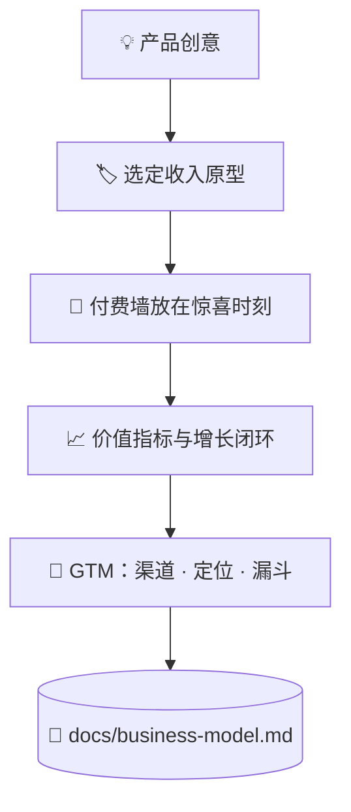

# 💰 superforge-biz

[](https://opensource.org/licenses/MIT)
[](https://claude.com/claude-code)
[](https://github.com/takaoumehara/superforge-skill)

[English](README.md) · [日本語](README.ja.md) · **简体中文** · [Español](README.es.md) · [한국어](README.ko.md)

> **把一个产品创意变成有定价、有付费边界、也有第一批客户获取路径的生意。**

---

## 🔰 这是什么？

开店的人要定三件事：哪些东西可以随便试，哪些放在柜台后面，以及柜台摆在哪里。柜台离门太近没人逛，离门太远没人掏钱。

这个技能就是替软件做这三个决定。它先选定商业模式原型，把付费墙放在产品刚刚证明了自己价值的那一刻，再把"客户价值越大就越增长"的那个指标收敛成一个。

---

## 📐 系统架构



原型由产品形态推导出来，绝不反过来。

---

## ✨ 三大亮点

### 🏷️ 四种原型里，带着理由选一种
功能门槛式 freemium、分层订阅、按用量计费、B2B 企业授权。产品会被逐一对照这四种评估，最终指定一个主驱动，并写下选它的理由。

### 🚪 付费墙放在惊喜处，而不是门口
门槛设在用户刚刚产出一个真实结果之后，价格之前先摆出收益，硬性上限之前先给零摩擦试用。降级和赢回路径也一并设计，而不是交给流失。

### ⚖️ 说服手法配一条伦理红线
锚定、损失厌恶、默认选项确实有效，而每一种都有一个"越过就是暗黑模式"的位置。红线画在哪里不靠感觉，而是写在参考文档里。

---

## 🔄 使用前 / 使用后

| | 使用前 | 使用后 |
|---|---|---|
| 定价 | 一个看着顺眼的数字 | 对照四种原型选出的模式 |
| 付费墙位置 | 哪里好加就加在哪 | 价值被证明的那一刻 |
| 增长 | "获客以后再说" | 闭环和渠道都写进产物 |
| 说服手法 | 照抄转化率高的同行 | 连同伦理边界一起使用 |

---

## 🚀 安装与使用

### 🖥️ 一次装好全部 11 个技能（只需一次）

克隆仓库并运行安装脚本。它会找出本机所有技能目录，把 11 个技能一次性链接进去（Claude Code / Codex CLI / Gemini CLI / Antigravity）。

```bash
git clone https://github.com/takaoumehara/superforge-skill
cd superforge-skill
./install.sh
```

完整选项、只装单个技能的方法，以及 claude.ai 的上传步骤，都在[整套 README](../../README.zh-CN.md)。

### ⌨️ 调用它

```
/superforge-biz
```

项目里如果已有 `docs/product-idea.md` 和 `docs/brief.md`，它会先读这两份。

---

## 📄 许可证

MIT — 见 [LICENSE](../../LICENSE)。技能正文在 [SKILL.md](SKILL.md)；锚定、损失厌恶、默认选项以及各自的伦理边界，都在 [references/behavioral-frameworks.md](references/behavioral-frameworks.md)。整套说明见 [superforge-skill](../../README.zh-CN.md)。
