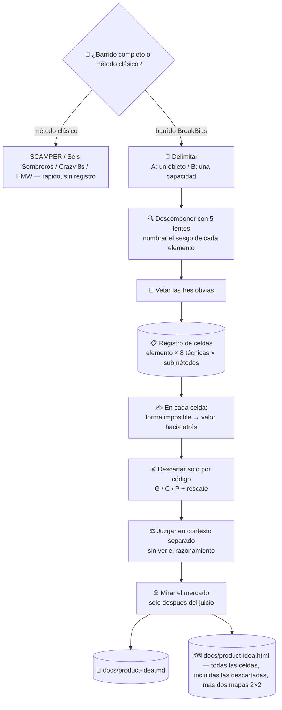

# 💡 superforge-brain — el motor BreakBias

[](https://opensource.org/licenses/MIT)
[](https://claude.com/claude-code)
[](https://github.com/takaoumehara/breakbias-studio)

[English](README.md) · [日本語](README.ja.md) · [简体中文](README.zh-CN.md) · **Español** · [한국어](README.ko.md)

> **Deja de esperar a que llegue la buena idea. Que una máquina barra todas las combinaciones y lee lo que sobreviva.**

---

## 🔰 ¿Qué es esto?

A la media hora de cualquier sesión de lluvia de ideas, alguien dice «bueno, esa vale». No porque se haya encontrado algo bueno, sino porque **alguien se cansó primero**.

BreakBias no se cansa.

Descompone el sujeto en 20–40 elementos y cruza cada uno con ocho técnicas y sus submétodos. Cada combinación es **una celda** con identificador y estado, y la ejecución termina solo cuando todas están en estado terminal. No «creo que lo vimos todo», sino *300 de 300 celdas completas*.

Una persona no puede rellenar una cuadrícula de 300 filas sin perder el sitio. Una máquina sí. **Esa asimetría es toda la razón de que esto sea una skill y no una reunión.**

---

## 📐 Arquitectura



Durante el barrido no se poda nada. La deduplicación y la puntuación llegan después de generar, nunca durante. El propio método es una elección declarada de antemano, no un supuesto.

---

## ✨ 3 puntos clave

### 📋 «Lo hemos visto todo» se convierte en un número
Elemento × técnica × submétodo es una fila del registro, y el estado avanza en un solo sentido: `todo → generada → sobrevive/descartada → desarrollada → juzgada`. Terminado significa *cero filas en `todo`*. Una celda saltada no puede convertirse discretamente en una celda que nunca existió.

### 🔒 Nada entra desde fuera de la caja (Closed World)
Las ideas se montan solo con elementos que ya están dentro del sujeto y de su frontera inmediata. En cuanto importas algo externo deja de ser no obvio y pasa a ser un añadido que cualquiera habría hecho. Esa restricción es la que produce una combinación realmente nueva en vez de una función copiada de la competencia.

### ⚖️ Descartar exige un motivo, y conservar también
Una celda muere solo por tres códigos: **G** (cambias el sujeto y sigue leyéndose bien, luego nunca fue sobre este sistema), **C** (ya es corriente), **P** (físicamente imposible). «Parece flojo» no es un motivo. Después, un **pase de rescate** relee las filas descartadas, porque una idea mal descartada no aparece en el informe: es el único fallo que jamás detectarás mirando la salida.

### 🗺️ Ves lo que se descartó, no solo lo que sobrevivió
`docs/product-idea.html` muestra **cada idea generada**, incluidas las descartadas, cada una con su código de descarte y el motivo en una línea — se acabó recibir solo los tres nombres finales. Dos mapas 2×2 ubican a las supervivientes espacialmente: Impacto × Esfuerzo (con el cuadrante de «fruta al alcance de la mano» nombrado) y Impacto en el usuario × Impacto en la empresa, para ver la prioridad antes de leer una sola tarjeta.

### 🔀 BreakBias es una opción, no la única
Se pregunta una sola vez, de entrada: el barrido completo y trazado, o un método clásico — SCAMPER, los Seis Sombreros, Crazy 8s, How Might We, brainwriting, lluvia de ideas inversa. El motor pesado es para cuando la idea tiene que aguantar el escrutinio; un método clásico es para una primera pasada rápida y de poco riesgo. Menú completo en [references/classic-methods.md](references/classic-methods.md).

---

## 🔄 Antes / Después

| | Antes | Después |
|---|---|---|
| Cómo termina | Cuando alguien se cansó | Cuando el registro tiene cero filas en `todo` |
| De dónde salen las ideas | Lo primero que apareció | Cada elemento × técnica × submétodo |
| La respuesta obvia | Se propone una y otra vez | Vetada de entrada; la novedad se mide por distancia |
| Cuándo miras el mercado | Al principio, y el pensamiento se encoge | Tras el juicio, para que no sesgue la novedad |
| Qué llegas a ver | Los tres nombres finales | Cada idea generada, qué se descartó y por qué |
| Cómo priorizas lo que sobrevive | Leer cada tarjeta y adivinar | Dos mapas 2×2 — Impacto × Esfuerzo, Usuario × Impacto en la empresa |
| Qué método corre | BreakBias, dado por hecho | Una elección, declarada de antemano — barrido completo o método clásico |
| Qué queda | Un registro de chat | `docs/product-idea.md` + `docs/product-idea.html` con los vetos y la cobertura |

---

## 🚀 Instalación y uso

### 🖥️ Instala las doce skills (una sola vez)

Clona el repositorio y ejecuta el instalador. Enlaza las doce skills en todos los directorios de skills de tu máquina (Claude Code, Codex CLI, Gemini CLI, Antigravity).

```bash
git clone https://github.com/takaoumehara/superforge-skill
cd superforge-skill
./install.sh
```

Todas las opciones, la instalación de una sola skill y la ruta de subida a claude.ai están en el [README de la suite](../../README.es.md).

### ⌨️ Invócala

```
/superforge-brain
```

Empieza preguntando qué método: el barrido BreakBias completo, o un método clásico más rápido (SCAMPER, Seis Sombreros, Crazy 8s, How Might We — ver [references/classic-methods.md](references/classic-methods.md)). Para un barrido, fija después si el sujeto es un objeto o una capacidad (Domain A / B) y explica la resolución en términos llanos antes de preguntar — `quick` (~80 celdas, una pasada sobre los elementos de mayor potencial), `standard` (~300, cada elemento × cada técnica una vez) o `exhaustive` (900+, más pasadas de desbloqueo donde se repita una forma). Si existe `docs/brief.md`, lo lee en vez de volver a preguntar.

---

## 🧬 Relación con SIT

BreakBias se apoya en dos principios de **SIT (Systematic Inventive Thinking)**:

- **Closed World** — nunca traer un elemento de fuera de la caja
- **Function Follows Form** — construir primero la forma imposible y deducir el valor hacia atrás

Eso es lo heredado. Esto es lo que añade BreakBias.

| | SIT | BreakBias |
|---|---|---|
| Técnicas | 5 | **8** (añade Reverse / Shift / Repurpose) |
| Sesgo | sin tratamiento explícito | **nombrado en cada elemento** (funcional / estructural / relacional) |
| Clichés | — | **tres vetados de entrada**, y la novedad se puntúa por distancia a ellos |
| Exhaustividad | depende del aguante humano | **un registro de celdas que una máquina verifica**: si queda algún `todo`, no está terminado |
| Selección | — | **códigos de descarte G / C / P** más un pase de rescate |
| Puntuación | — | **un juez en contexto separado**, que nunca ve el razonamiento |
| Mercado | fuera de alcance | **red / gray / white y veredicto de entrada, solo tras el juicio** |

SIT es un método para personas en una sala. BreakBias lo reconstruye en algo que **una máquina puede barrer de forma exhaustiva, y demostrar que lo hizo**.

Implementación y registros de ejecuciones reales: [takaoumehara/breakbias-studio](https://github.com/takaoumehara/breakbias-studio)

---

## 📄 Licencia

MIT — consulta [LICENSE](../../LICENSE). El cuerpo de la skill está en [SKILL.md](SKILL.md); los submétodos, las pruebas de descarte, el protocolo de juicio, la rúbrica de mercado y el filtro de dirección están en [references/ideation-tools.md](references/ideation-tools.md); el menú de métodos clásicos (SCAMPER, Seis Sombreros, Crazy 8s y más) está en [references/classic-methods.md](references/classic-methods.md); la especificación de `docs/product-idea.html` — cada idea visualizada, más los mapas de Impacto×Esfuerzo y Usuario×Impacto en la empresa — está en [references/idea-map-output.md](references/idea-map-output.md). Visión general de la suite: [superforge-skill](../../README.es.md).
