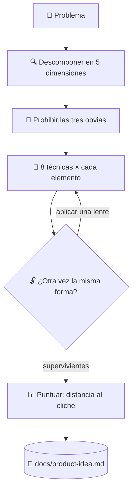

# 💡 superforge-brain

[](https://opensource.org/licenses/MIT)
[](https://claude.com/claude-code)
[](https://github.com/takaoumehara/superforge-skill)

[English](README.md) · [日本語](README.ja.md) · [简体中文](README.zh-CN.md) · **Español** · [한국어](README.ko.md)

> **Deja de esperar a que llegue la buena idea. Pasa cada parte del problema por cada técnica y lee lo que sobreviva.**

---

## 🔰 ¿Qué es esto?

Para buscar un anillo perdido en la playa puedes caminar sin rumbo esperando verlo, o trazar una cuadrícula sobre la arena y recorrer casilla por casilla. Esta skill es la cuadrícula.

Descompone el problema en sus partes, prohíbe las tres respuestas más obvias antes de generar nada y empuja cada parte a través de ocho técnicas de transformación. La cobertura sustituye a la inspiración, y lo que sobrevive se puntúa por su distancia al cliché.

---

## 📐 Arquitectura



Durante el barrido no se poda nada: la deduplicación y la puntuación llegan solo al final.

---

## ✨ 3 puntos clave

### 🔒 Closed World: nada viene de fuera
Los conceptos se construyen únicamente con elementos que ya están dentro del sistema y de su frontera inmediata. Esa restricción es la que fuerza una combinación realmente nueva en lugar de una función copiada de la competencia.

### 🚫 Las tres obvias se nombran y se prohíben primero
Las tres respuestas que cualquier modelo daría se listan explícitamente y quedan vetadas antes de empezar a generar. Además se escriben en el artefacto, así que nadie las vuelve a proponer el mes que viene.

### 📊 La novedad se mide, no se afirma
Los supervivientes se puntúan en cuatro ejes, y la novedad es literalmente la distancia a las tres prohibidas. Por debajo de 30 se descarta; a partir de 37 se convierte en Hero Concept, con MVP, plan de validación y primer paso.

---

## 🔄 Antes / Después

| | Antes | Después |
|---|---|---|
| Origen de las ideas | Lo primero que aparece | Cada elemento × cada técnica |
| La respuesta obvia | Se propone una y otra vez | Vetada por escrito antes del barrido |
| Filtrado | Se poda mientras se genera | Se genera todo y se puntúa al final |
| Qué queda | Un registro de chat | `docs/product-idea.md` con la lista de vetos |

---

## 🚀 Instalación y uso

Solo hacen falta `git` y una herramienta de AI que cargue skills desde un directorio.

### 🖥️ Claude Code (CLI)

Clona la suite donde quieras y enlaza solo esta skill:

```bash
git clone https://github.com/takaoumehara/superforge-skill ~/src/superforge-skill
ln -s ~/src/superforge-skill/skills/superforge-brain ~/.claude/skills/superforge-brain
```

Reinicia Claude Code e invócala:

```
/superforge-brain
```

Si el proyecto ya tiene `docs/brief.md`, lo lee en lugar de volver a preguntar de qué va.

### 🔗 Codex CLI / Gemini CLI / Antigravity

El mismo enlace, otro directorio. O deja que el instalador busque todos los directorios de skills de la máquina y enlace las once de una vez:

```bash
cd ~/src/superforge-skill
./install.sh
```

Es idempotente, solo toca sus propios enlaces simbólicos y acepta `--dry-run` y `--uninstall`.

### 🌐 claude.ai (navegador)

Comprime la carpeta de esta skill y súbela en los ajustes de skills de tu cuenta:

```bash
cd ~/src/superforge-skill/skills/superforge-brain
zip -r superforge-brain.zip .
```

La interfaz del navegador acepta una skill por vez, así que repite el proceso para cada una.

---

## 📄 Licencia

MIT — consulta [LICENSE](../../LICENSE). El cuerpo de la skill está en [SKILL.md](SKILL.md); los submétodos que hacen exhaustiva cada técnica y el filtro que decide qué Hero Concept merece construirse están en [references/ideation-tools.md](references/ideation-tools.md). Visión general de la suite: [superforge-skill](../../README.md).
