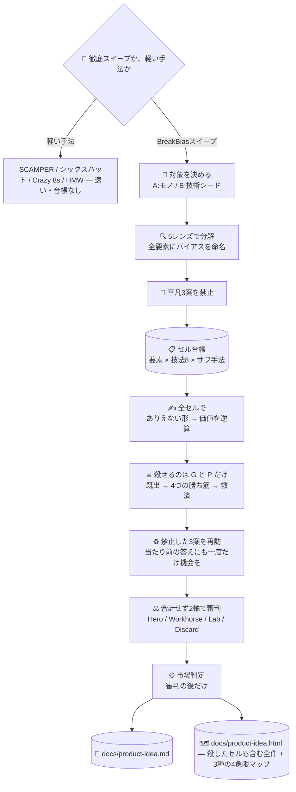

# 💡 superforge-brain — BreakBias エンジン

[](https://opensource.org/licenses/MIT)
[](https://claude.com/claude-code)
[](https://github.com/takaoumehara/breakbias-studio)

[English](README.md) · **日本語** · [简体中文](README.zh-CN.md) · [Español](README.es.md) · [한국어](README.ko.md)

> **良いアイデアが降ってくるのを待つのをやめる。全部の組み合わせを機械に踏破させて、生き残ったものを読む。**

---

## 🔰 これは何？

会議室でアイデア出しをすると、だいたい30分くらいで誰かが「まあ、これでいいんじゃない」と言い始めます。それは良い案が見つかったからではなく、**先に疲れた人が出てきたから**です。

BreakBias は疲れません。

対象を20〜40個の要素に分解し、それぞれに8つの技法と、その下のサブ手法を全部かけ合わせます。組み合わせは**1つ1つが「セル」**として番号と状態を持ち、全セルが終わるまで走り切ります。「たぶん全部見た気がする」ではなく「300セル中300セル完了」と数字で言えます。

人間が300マスの表を1つも飛ばさずに埋めるのは無理です。ソフトウェアにはできます。**このスキルが会議ではなくスキルである理由は、そこだけです。**

---

## 📐 システム概念図



スイープ中は1つも間引きません。重複整理も採点も、生成が終わってからです。手法そのものも、決めつけずに先に選ばせます。

---

## ✨ 3つの強み

### 📋 「全部見た」を数字で言える
要素 × 技法 × サブ手法を1セルとして台帳に並べ、`todo → 生成 → 生存/kill → 開発 → 審判` と状態が一方向に進みます。完了条件は「`todo` が0件」。飛ばしたセルを「無かったこと」にできない構造です。

### 🔒 箱の外から持ってこない（Closed World）
アイデアは、対象の中とそのすぐ隣にある要素だけで組み立てます。外から新しい要素を足した瞬間、それは非自明ではなく「誰でも思いつく追加」になるからです。この制約が、競合の機能の後付けではなく本当に新しい配置を生みます。

### ⚖️ 「すでにある」は、殺す理由になりません
kill できるコードは2つだけです — **G**（主語を入れ替えても成立する＝この対象の話ではない）と **P**（物理的に破綻）。どちらも**市場を知らなくても判定できる**ことが条件です。市場知識を要する kill は、このエンジンが §8 まで遅らせている毒を、より早く・より見えない形で盛る行為だからです。

すでにどこかで存在する案は、殺さずに**タグを付けて**4つの勝ち筋テストに回します — **差分**（ほんの少し変えるだけで別物になるか）、**地理**（ある市場にあって別の市場に無いか）、**時機**（以前は無理で今は可能か）、**実行**（誰もちゃんとやっていない。その欠陥を名指しできるか）。4つとも落ちた場合にだけ kill され、そのコードが **C** です。そして誤殺を戻す**救済パス**を毎回走らせます。捨てられた案は最終レポートに載らないので、誤殺だけは出力を見ても永遠に気づけないからです。

### 🏪 「スーパーマーケット問題」を直しました
旧来の採点では、「この町にスーパーを作る」は Novelty 1 / Wow 1 / User Impact 9 / Company Impact 8 で合計19。閾値を下回り、削除されます。どの町にも必要で、確実に儲かる事業がです。エンジンは**「当たり前からの距離」を測って、それを「価値」と呼んでいた**わけです。

いまは4つの点数を、決して足し合わせない2軸にまとめます — **独創軸**（Novelty + Wow）と**事業軸**（User + Company Impact）。判定は象限になります：**Hero**（見たことがなく、かつ求められている）、**Workhorse**（ありふれているが確実に必要とされる）、**Lab**（面白いが今は金にならない。戻る条件を添えて棚に置く）、**Discard**（唯一の正当な廃棄）。そして当たり前の答えは**たいてい理由があって当たり前**なので、禁止した3案にもスイープ後に**一度だけ再訪**の機会を与え、同じ4つの勝ち筋にかけます。

### 🗺️ 生き残った案だけでなく、削られた案も見える
`docs/product-idea.html` には**生成した全アイデア**が、殺したものも含めて、kill コードと一言の理由つきで並びます。最後の3案だけを渡されることはもうありません。既出として殺された案には、4つの勝ち筋すべてが取り消し線つきで表示されます——**捨てる前に4方向から勝ち筋を探した証拠**が残るということです。結果は3種類の4象限マップに配置されます——独創軸 × 事業軸（4象限の名前を図の中に直接表示）、Impact × Effort（low-hanging fruit 象限に名前つき）、User Impact × Company Impact。カードを1枚も読まずに、優先度が視覚的にわかります。

### 🔀 BreakBias は選択肢の1つ、唯一の方法ではない
最初に一度だけ確認します——徹底的に追跡するスイープか、軽い手法か。SCAMPER、シックスハット、Crazy 8s、How Might We、ブレインライティング、逆ブレスト。重い方は精査に耐える必要があるとき、軽い方は速くて低リスクな最初の一手のときに使います。全メニューは [references/classic-methods.md](references/classic-methods.md)。

---

## 🔄 導入前 / 導入後

| | 導入前 | 導入後 |
|---|---|---|
| 終わりの決め方 | 誰かが疲れたところ | 台帳の `todo` が0件になったところ |
| アイデアの出どころ | 最初に浮かんだもの | 全要素 × 全技法 × 全サブ手法 |
| ありがちな案 | 毎回また出てくる | 開始前に禁止し、その距離で新規性を採点 |
| 市場を見るタイミング | 最初（そして発想が縮こまる） | 審判のあと（新規性の採点を汚さない） |
| 見えるもの | 最後の3案の名前だけ | 生成した全アイデア、何を殺したか、その理由 |
| 生存案の優先順位づけ | カードを全部読んで勘で判断 | 独創×事業・Impact×Effort・User×Company Impact の3種のマップ |
| ありきたりだが需要のある案 | 「すでにある」で殺される | タグを付けて4つの勝ち筋で検査し、**Workhorse** として残す |
| 面白いが金にならない案 | まとめて捨てられる | **Lab** の棚へ。戻ってくる条件を1文添えて |
| 禁止した平凡3案 | 禁止したきり二度と見ない | 生成からは禁止、審判の前に一度だけ再訪 |
| 使う手法 | BreakBias 前提 | 先に選ばせる——徹底スイープか軽い手法か |
| 残るもの | 会話ログ | 禁止リストと踏破率つきの `docs/product-idea.md` + `docs/product-idea.html` |

---

## 🚀 インストールと使い方

### 🖥️ 12個まとめて入れる（最初の1回だけ）

クローンしてインストーラを走らせるだけです。マシンの中にあるスキル用フォルダを全部探して、13個をまとめてリンクします（Claude Code / Codex CLI / Gemini CLI / Antigravity）。

```bash
git clone https://github.com/takaoumehara/superforge-skill
cd superforge-skill
./install.sh
```

オプション、1個だけ入れる方法、claude.ai へのアップロード手順は [スイート全体の README](../../README.ja.md) にあります。

### ⌨️ 呼び出す

```
/superforge-brain
```

最初に「どの手法で進めるか」を聞きます——徹底スイープか、速い軽量手法（SCAMPER、シックスハット、Crazy 8s、How Might We。[references/classic-methods.md](references/classic-methods.md)）か。スイープの場合は続けて「対象はモノか技術か（Domain A / B）」と、網羅度ダイヤルの意味を説明してから決めます——`quick`（約80セル、可能性が高い要素だけに1回ずつ）／`standard`（約300、全要素×全技法を1回ずつ）／`exhaustive`（900+、同じ形が繰り返す箇所には追加のブロック解除も）。`docs/brief.md` があればそれを読み、前提を聞き直しません。

---

## 🧬 SIT との関係

BreakBias の土台は **SIT（Systematic Inventive Thinking）** の2原則です。

- **Closed World** — 箱の外から要素を足さない
- **Function Follows Form** — 先に「ありえない形」を作り、価値は後から逆算する

この2つは SIT から受け継いでいます。そのうえで BreakBias が足したものは次のとおりです。

| | SIT | BreakBias |
|---|---|---|
| 技法 | 5つ | **8つ**（Reverse / Shift / Repurpose を追加） |
| バイアス | 明示的な扱いなし | **全要素に命名を義務づけ**（機能性 / 構造性 / 関係性） |
| 凡庸案 | — | **先に3案を禁止**し、そこからの距離で新規性を採点 |
| 網羅性 | 人の集中力に依存 | **セル台帳で機械が検証**。`todo` が残っていれば未完了 |
| 選別 | — | **kill は G と P だけ**。既出は4つの勝ち筋で検査＋誤殺の救済パス＋禁止3案の再訪 |
| 採点 | — | **生成過程を見せない別コンテキストの審判**。合計せず独創軸と事業軸に分け、4象限で判定 |
| 市場 | 対象外 | **審判の後だけ** red / gray / white ＋ 参入判定 |

SIT は人が集まって行うワークショップ手法です。BreakBias はそれを、**機械が全数踏破して、踏破したことを証明できる形**に作り替えたものです。

実装と実走ログ: [takaoumehara/breakbias-studio](https://github.com/takaoumehara/breakbias-studio)

---

## 📄 ライセンス

MIT — [LICENSE](../../LICENSE) を参照してください。スキル本体は [SKILL.md](SKILL.md)、サブ手法・kill テスト・審判プロトコル・市場ルーブリック・方向性フィルタは [references/ideation-tools.md](references/ideation-tools.md)、4象限と勝ち筋テストと禁止案の再訪は [references/value-classification.md](references/value-classification.md)、実在の人に確認する方法は [references/talk-to-users.md](references/talk-to-users.md)、軽量な手法メニュー（SCAMPER・シックスハット・Crazy 8s ほか）は [references/classic-methods.md](references/classic-methods.md)、`docs/product-idea.html` の仕様（全アイデアの可視化＋4象限・Impact×Effort・User×Company Impact マップ）は [references/idea-map-output.md](references/idea-map-output.md) にあります。スイート全体の説明は [superforge-skill](../../README.ja.md) へ。
