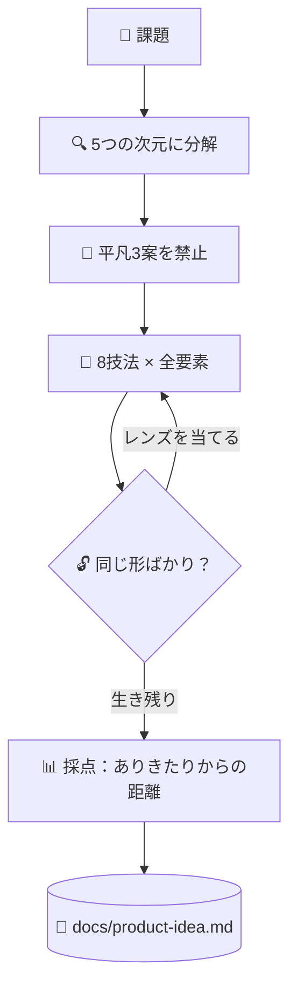

# 💡 superforge-brain

[](https://opensource.org/licenses/MIT)
[](https://claude.com/claude-code)
[](https://github.com/takaoumehara/superforge-skill)

[English](README.md) · **日本語** · [简体中文](README.zh-CN.md) · [Español](README.es.md) · [한국어](README.ko.md)

> **良いアイデアが降ってくるのを待つのをやめる。問題のあらゆる要素をあらゆる技法に通し、生き残ったものを読む。**

---

## 🔰 これは何？

砂浜で落とした指輪を探すとき、当てもなく歩き回る方法と、砂地にグリッドを引いて一マスずつ潰す方法があります。このスキルは後者のグリッドです。

問題を要素に分解し、何かを出す前に「いちばんありがちな3案」を名指しで禁止し、全要素を8つの変換技法に通します。ひらめきの代わりに網羅で攻め、生き残ったアイデアは「ありきたりからどれだけ離れているか」で採点されます。

---

## 📐 システム概念図



スイープの途中では間引きません。重複の整理も採点も、最後にまとめて行います。

---

## ✨ 3つの強み

### 🔒 Closed World — 箱の外から持ってこない
システムの内部要素と、そのすぐ外側の境界だけでコンセプトを組み立てます。この制約があるからこそ、競合の機能を後付けするのではなく、本当に新しい組み合わせが生まれます。

### 🚫 平凡3案を最初に名指しして禁じる
どのモデルでも真っ先に出てくる3案を明示的に列挙し、発想を始める前に禁止します。しかもそれを成果物に書き残すので、来月また同じ案が出てくることがありません。

### 📊 新規性は主張ではなく測定する
生き残った案を4軸で採点し、新規性は「禁止した3案からの距離」そのものとして測ります。30点未満は破棄、37点以上は Hero Concept として MVP・検証計画・次の一歩まで書き出します。

---

## 🔄 導入前 / 導入後

| | 導入前 | 導入後 |
|---|---|---|
| アイデアの出どころ | 最初に浮かんだもの | 全要素 × 全技法 |
| ありがちな案 | 毎回また出てくる | スイープ前に文書で禁止 |
| 絞り込み | 生成しながら間引く | 出し切ってから採点 |
| 残るもの | 会話ログ | 禁止リスト付きの `docs/product-idea.md` |

---

## 🚀 インストールと使い方

必要なのは `git` と、ディレクトリからスキルを読み込む AI ツールだけです。

### 🖥️ Claude Code（CLI）

好きな場所にスイート全体をクローンし、このスキルだけをリンクします。

```bash
git clone https://github.com/takaoumehara/superforge-skill ~/src/superforge-skill
ln -s ~/src/superforge-skill/skills/superforge-brain ~/.claude/skills/superforge-brain
```

Claude Code を再起動して呼び出します。

```
/superforge-brain
```

`docs/brief.md` があればそれを読み、プロジェクトの前提を聞き直しません。

### 🔗 Codex CLI / Gemini CLI / Antigravity

リンク先のディレクトリを変えるだけです。インストーラーに任せれば、このマシンにあるスキルディレクトリをすべて探して11個を一括でリンクします。

```bash
cd ~/src/superforge-skill
./install.sh
```

何度実行しても結果は同じで、自分が作ったシンボリックリンク以外には触れません。`--dry-run` で確認、`--uninstall` で削除できます。

### 🌐 claude.ai（ブラウザ）

このスキルのフォルダを zip にまとめ、アカウントのスキル設定からアップロードします。

```bash
cd ~/src/superforge-skill/skills/superforge-brain
zip -r superforge-brain.zip .
```

ブラウザ版は一度に1スキルずつなので、入れたい数だけ繰り返してください。

---

## 📄 ライセンス

MIT — [LICENSE](../../LICENSE) を参照してください。スキル本体は [SKILL.md](SKILL.md)、各技法を網羅的にするサブ手法と「どの Hero Concept を実際に作るか」の判定基準は [references/ideation-tools.md](references/ideation-tools.md) にあります。スイート全体の説明は [superforge-skill](../../README.ja.md) へ。
