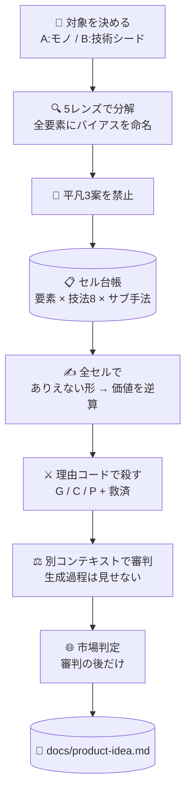

# 💡 superforge-brain — BreakBias エンジン

[](https://opensource.org/licenses/MIT)
[](https://claude.com/claude-code)
[](https://github.com/takaoumehara/breakbias-studio)

[English](README.md) · **日本語** · [简体中文](README.zh-CN.md) · [Español](README.es.md) · [한국어](README.ko.md)

> **良いアイデアが降ってくるのを待つのをやめる。全部の組み合わせを機械に踏破させて、生き残ったものを読む。**

---

## 🔰 これは何？

会議室でアイデア出しをすると、だいたい30分くらいで誰かが「まあ、これでいいんじゃない」と言い始めます。それは良い案が見つかったからではなく、**先に疲れた人が出てきたから**です。

BreakBias は疲れません。

対象を20〜40個の要素に分解し、それぞれに8つの技法と、その下のサブ手法を全部かけ合わせます。組み合わせは**1つ1つが「セル」**として番号と状態を持ち、全セルが終わるまで走り切ります。「たぶん全部見た気がする」ではなく「300セル中300セル完了」と数字で言えます。

人間が300マスの表を1つも飛ばさずに埋めるのは無理です。ソフトウェアにはできます。**このスキルが会議ではなくスキルである理由は、そこだけです。**

---

## 📐 システム概念図



スイープ中は1つも間引きません。重複整理も採点も、生成が終わってからです。

---

## ✨ 3つの強み

### 📋 「全部見た」を数字で言える
要素 × 技法 × サブ手法を1セルとして台帳に並べ、`todo → 生成 → 生存/kill → 開発 → 審判` と状態が一方向に進みます。完了条件は「`todo` が0件」。飛ばしたセルを「無かったこと」にできない構造です。

### 🔒 箱の外から持ってこない（Closed World）
アイデアは、対象の中とそのすぐ隣にある要素だけで組み立てます。外から新しい要素を足した瞬間、それは非自明ではなく「誰でも思いつく追加」になるからです。この制約が、競合の機能の後付けではなく本当に新しい配置を生みます。

### ⚖️ 殺すときも褒めるときも、理由を残す
kill は3つのコードでのみ行います — **G**（主語を入れ替えても成立する＝この対象の話ではない）、**C**（すでにありふれている）、**P**（物理的に破綻）。「なんとなく弱い」は kill の理由になりません。そして誤殺を戻す**救済パス**を毎回走らせます。捨てられた案は最終レポートに載らないので、誤殺だけは出力を見ても永遠に気づけないからです。

---

## 🔄 導入前 / 導入後

| | 導入前 | 導入後 |
|---|---|---|
| 終わりの決め方 | 誰かが疲れたところ | 台帳の `todo` が0件になったところ |
| アイデアの出どころ | 最初に浮かんだもの | 全要素 × 全技法 × 全サブ手法 |
| ありがちな案 | 毎回また出てくる | 開始前に禁止し、その距離で新規性を採点 |
| 市場を見るタイミング | 最初（そして発想が縮こまる） | 審判のあと（新規性の採点を汚さない） |
| 残るもの | 会話ログ | 禁止リストと踏破率つきの `docs/product-idea.md` |

---

## 🚀 インストールと使い方

### 🖥️ 12個まとめて入れる（最初の1回だけ）

クローンしてインストーラを走らせるだけです。マシンの中にあるスキル用フォルダを全部探して、12個をまとめてリンクします（Claude Code / Codex CLI / Gemini CLI / Antigravity）。

```bash
git clone https://github.com/takaoumehara/superforge-skill
cd superforge-skill
./install.sh
```

オプション、1個だけ入れる方法、claude.ai へのアップロード手順は [スイート全体の README](../../README.ja.md) にあります。

### ⌨️ 呼び出す

```
/superforge-brain
```

最初に「対象はモノか技術か（Domain A / B）」と「網羅度（quick 約80セル / standard 約300 / exhaustive 900+）」を決めます。`docs/brief.md` があればそれを読み、前提を聞き直しません。

---

## 🧬 SIT との関係

BreakBias の土台は **SIT（Systematic Inventive Thinking）** の2原則です。

- **Closed World** — 箱の外から要素を足さない
- **Function Follows Form** — 先に「ありえない形」を作り、価値は後から逆算する

この2つは SIT から受け継いでいます。そのうえで BreakBias が足したものは次のとおりです。

| | SIT | BreakBias |
|---|---|---|
| 技法 | 5つ | **8つ**（Reverse / Shift / Repurpose を追加） |
| バイアス | 明示的な扱いなし | **全要素に命名を義務づけ**（機能性 / 構造性 / 関係性） |
| 凡庸案 | — | **先に3案を禁止**し、そこからの距離で新規性を採点 |
| 網羅性 | 人の集中力に依存 | **セル台帳で機械が検証**。`todo` が残っていれば未完了 |
| 選別 | — | **G / C / P の理由コード**＋誤殺の救済パス |
| 採点 | — | **生成過程を見せない別コンテキストの審判** |
| 市場 | 対象外 | **審判の後だけ** red / gray / white ＋ 参入判定 |

SIT は人が集まって行うワークショップ手法です。BreakBias はそれを、**機械が全数踏破して、踏破したことを証明できる形**に作り替えたものです。

実装と実走ログ: [takaoumehara/breakbias-studio](https://github.com/takaoumehara/breakbias-studio)

---

## 📄 ライセンス

MIT — [LICENSE](../../LICENSE) を参照してください。スキル本体は [SKILL.md](SKILL.md)、サブ手法・kill テスト・審判プロトコル・市場ルーブリック・方向性フィルタは [references/ideation-tools.md](references/ideation-tools.md) にあります。スイート全体の説明は [superforge-skill](../../README.ja.md) へ。
