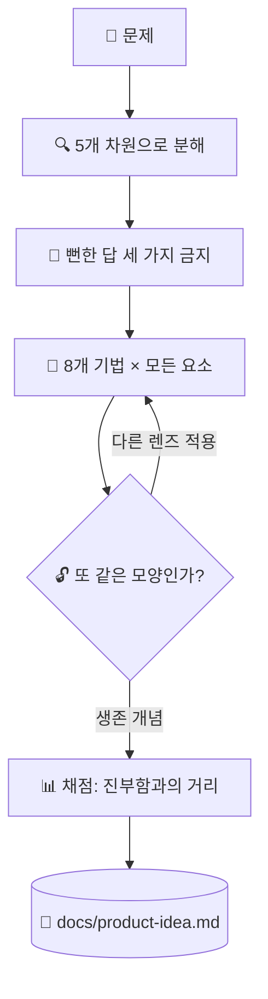

# 💡 superforge-brain

[](https://opensource.org/licenses/MIT)
[](https://claude.com/claude-code)
[](https://github.com/takaoumehara/superforge-skill)

[English](README.md) · [日本語](README.ja.md) · [简体中文](README.zh-CN.md) · [Español](README.es.md) · **한국어**

> **좋은 아이디어가 떠오르기를 기다리지 마세요. 문제의 모든 요소를 모든 기법에 통과시키고, 살아남은 것을 읽습니다.**

---

## 🔰 이게 뭔가요?

해변에서 잃어버린 반지를 찾을 때, 무작정 돌아다니며 눈에 띄기를 바랄 수도 있고 모래 위에 격자를 그어 한 칸씩 훑을 수도 있습니다. 이 스킬은 그 격자입니다.

문제를 요소로 분해하고, 무언가를 만들어 내기 전에 가장 뻔한 답 세 가지를 지목해 금지한 뒤, 모든 요소를 여덟 가지 변환 기법에 통과시킵니다. 영감 대신 커버리지로 밀어붙이고, 살아남은 개념은 "진부함에서 얼마나 멀리 떨어져 있는가"로 채점됩니다.

---

## 📐 시스템 구조



스윕 도중에는 아무것도 쳐내지 않습니다. 중복 정리와 채점은 마지막에 한 번에 합니다.

---

## ✨ 3가지 강점

### 🔒 Closed World — 상자 밖에서 가져오지 않습니다
개념은 시스템 내부 요소와 바로 맞닿은 경계만으로 조립합니다. 이 제약이 있어야 경쟁사의 기능을 덧붙이는 대신 진짜 새로운 조합이 나옵니다.

### 🚫 뻔한 세 가지를 먼저 지목해 금지합니다
어떤 모델이든 가장 먼저 떠올릴 답 세 가지를 명시적으로 나열하고 발상 전에 금지합니다. 게다가 그 목록을 산출물에 남기므로 다음 달에 같은 안이 다시 올라오지 않습니다.

### 📊 참신함은 주장하지 않고 측정합니다
살아남은 개념을 네 축으로 채점하며, 참신함은 곧 금지한 세 가지로부터의 거리입니다. 30점 미만은 폐기하고, 37점 이상은 MVP와 검증 계획, 첫걸음까지 갖춘 Hero Concept가 됩니다.

---

## 🔄 도입 전 / 도입 후

| | 도입 전 | 도입 후 |
|---|---|---|
| 아이디어의 출처 | 가장 먼저 떠오른 것 | 모든 요소 × 모든 기법 |
| 뻔한 답 | 매번 다시 등장 | 스윕 전에 문서로 금지 |
| 좁히는 방식 | 만들면서 쳐냄 | 다 뽑은 뒤 마지막에 채점 |
| 남는 것 | 대화 기록 | 금지 목록이 담긴 `docs/product-idea.md` |

---

## 🚀 설치 및 사용법

`git`과 디렉터리에서 스킬을 불러오는 AI 도구만 있으면 됩니다.

### 🖥️ Claude Code (CLI)

원하는 위치에 전체 스위트를 클론한 뒤, 이 스킬 하나만 링크합니다.

```bash
git clone https://github.com/takaoumehara/superforge-skill ~/src/superforge-skill
ln -s ~/src/superforge-skill/skills/superforge-brain ~/.claude/skills/superforge-brain
```

Claude Code를 다시 시작하고 호출합니다.

```
/superforge-brain
```

프로젝트에 `docs/brief.md`가 있으면 그 파일을 읽고, 전제를 다시 묻지 않습니다.

### 🔗 Codex CLI / Gemini CLI / Antigravity

링크할 디렉터리만 다릅니다. 설치 스크립트에 맡기면 이 머신의 모든 스킬 디렉터리를 찾아 열한 개를 한 번에 링크합니다.

```bash
cd ~/src/superforge-skill
./install.sh
```

여러 번 실행해도 결과가 같고, 자기가 만든 심볼릭 링크만 건드리며, `--dry-run`과 `--uninstall`을 지원합니다.

### 🌐 claude.ai (브라우저)

이 스킬 폴더를 zip으로 묶어 계정의 스킬 설정에서 업로드합니다.

```bash
cd ~/src/superforge-skill/skills/superforge-brain
zip -r superforge-brain.zip .
```

브라우저에서는 한 번에 하나씩만 올릴 수 있으므로 필요한 스킬 수만큼 반복합니다.

---

## 📄 라이선스

MIT — [LICENSE](../../LICENSE)를 참고하세요. 스킬 본문은 [SKILL.md](SKILL.md)에 있고, 각 기법을 빠짐없이 만들어 주는 하위 방법과 어떤 Hero Concept을 실제로 만들지 가르는 기준은 [references/ideation-tools.md](references/ideation-tools.md)에 있습니다. 스위트 전체 소개는 [superforge-skill](../../README.md)을 보세요.
