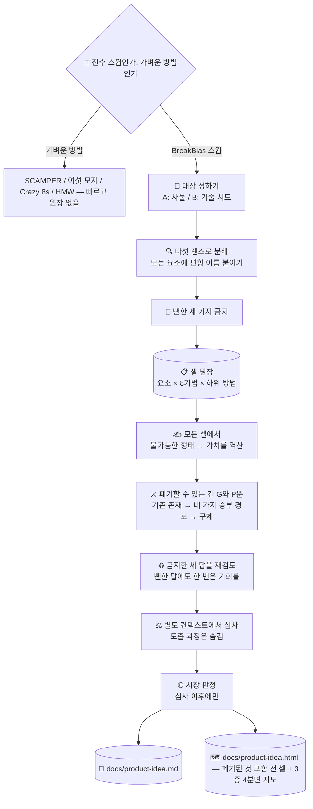

# 💡 superforge-brain — BreakBias 엔진

[](https://opensource.org/licenses/MIT)
[](https://claude.com/claude-code)
[](https://github.com/takaoumehara/breakbias-studio)

[English](README.md) · [日本語](README.ja.md) · [简体中文](README.zh-CN.md) · [Español](README.es.md) · **한국어**

> **좋은 아이디어가 떠오르기를 기다리지 마세요. 기계가 모든 조합을 훑게 하고, 살아남은 것을 읽습니다.**

---

## 🔰 이게 뭔가요?

아이디어 회의는 삼십 분쯤 지나면 누군가 "뭐, 이 정도면 됐지"라고 말합니다. 좋은 안을 찾아서가 아니라 **누군가 먼저 지쳤기 때문**입니다.

BreakBias는 지치지 않습니다.

대상을 20–40개의 요소로 쪼개고, 여덟 가지 기법과 그 하위 방법을 하나하나 곱합니다. 조합 하나하나가 번호와 상태를 가진 **"셀"** 이고, 모든 셀이 종료 상태가 되어야 실행이 끝납니다. "대충 다 본 것 같다"가 아니라 *300셀 중 300셀 완료*입니다.

사람은 300줄짜리 표를 한 칸도 빠뜨리지 않고 채울 수 없습니다. 기계는 할 수 있습니다. **이것이 회의가 아니라 스킬인 이유의 전부입니다.**

---

## 📐 시스템 구조



스윕 도중에는 한 셀도 쳐내지 않습니다. 중복 정리와 채점은 생성이 끝난 뒤에 합니다. 어떤 방법을 쓸지도 미리 밝히는 선택이지, 당연히 정해진 것이 아닙니다.

---

## ✨ 강점

### 📋 "다 봤다"가 숫자가 됩니다
요소 × 기법 × 하위 방법이 원장의 한 줄이고, 상태는 한 방향으로만 나아갑니다: `todo → 생성 → 생존/폐기 → 전개 → 심사`. 완료의 정의는 **`todo`에 남은 줄이 0**인 것입니다. 건너뛴 셀이 슬그머니 "원래 없던 셀"이 될 수 없습니다.

### 🔒 상자 밖에서 가져오지 않습니다 (Closed World)
아이디어는 대상 내부와 바로 맞닿은 경계의 요소만으로 조립합니다. 밖에서 새 요소를 들여오는 순간 그것은 비자명한 것이 아니라 누구나 떠올릴 추가가 됩니다. 이 제약이 경쟁사 기능을 덧붙이는 대신 진짜 새로운 배치를 만들어 냅니다.

### ⚖️ 「이미 있다」는 폐기 사유가 아닙니다
폐기할 수 있는 코드는 둘뿐입니다 — **G**(주어를 바꿔도 말이 되므로 이 대상의 이야기가 아님)와 **P**(물리적으로 성립 불가). 둘 다 **시장을 몰라도 판정할 수 있다**는 것이 조건입니다. 시장 지식이 필요한 폐기는, 이 엔진이 §8까지 미뤄 둔 바로 그 독을 더 이르고 더 안 보이게 먹이는 일이기 때문입니다.

이미 어딘가에 존재하는 아이디어는 죽이지 않고 **태그를 붙여** 네 가지 승부 경로로 보냅니다 — **차이**(아주 조금만 바꿔도 다른 경험이 되는가), **지리**(한 시장엔 있고 다른 시장엔 없는가), **시기**(예전엔 불가능했고 지금은 가능한가), **실행**(아무도 제대로 못 하고 있고, 그 결함을 짚을 수 있는가). 넷 다 떨어졌을 때만 폐기되며 그 코드가 **C**입니다. 그다음 **구제 패스**가 폐기된 줄을 다시 읽습니다. 잘못 버려진 아이디어는 보고서에 아예 나타나지 않아서, 결과물만 봐서는 영원히 잡을 수 없는 유일한 실패이기 때문입니다.

### 🏪 「슈퍼마켓 문제」를 고쳤습니다
옛 방식으로 채점하면 「이 동네에 슈퍼마켓을 연다」는 Novelty 1, Wow 1, User Impact 9, Company Impact 8 — 합계 19로 기준선 아래, 삭제됩니다. 어느 동네에나 필요하고, 확실하게 돈을 법니다. 엔진은 **「뻔함으로부터의 거리」를 재고서 그 결과를 「가치」라고 부르고** 있었습니다.

이제 네 점수는 **절대 더하지 않는** 두 축이 됩니다 — **독창축**(Novelty + Wow)과 **사업축**(User + Company Impact). 판정은 사분면입니다: **Hero**(본 적 없고 원해진다), **Workhorse**(뻔하지만 확실히 필요하다), **Lab**(재미있지만 지금은 돈이 안 된다 — 돌아올 조건을 붙여 선반에), **Discard**(유일하게 정당한 폐기). 그리고 뻔한 답은 **대개 이유가 있어서 뻔하므로**, 금지한 세 답도 스윕이 끝난 뒤 같은 네 경로로 **한 번 재검토**받습니다.

### 🗺️ 살아남은 것뿐 아니라 잘려나간 것도 보입니다
`docs/product-idea.html`에는 **생성된 모든 아이디어**가, 폐기된 것까지 포함해서, 폐기 코드와 한 줄 이유와 함께 나옵니다 — 이제 마지막 세 개 이름만 받는 일은 없습니다. 「이미 존재한다」로 폐기된 아이디어에는 네 가지 승부 경로가 모두 취소선과 함께 표시됩니다 — **버리기 전에 네 방향에서 이길 길을 찾아봤다는 증거**입니다. 결과는 세 개의 4분면 지도에 배치됩니다 — 독창축 × 사업축(사분면 이름을 그림 안에 직접 표시), Impact × Effort(로우행잉 프루트 사분면에 이름을 붙임), User Impact × Company Impact. 카드를 한 장도 읽기 전에 우선순위가 눈에 보입니다.

### 🔀 BreakBias는 선택지 중 하나이지, 유일한 방법이 아닙니다
시작할 때 딱 한 번 묻습니다 — 철저히 추적하는 스윕으로 할지, 가벼운 방법으로 할지. SCAMPER, 여섯 모자 사고법, Crazy 8s, How Might We, 브레인라이팅, 역발상 브레인스토밍. 무거운 엔진은 아이디어가 검증을 견뎌야 할 때, 가벼운 방법은 빠르고 저위험인 첫 시도일 때 씁니다. 전체 메뉴는 [references/classic-methods.md](references/classic-methods.md)에 있습니다.

---

## 🔄 도입 전 / 도입 후

| | 도입 전 | 도입 후 |
|---|---|---|
| 끝나는 시점 | 누군가 지쳤을 때 | 원장의 `todo`가 0이 됐을 때 |
| 아이디어의 출처 | 가장 먼저 떠오른 것 | 모든 요소 × 기법 × 하위 방법 |
| 뻔한 답 | 매번 다시 등장 | 시작 전에 금지하고, 그 거리로 참신함을 채점 |
| 시장을 보는 시점 | 맨 처음, 그래서 발상이 위축됨 | 심사 이후, 참신함 점수를 흔들지 않음 |
| 보이는 것 | 마지막 세 개 이름뿐 | 생성된 모든 아이디어, 무엇을 왜 버렸는지 |
| 생존안의 우선순위 매기기 | 카드를 다 읽고 감으로 판단 | 독창×사업, Impact×Effort, User×Company Impact 세 개의 지도 |
| 뻔하지만 수요가 확실한 안 | 「이미 있다」로 폐기 | 태그를 붙여 네 가지 승부 경로로 검사하고 **Workhorse**로 남김 |
| 재미있지만 돈이 안 되는 안 | 나머지와 함께 폐기 | **Lab** 선반으로. 돌아올 조건을 한 문장 붙여서 |
| 금지한 뻔한 세 답 | 금지한 뒤 다시 보지 않음 | 생성에서만 금지, 심사 전에 한 번 재검토 |
| 어떤 방법으로 돌리는지 | BreakBias가 당연시됨 | 미리 밝히고 선택 — 전수 스윕인지 가벼운 방법인지 |
| 남는 것 | 대화 기록 | 금지 목록과 진행률이 담긴 `docs/product-idea.md` + `docs/product-idea.html` |

---

## 🚀 설치 및 사용법

### 🖥️ 열세 개를 한 번에 설치 (처음 한 번만)

저장소를 클론하고 설치 스크립트를 실행하면 됩니다. 이 머신의 모든 스킬 디렉터리를 찾아 열세 개를 한 번에 링크합니다(Claude Code / Codex CLI / Gemini CLI / Antigravity).

```bash
git clone https://github.com/takaoumehara/superforge-skill
cd superforge-skill
./install.sh
```

옵션 전체와 스킬 하나만 설치하는 방법, claude.ai 업로드 절차는 [스위트 README](../../README.ko.md)에 있습니다.

### ⌨️ 호출하기

```
/superforge-brain
```

시작할 때 먼저 어떤 방법을 쓸지 묻습니다 — 전수 BreakBias 스윕인지, 더 빠른 가벼운 방법(SCAMPER, 여섯 모자, Crazy 8s, How Might We — [references/classic-methods.md](references/classic-methods.md) 참고)인지. 스윕을 고르면 이어서 대상이 사물인지 기술인지(Domain A / B)를 정하고, 묻기 전에 탐색 밀도의 의미를 평이하게 설명합니다 — `quick`(약 80셀, 잠재력이 가장 큰 요소에만 한 번씩), `standard`(약 300, 모든 요소 × 모든 기법을 한 번씩), `exhaustive`(900+, 같은 형태가 반복되는 곳마다 추가 잠금 해제 패스까지). `docs/brief.md`가 있으면 그 파일을 읽고 전제를 다시 묻지 않습니다.

---

## 🧬 SIT와의 관계

BreakBias의 토대는 **SIT(Systematic Inventive Thinking)** 의 두 원칙입니다.

- **Closed World** — 상자 밖에서 요소를 가져오지 않는다
- **Function Follows Form** — 먼저 불가능한 형태를 만들고, 가치는 나중에 역산한다

이 둘은 물려받은 것입니다. BreakBias가 더한 것은 다음과 같습니다.

| | SIT | BreakBias |
|---|---|---|
| 기법 | 5가지 | **8가지**(Reverse / Shift / Repurpose 추가) |
| 편향 | 명시적으로 다루지 않음 | **모든 요소에 이름 붙이기 의무화**(기능성 / 구조성 / 관계성) |
| 뻔한 안 | — | **먼저 세 가지를 금지**하고, 그로부터의 거리로 참신함을 채점 |
| 전수성 | 사람의 집중력에 의존 | **기계가 검증하는 셀 원장** — `todo`가 남아 있으면 미완료 |
| 선별 | — | **폐기는 G와 P뿐**. 기존 존재는 네 가지 승부 경로로 검사 + 오폐기 구제 패스 + 금지 세 안의 재검토 |
| 채점 | — | **도출 과정을 보지 않는 별도 컨텍스트의 심사** |
| 시장 | 대상 아님 | **심사 이후에만** red / gray / white와 진입 판정 |

SIT는 사람들이 모여서 하는 워크숍 방법입니다. BreakBias는 그것을 **기계가 전수 탐색하고, 탐색했음을 증명할 수 있는 형태**로 다시 만든 것입니다.

구현과 실제 실행 로그: [takaoumehara/breakbias-studio](https://github.com/takaoumehara/breakbias-studio)

---

## 📄 라이선스

MIT — [LICENSE](../../LICENSE)를 참고하세요. 스킬 본문은 [SKILL.md](SKILL.md)에, 하위 방법·폐기 판정·심사 프로토콜·시장 루브릭·방향 필터는 [references/ideation-tools.md](references/ideation-tools.md)에, 사분면과 승부 경로와 금지안 재검토는 [references/value-classification.md](references/value-classification.md)에, 실제 사람에게 확인하는 방법은 [references/talk-to-users.md](references/talk-to-users.md)에, 가벼운 방법 메뉴(SCAMPER·여섯 모자·Crazy 8s 등)는 [references/classic-methods.md](references/classic-methods.md)에, `docs/product-idea.html` 명세(전 아이디어 시각화 + 사분면·Impact×Effort·User×Company Impact 지도)는 [references/idea-map-output.md](references/idea-map-output.md)에 있습니다. 스위트 전체 소개는 [superforge-skill](../../README.ko.md)을 보세요.
