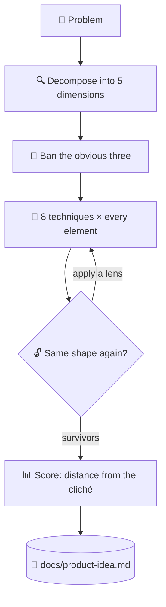

# 💡 superforge-brain

[](https://opensource.org/licenses/MIT)
[](https://claude.com/claude-code)
[](https://github.com/takaoumehara/superforge-skill)

**English** · [日本語](README.ja.md) · [简体中文](README.zh-CN.md) · [Español](README.es.md) · [한국어](README.ko.md)

> **Stop waiting for a good idea to arrive. Sweep every part of the problem through every technique, and read what survives.**

---

## 🔰 What is this?

Searching a beach for a lost ring, you can wander around hoping to spot it — or you can lay a grid over the sand and cover every square. This skill is the grid.

It decomposes the problem into its parts, forbids the three most obvious answers before generating anything, and pushes every part through eight transformation techniques. Coverage replaces inspiration, and the ideas that survive are scored on how far they sit from the cliché.

---

## 📐 Architecture



Nothing is pruned mid-sweep. Deduplication and scoring happen only at the end.

---

## ✨ Features

### 🔒 Closed World — no borrowing from outside
Concepts are built only from elements already inside the system and its immediate boundary. That constraint is what forces a genuinely new arrangement instead of a competitor's feature bolted on.

### 🚫 The obvious three are named and outlawed first
The three answers any model would reach for are listed explicitly and banned before generation begins — and they are written into the artifact, so nobody proposes them again next month.

### 📊 Novelty measured, not asserted
Survivors are scored on four axes, where novelty is literally the distance from the banned three. Under 30 is discarded; 37 or above becomes a Hero Concept with an MVP, a validation plan, and a first step.

---

## 🔄 Before / After

| | Before | After |
|---|---|---|
| Where ideas come from | Whatever surfaces first | Every element × every technique |
| The obvious answer | Proposed again every time | Banned in writing before the sweep |
| Filtering | Pruned while generating | Generated fully, scored at the end |
| What remains | A chat log | `docs/product-idea.md` with the ban list |

---

## 🚀 Install & Usage

You need `git` and an AI tool that loads skills from a directory.

### 🖥️ Claude Code (CLI)

Clone the suite anywhere, then link this one skill:

```bash
git clone https://github.com/takaoumehara/superforge-skill ~/src/superforge-skill
ln -s ~/src/superforge-skill/skills/superforge-brain ~/.claude/skills/superforge-brain
```

Restart Claude Code, then invoke it:

```
/superforge-brain
```

It reads `docs/brief.md` when that file exists rather than re-asking what the project is.

### 🔗 Codex CLI / Gemini CLI / Antigravity

The same link, a different directory. Or let the installer find every skills directory on this machine and link all eleven skills at once:

```bash
cd ~/src/superforge-skill
./install.sh
```

It is idempotent, touches only its own symlinks, and accepts `--dry-run` and `--uninstall`.

### 🌐 claude.ai (browser)

Zip this skill's folder and upload it in your account's skill settings:

```bash
cd ~/src/superforge-skill/skills/superforge-brain
zip -r superforge-brain.zip .
```

The browser UI takes one skill at a time, so repeat it for each skill you want.

---

## 📄 License

MIT — see [LICENSE](../../LICENSE). The full skill body is in [SKILL.md](SKILL.md); the sub-methods that make each technique exhaustive, and the filter that decides which Hero Concept is worth building, are in [references/ideation-tools.md](references/ideation-tools.md). Suite overview: [superforge-skill](../../README.md).
