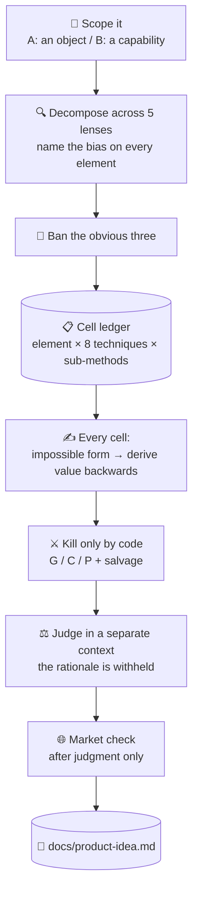

# 💡 superforge-brain — the BreakBias engine

[](https://opensource.org/licenses/MIT)
[](https://claude.com/claude-code)
[](https://github.com/takaoumehara/breakbias-studio)

**English** · [日本語](README.ja.md) · [简体中文](README.zh-CN.md) · [Español](README.es.md) · [한국어](README.ko.md)

> **Stop waiting for a good idea to arrive. Make a machine sweep every combination, and read what survives.**

---

## 🔰 What is this?

About thirty minutes into any brainstorming meeting, someone says "yeah, that one's probably fine." Not because a good idea was found, but because **somebody got tired first**.

BreakBias does not get tired.

It breaks the subject into 20–40 elements and crosses each one with eight techniques and their sub-methods. Every combination is **a cell** with an ID and a status, and the run finishes only when all of them are terminal. Not "I think we covered everything" — *300 of 300 cells complete*.

A person cannot fill a 300-row grid without losing their place. Software can. **That asymmetry is the entire reason this is a skill and not a meeting.**

---

## 📐 Architecture



Nothing is pruned mid-sweep. Deduplication and scoring happen after generation, never during.

---

## ✨ Features

### 📋 "We covered everything" becomes a number
Element × technique × sub-method is one row in a ledger, and status moves one way only: `todo → generated → survived/killed → developed → judged`. Done means *zero rows left at `todo`*. A skipped cell cannot quietly become a cell that never existed.

### 🔒 Nothing comes in from outside the box (Closed World)
Ideas are assembled only from elements already inside the subject and its immediate boundary. The moment you import something external it stops being non-obvious and becomes an addition anyone could have made. That constraint is what produces a genuinely new arrangement instead of a competitor's feature bolted on.

### ⚖️ Killing needs a reason, and so does keeping
A cell dies on one of three codes only — **G** (swap the subject and it still reads fine, so it was never about this system), **C** (already ordinary), **P** (physically impossible). "Feels weak" is not a kill reason. Then a **salvage pass** re-reads the killed rows, because a wrongly killed idea never appears in the report — making it the one failure you can never catch by looking at the output.

---

## 🔄 Before / After

| | Before | After |
|---|---|---|
| How it ends | When someone got tired | When the ledger has zero `todo` rows |
| Where ideas come from | Whatever surfaced first | Every element × technique × sub-method |
| The obvious answer | Proposed again every time | Banned up front; novelty scored as distance from it |
| When you look at the market | First — and the thinking shrinks | After judgment, so it cannot skew novelty |
| What remains | A chat log | `docs/product-idea.md` with the ban list and the coverage count |

---

## 🚀 Install & Usage

### 🖥️ Install all twelve skills (once)

Clone the repository and run the installer. It links every skill into every skills directory it finds on this machine — Claude Code, Codex CLI, Gemini CLI, Antigravity.

```bash
git clone https://github.com/takaoumehara/superforge-skill
cd superforge-skill
./install.sh
```

Full options, single-skill installs, and the claude.ai upload route are in the [suite README](../../README.md).

### ⌨️ Call it

```
/superforge-brain
```

It starts by settling two things: whether the subject is an object or a capability (Domain A / B), and the resolution — `quick` (~80 cells), `standard` (~300), or `exhaustive` (900+). If `docs/brief.md` exists it reads that instead of re-asking.

---

## 🧬 Relationship to SIT

BreakBias stands on two principles from **SIT (Systematic Inventive Thinking)**:

- **Closed World** — never import an element from outside the box
- **Function Follows Form** — build the impossible shape first, derive the value backwards

Those are inherited. Here is what BreakBias adds.

| | SIT | BreakBias |
|---|---|---|
| Techniques | 5 | **8** (adds Reverse / Shift / Repurpose) |
| Bias | not handled explicitly | **named on every element** (functional / structural / relational) |
| Clichés | — | **three banned up front**, and novelty is scored as distance from them |
| Exhaustiveness | depends on human stamina | **a cell ledger a machine verifies** — any `todo` left means unfinished |
| Selection | — | **G / C / P kill codes** plus a salvage pass for wrongful kills |
| Scoring | — | **a judge in a separate context**, never shown the rationale |
| Market | out of scope | **red / gray / white plus an entry verdict, after judgment only** |

SIT is a method for people in a room. BreakBias rebuilds it into something **a machine can sweep exhaustively, and prove that it did**.

Implementation and real run logs: [takaoumehara/breakbias-studio](https://github.com/takaoumehara/breakbias-studio)

---

## 📄 License

MIT — see [LICENSE](../../LICENSE). The skill body is in [SKILL.md](SKILL.md); the sub-methods, kill tests, judge protocol, market rubric, and direction filter are in [references/ideation-tools.md](references/ideation-tools.md). Suite overview: [superforge-skill](../../README.md).
