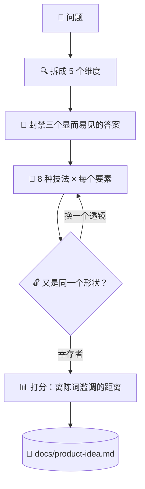

# 💡 superforge-brain

[](https://opensource.org/licenses/MIT)
[](https://claude.com/claude-code)
[](https://github.com/takaoumehara/superforge-skill)

[English](README.md) · [日本語](README.ja.md) · **简体中文** · [Español](README.es.md) · [한국어](README.ko.md)

> **别再等好点子自己冒出来。把问题的每个要素都过一遍每种技法，再看谁活了下来。**

---

## 🔰 这是什么？

在海滩上找丢掉的戒指，你可以漫无目的地走，也可以在沙面上打好网格，一格一格地过。这个技能就是那张网格。

它先把问题拆成要素，在产出任何东西之前点名封禁三个最显而易见的答案，然后让每个要素依次穿过八种变换技法。用覆盖率取代灵感，活下来的概念再按"离陈词滥调有多远"来打分。

---

## 📐 系统架构



扫描过程中不做任何裁剪，去重和打分都放到最后一次性完成。

---

## ✨ 三大亮点

### 🔒 Closed World — 不从盒子外面拿东西
概念只能用系统内部的要素及其紧邻的边界来搭建。正是这条约束逼出真正新的组合，而不是把竞品的功能生搬过来。

### 🚫 先点名封禁三个平庸方案
把任何模型都会最先想到的三个答案明确列出来并禁用，然后才开始发想；而且它们会被写进产物，下个月不会有人再提一遍。

### 📊 新颖度是量出来的，不是自封的
幸存概念按四个维度打分，其中新颖度就等于"离被封禁的三个方案有多远"。低于 30 分丢弃，37 分以上升级为 Hero Concept，附带 MVP、验证计划和第一步动作。

---

## 🔄 使用前 / 使用后

| | 使用前 | 使用后 |
|---|---|---|
| 点子来源 | 最先冒出来的那个 | 每个要素 × 每种技法 |
| 显而易见的方案 | 每次都会再来一遍 | 扫描前就写进禁用清单 |
| 收敛方式 | 边生成边裁剪 | 先出完，最后统一打分 |
| 留下什么 | 一段对话记录 | 带禁用清单的 `docs/product-idea.md` |

---

## 🚀 安装与使用

只需要 `git`，以及一个从目录加载技能的 AI 工具。

### 🖥️ Claude Code（CLI）

把整套克隆到任意位置，然后只链接这一个技能：

```bash
git clone https://github.com/takaoumehara/superforge-skill ~/src/superforge-skill
ln -s ~/src/superforge-skill/skills/superforge-brain ~/.claude/skills/superforge-brain
```

重启 Claude Code，然后调用：

```
/superforge-brain
```

如果项目里已有 `docs/brief.md`，它会直接读，而不是重新追问项目背景。

### 🔗 Codex CLI / Gemini CLI / Antigravity

链接方式相同，只是目录不同。也可以交给安装脚本，它会找出本机所有技能目录，一次性链接全部 11 个技能：

```bash
cd ~/src/superforge-skill
./install.sh
```

脚本可重复执行，只处理自己创建的符号链接，并支持 `--dry-run` 预览和 `--uninstall` 卸载。

### 🌐 claude.ai（浏览器）

把这个技能的文件夹打包成 zip，在账号的技能设置里上传：

```bash
cd ~/src/superforge-skill/skills/superforge-brain
zip -r superforge-brain.zip .
```

浏览器端一次只能传一个技能，需要几个就重复几次。

---

## 📄 许可证

MIT — 见 [LICENSE](../../LICENSE)。技能正文在 [SKILL.md](SKILL.md)；让每种技法真正穷尽的子方法，以及判断哪个 Hero Concept 值得动手的筛选标准，都在 [references/ideation-tools.md](references/ideation-tools.md)。整套说明见 [superforge-skill](../../README.md)。
