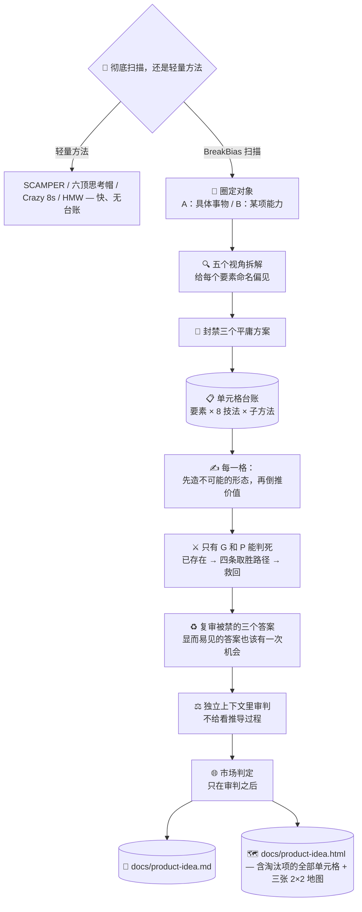

# 💡 superforge-brain — BreakBias 引擎

[](https://opensource.org/licenses/MIT)
[](https://claude.com/claude-code)
[](https://github.com/takaoumehara/breakbias-studio)

[English](README.md) · [日本語](README.ja.md) · **简体中文** · [Español](README.es.md) · [한국어](README.ko.md)

> **别再等好点子自己冒出来。让机器把所有组合跑完一遍，再看谁活下来。**

---

## 🔰 这是什么？

任何头脑风暴会开到三十分钟左右，总会有人说「差不多就这个吧」。不是因为找到了好方案，而是因为**有人先累了**。

BreakBias 不会累。

它把对象拆成 20–40 个要素，再和八种技法及其子方法逐一相乘。每个组合都是**一个「单元格」**，带编号和状态，全部走到终态才算跑完。不是「我觉得差不多都看过了」，而是「300 格里完成 300 格」。

人没法把三百行的表格一格不漏地填完，机器可以。**这就是它是一个技能而不是一场会议的全部理由。**

---

## 📐 系统架构



扫描过程中一格都不裁。去重和打分都放在生成结束之后。用哪种方法本身，也是先摆出来让人选，而不是替人假定。

---

## ✨ 三大亮点

### 📋 「都看过了」变成一个数字
要素 × 技法 × 子方法就是台账里的一行，状态只能单向前进：`todo → 已生成 → 存活/淘汰 → 已展开 → 已审判`。完成的定义是**没有一行停在 `todo`**。漏掉的格子没法悄悄变成「本来就不存在的格子」。

### 🔒 不从盒子外面拿东西（Closed World）
点子只能用对象内部及其紧邻边界的要素来搭。一旦从外面引入新东西，它就不再是非自明的，而是谁都想得到的添加。正是这条约束，逼出真正新的组合，而不是把竞品的功能生搬过来。

### ⚖️ 「早就有人做了」不是判死的理由
能判死的代码只有两个——**G**（把主语换成别的照样成立，说明这事跟本对象无关）和 **P**（物理上不成立）。两者都**不需要了解市场就能判定**，这正是关键：需要市场知识的判死，就是这台引擎特意推迟到 §8 的那剂毒，只是下得更早、更看不见。

已经在别处存在的点子不判死，而是**打上标签**送进四条取胜路径——**差异**（只改一点点就变成另一种体验）、**地理**（在一个市场有、在另一个没有）、**时机**（以前做不成、现在做得成）、**执行**（没人做好，而且你能指出具体缺陷）。四条全不过才判死，代码是 **C**。之后还有**救回环节**重读被判死的行，因为被误杀的点子根本不会出现在报告里，这是唯一一种看输出永远发现不了的失误。

### 🏪 「超市问题」修好了
按旧算法，「在这个镇上开一家超市」拿到 Novelty 1、Wow 1、User Impact 9、Company Impact 8——合计 19，低于门槛，删掉。每个镇都需要一家。它稳定赚钱。引擎测的是**「离显而易见有多远」，却把结果叫作「价值」**。

现在四个分数汇成两条**绝不相加**的轴——**独创轴**（Novelty + Wow）和**事业轴**（User + Company Impact），判定变成象限：**Hero**（没见过且被需要）、**Workhorse**（平凡但确实被需要）、**Lab**（有意思但当下赚不到钱，附上让它回来的条件放上架）、**Discard**（唯一正当的丢弃）。而显而易见的答案**通常是有原因才显而易见的**，所以被禁的三个答案在扫描结束后还有**一次复审**，走同样的四条路径。

### 🗺️ 不只看到活下来的，也看到被砍掉的
`docs/product-idea.html` 展示**每一个生成过的点子**，包括被淘汰的，各自带着判死代码和一句话理由——不会再只拿到最后三个名字。被当作「已存在」淘汰的点子，会把四条取胜路径都带删除线地列出来——**在丢掉它之前，确实从四个方向找过取胜的办法**。结果被摆进三张 2×2 地图：独创轴 × 事业轴（四个象限的名字直接标在图里）、Impact × Effort（标出「low-hanging fruit」象限）、User Impact × Company Impact，不用逐张卡片读完就能看出优先级。

### 🔀 BreakBias 是一个选项，不是唯一方法
一开始就问清楚：要彻底追踪的扫描，还是一种轻量方法——SCAMPER、六顶思考帽、Crazy 8s、How Might We、脑力写作、逆向头脑风暴。重的那套用在经得起推敲的时候，轻的那套用在快、低风险的第一轮。完整菜单见 [references/classic-methods.md](references/classic-methods.md)。

---

## 🔄 使用前 / 使用后

| | 使用前 | 使用后 |
|---|---|---|
| 什么时候结束 | 有人累了的时候 | 台账里 `todo` 归零的时候 |
| 点子从哪来 | 最先冒出来的那个 | 每个要素 × 每种技法 × 每种子方法 |
| 显而易见的方案 | 每次都会再来一遍 | 开跑前先封禁，再按距离打新颖度 |
| 什么时候看市场 | 一开始就看，然后想法就缩了 | 审判之后，不影响新颖度评分 |
| 能看到什么 | 只有最后三个名字 | 生成过的全部点子、淘汰了什么、为什么 |
| 怎么给生存的点子排优先级 | 逐张卡片读完再凭感觉 | 三张 2×2 地图——独创×事业、Impact×Effort、User×Company Impact |
| 平凡但确有需求的点子 | 以「早就有了」判死 | 打标签，过四条取胜路径，作为 **Workhorse** 留下 |
| 有趣但赚不到钱的点子 | 和其他一起丢掉 | 放进 **Lab** 架子，附上让它回来的条件 |
| 被禁的三个显而易见答案 | 禁掉之后再也不看 | 只禁生成，审判之前复审一次 |
| 用哪种方法跑 | 默认 BreakBias | 先摆出来选——彻底扫描还是轻量方法 |
| 留下什么 | 一段对话记录 | 带禁用清单和覆盖率的 `docs/product-idea.md` + `docs/product-idea.html` |

---

## 🚀 安装与使用

### 🖥️ 一次装好全部 13 个技能（只需一次）

克隆仓库并运行安装脚本。它会找出本机所有技能目录，把 13 个技能一次性链接进去（Claude Code / Codex CLI / Gemini CLI / Antigravity）。

```bash
git clone https://github.com/takaoumehara/superforge-skill
cd superforge-skill
./install.sh
```

完整选项、只装单个技能的方法，以及 claude.ai 的上传步骤，都在[整套 README](../../README.zh-CN.md)。

### ⌨️ 调用它

```
/superforge-brain
```

先问用哪种方法：彻底的 BreakBias 扫描，还是更快的轻量方法（SCAMPER、六顶思考帽、Crazy 8s、How Might We——见 [references/classic-methods.md](references/classic-methods.md)）。选扫描的话，接着定对象是具体事物还是一项能力（Domain A / B），并在问之前用大白话讲清楚覆盖档位的意思——`quick`（约 80 格，只在潜力最高的要素上各跑一遍）、`standard`（约 300，每个要素 × 每种技法各一遍）、`exhaustive`（900+，遇到重复的形态还会追加解锁手法）。项目里若已有 `docs/brief.md`，它会直接读而不再追问。

---

## 🧬 和 SIT 的关系

BreakBias 的地基是 **SIT（Systematic Inventive Thinking）** 的两条原则：

- **Closed World** —— 不从盒子外面拿东西
- **Function Follows Form** —— 先造出不可能的形态，价值再倒推

这两条是继承来的。BreakBias 在此之上加了这些。

| | SIT | BreakBias |
|---|---|---|
| 技法 | 5 种 | **8 种**（增加 Reverse / Shift / Repurpose） |
| 偏见 | 没有明确处理 | **强制给每个要素命名**（功能性 / 结构性 / 关系性） |
| 平庸方案 | — | **开跑前封禁三个**，再按离它们多远来打新颖度 |
| 穷尽性 | 靠人的耐力 | **机器可验证的单元格台账**，还有 `todo` 就是没跑完 |
| 筛选 | — | **只有 G 和 P 能判死**；已存在的走四条取胜路径，外加误杀救回与被禁三案的复审 |
| 打分 | — | **独立上下文的审判**，看不到推导过程 |
| 市场 | 不涉及 | **red / gray / white 加参入判定，且只在审判之后** |

SIT 是给一屋子人开会用的方法。BreakBias 把它重建成**机器能穷尽扫描、而且能证明自己扫完了**的东西。

实现与实跑记录：[takaoumehara/breakbias-studio](https://github.com/takaoumehara/breakbias-studio)

---

## 📄 许可证

MIT — 见 [LICENSE](../../LICENSE)。技能正文在 [SKILL.md](SKILL.md)；子方法、判死测试、审判协议、市场评估表和方向筛选都在 [references/ideation-tools.md](references/ideation-tools.md)；四象限、取胜路径与被禁三案的复审在 [references/value-classification.md](references/value-classification.md)；怎么去问真人在 [references/talk-to-users.md](references/talk-to-users.md)；轻量方法菜单（SCAMPER、六顶思考帽等）在 [references/classic-methods.md](references/classic-methods.md)；`docs/product-idea.html` 的规格——全部点子可视化，加四象限、Impact×Effort 和 User×Company Impact 地图——在 [references/idea-map-output.md](references/idea-map-output.md)。整套说明见 [superforge-skill](../../README.zh-CN.md)。
