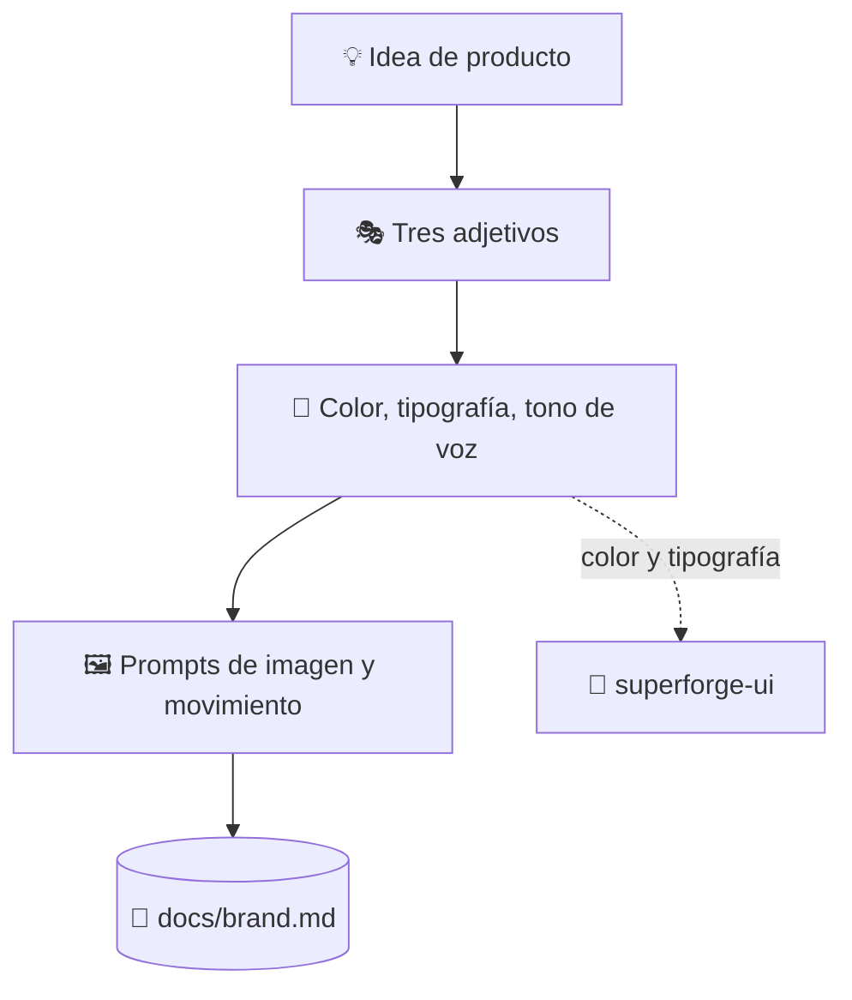

# 🎭 superforge-brand

[](https://opensource.org/licenses/MIT)
[](https://claude.com/claude-code)
[](https://github.com/takaoumehara/superforge-skill)

[English](README.md) · [日本語](README.ja.md) · [简体中文](README.zh-CN.md) · **Español** · [한국어](README.ko.md)

> **Decide cómo se ve y cómo suena el producto, y llévate los prompts que de verdad generan los recursos.**

---

## 🔰 ¿Qué es esto?

Una dirección de arte hace dos trabajos. El primero es fijar el tono: qué sensación transmite esto, qué nunca dice, con qué tres palabras vive. El segundo es la lista de tomas, o sea las instrucciones concretas que alguien puede ejecutar mañana.

Casi todos los ejercicios de marca se quedan en el primero. Esta skill hace los dos: un sistema de marca en tres adjetivos y prompts listos para pegar, de imagen y de movimiento, construidos con una fórmula explícita.

---

## 📐 Arquitectura



Las decisiones de color y tipografía pasan a `superforge-ui`, que las convierte en tokens. Nunca se definen dos veces.

---

## ✨ 3 puntos clave

### 🎭 Tres adjetivos ante los que responde todo lo demás
La personalidad visual se fija en exactamente tres palabras, y cada decisión posterior — paleta, pareja tipográfica, tono de voz — tiene que poder defenderse frente a ellas. Con tres adjetivos se puede discutir; con un mood board no.

### 🖼️ Fórmulas de prompt en lugar de dirección vaga
La imagen sigue *sujeto + estilo + luz y paleta + composición + atmósfera*; el movimiento sigue *acción + movimiento de cámara + transición de luz + estética + ritmo*. Los recursos de interfaz se generan sin marco por defecto, sin un portátil dibujado alrededor.

### 🔗 Entrega los tokens en vez de inventarlos
El color y la tipografía pasan a `superforge-ui` para convertirse en tokens dentro de `docs/design.md`. Esta skill no define tokens a propósito, y eso es justo lo que evita que el documento de marca y el sistema de diseño se contradigan.

---

## 🔄 Antes / Después

| | Antes | Después |
|---|---|---|
| Definición de marca | Un mood board y una sensación | Tres adjetivos más colores funcionales |
| Generación de recursos | «Que se vea mejor» | Una fórmula con nombre, rellenada |
| Imágenes de interfaz | Envueltas en un portátil de mentira | La interfaz sola, sin marco |
| Fuente de verdad del color | Redefinida en cada documento | Definida una vez, como tokens |

---

## 🚀 Instalación y uso

### 🖥️ Instala las once skills (una sola vez)

Clona el repositorio y ejecuta el instalador. Enlaza las once skills en todos los directorios de skills de tu máquina (Claude Code, Codex CLI, Gemini CLI, Antigravity).

```bash
git clone https://github.com/takaoumehara/superforge-skill
cd superforge-skill
./install.sh
```

Todas las opciones, la instalación de una sola skill y la ruta de subida a claude.ai están en el [README de la suite](../../README.es.md).

### ⌨️ Invócala

```
/superforge-brand
```

Aunque no haya ninguna herramienta de imagen disponible, sigue produciendo los prompts listos para pegar en el generador que uses.

---

## 📄 Licencia

MIT — consulta [LICENSE](../../LICENSE). El cuerpo de la skill, con las dos fórmulas de prompt, está en [SKILL.md](SKILL.md). Visión general de la suite: [superforge-skill](../../README.es.md).
