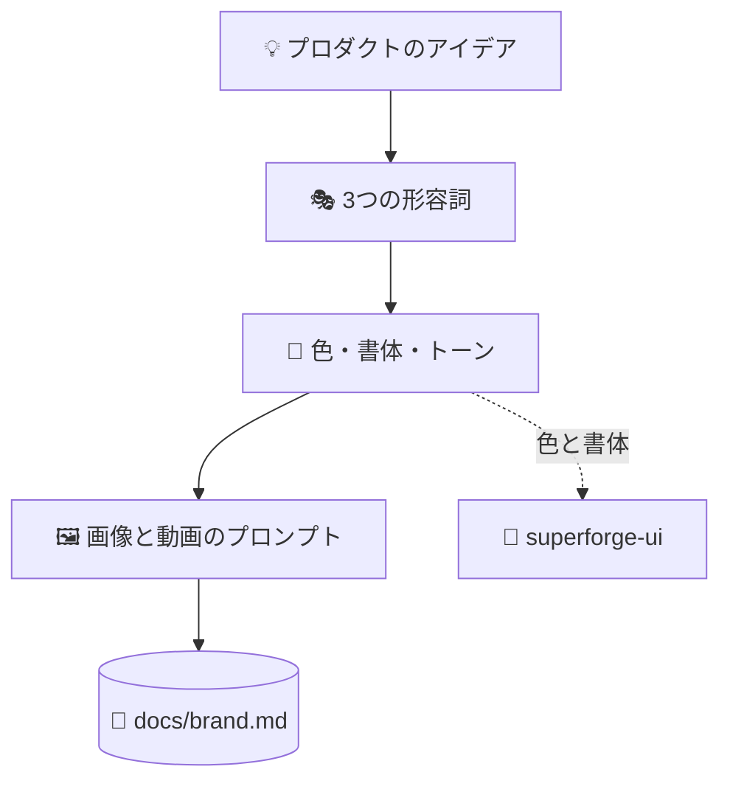

# 🎭 superforge-brand

[](https://opensource.org/licenses/MIT)
[](https://claude.com/claude-code)
[](https://github.com/takaoumehara/superforge-skill)

[English](README.md) · **日本語** · [简体中文](README.zh-CN.md) · [Español](README.es.md) · [한국어](README.ko.md)

> **プロダクトの見え方と話し方を決め、そのまま素材を生成できるプロンプトを持ち帰る。**

---

## 🔰 これは何？

アートディレクターの仕事は2つあります。1つはトーンを決めること。どんな感触で、何は絶対に言わないか、どの3語で生きるか。もう1つは撮影指示書、つまり明日から手を動かせる具体的な指示です。

ブランド作業の多くは1つ目で止まります。このスキルは両方やります。3つの形容詞で組み立てたブランドシステムと、明示的な公式から作った画像・動画のコピペ可能な生成プロンプトです。

---

## 📐 システム概念図



色と書体の判断は `superforge-ui` に渡され、そこでトークンになります。二重定義はしません。

---

## ✨ 強み

### 💸 生成したメディアがいくらかかっているのか、そして使っていいのか
1回が安いからこそ、合計が誰にも把握されない。実際の費用は、1枚を得るために生成した30枚のほうです。動画は1秒あたりで見ると画像の10〜100倍。だからアセットごとに、始める前に反復回数の予算を決める。そして本当に難しいのは一貫性です。良い1枚は簡単で、同じブランドに見える12枚が問題。解き方はパラメータを固定して1セッションで作りきることであって、言葉を上手くすることではありません。最後に権利の3つの問い——出す前に答える、後ではなく。そしてプロダクト自身と、顧客は、絶対に生成しない。

### 🎭 すべてが3つの形容詞に説明責任を負う
ビジュアルの人格をちょうど3語に固定し、以降の判断（パレット、書体の組み合わせ、トーン）はすべてその3語に対して説明できなければなりません。3語は議論できる制約ですが、ムードボードはそうではありません。

### 🖼️ 曖昧なディレクションではなく、プロンプトの公式
画像は「被写体＋スタイル＋ライティングと配色＋構図＋ムード」、モーションは「動作＋カメラワーク＋光の変化＋質感＋テンポ」。UI素材は既定でフレームなしに生成し、ノートPCのモックアップで囲みません。

### 🔗 トークンは作らず、渡す
色と書体は `superforge-ui` に渡り、`docs/design.md` のトークンになります。このスキルが意図的にトークンを定義しないからこそ、ブランド資料とデザインシステムが食い違わずに済みます。

---

## 🔄 導入前 / 導入後

| | 導入前 | 導入後 |
|---|---|---|
| ブランドの定義 | ムードボードと雰囲気 | 3つの形容詞と機能色 |
| 素材の生成 | 「もっといい感じに」 | 名前の付いた公式に沿って記述 |
| UIのビジュアル | ノートPCのモックで囲む | インターフェイス本体だけを生成 |
| 色の正 | 資料ごとに定義し直す | トークンとして一度だけ定義 |

---

## 🚀 インストールと使い方

### 🖥️ 12個まとめて入れる（最初の1回だけ）

クローンしてインストーラを走らせるだけです。マシンの中にあるスキル用フォルダを全部探して、14個をまとめてリンクします（Claude Code / Codex CLI / Gemini CLI / Antigravity）。

```bash
git clone https://github.com/takaoumehara/superforge-skill
cd superforge-skill
./install.sh
```

オプション、1個だけ入れる方法、claude.ai へのアップロード手順は [スイート全体の README](../../README.ja.md) にあります。

### ⌨️ 呼び出す

```
/superforge-brand
```

画像生成ツールが使えない環境でも、プロンプトはそのまま出力されます。好きなジェネレーターに貼り付けてください。

---

## 📄 ライセンス

MIT — [LICENSE](../../LICENSE) を参照してください。2つのプロンプト公式を含むスキル本体は [SKILL.md](SKILL.md) にあります。スイート全体の説明は [superforge-skill](../../README.ja.md) へ。
