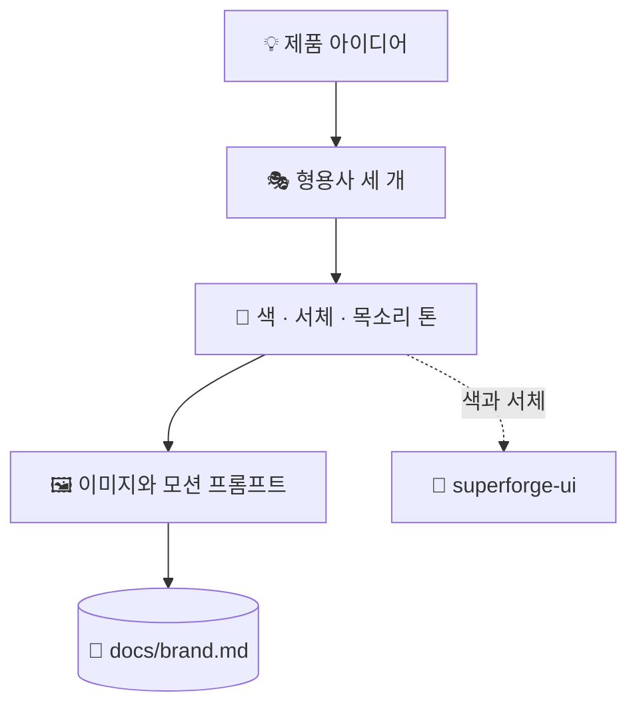

# 🎭 superforge-brand

[](https://opensource.org/licenses/MIT)
[](https://claude.com/claude-code)
[](https://github.com/takaoumehara/superforge-skill)

[English](README.md) · [日本語](README.ja.md) · [简体中文](README.zh-CN.md) · [Español](README.es.md) · **한국어**

> **제품이 어떻게 보이고 어떻게 말할지 정하고, 실제로 소재를 만들어 내는 프롬프트까지 함께 가져갑니다.**

---

## 🔰 이게 뭔가요?

아트 디렉터의 일은 두 가지입니다. 하나는 톤을 정하는 것입니다. 이 물건이 어떤 느낌인지, 절대 하지 않을 말은 무엇인지, 어떤 세 단어로 살아갈지. 다른 하나는 촬영 지시서, 즉 내일 바로 손을 움직일 수 있는 구체적인 지시입니다.

대부분의 브랜드 작업은 첫 번째에서 멈춥니다. 이 스킬은 둘 다 합니다. 형용사 세 개로 세운 브랜드 체계와, 명시적인 공식으로 만든 이미지·모션 생성 프롬프트를 그대로 붙여 쓸 수 있게 내놓습니다.

---

## 📐 시스템 구조



색과 서체 결정은 `superforge-ui`로 넘겨져 토큰이 됩니다. 두 번 정의하지 않습니다.

---

## ✨ 강점

### 💸 생성한 미디어가 얼마나 드는지, 그리고 써도 되는지
한 번이 싸기 때문에 오히려 총액을 아무도 세지 않는다 — 실제 비용은 한 장을 얻으려고 만든 서른 장이고, 영상은 초당으로 보면 이미지의 열 배에서 백 배다. 그래서 시작하기 전에 에셋마다 반복 예산을 정한다. 정말 어려운 건 일관성이다. 좋은 한 장은 쉽고, 같은 브랜드로 보이는 열두 장이 문제이며, 해법은 파라미터를 고정해 한 세션에서 끝내는 것이지 문구를 더 잘 쓰는 게 아니다. 마지막으로 권리에 관한 세 가지 질문 — 내보낸 다음이 아니라 그 전에 답한다. 그리고 제품 자체와 고객은 절대 생성하지 않는다.

### 🎭 나머지 전부가 형용사 세 개에 책임을 집니다
시각적 성격을 정확히 세 단어로 고정하고, 이후의 모든 결정(팔레트, 서체 조합, 목소리 톤)은 그 세 단어 앞에서 변론할 수 있어야 합니다. 세 단어는 반박할 수 있는 제약이지만, 무드보드는 그렇지 않습니다.

### 🖼️ 모호한 방향 대신 프롬프트 공식
이미지는 「대상 + 스타일 + 조명과 팔레트 + 구도 + 분위기」, 모션은 「동작 + 카메라 움직임 + 조명 변화 + 미감 + 속도감」을 따릅니다. UI 소재는 기본적으로 프레임 없이 생성하며, 노트북 목업으로 감싸지 않습니다.

### 🔗 토큰을 만들지 않고 넘깁니다
색과 서체는 `superforge-ui`로 넘어가 `docs/design.md`의 토큰이 됩니다. 이 스킬이 일부러 토큰을 정의하지 않기 때문에 브랜드 문서와 디자인 시스템이 서로 어긋나지 않습니다.

---

## 🔄 도입 전 / 도입 후

| | 도입 전 | 도입 후 |
|---|---|---|
| 브랜드 정의 | 무드보드 한 장과 분위기 | 형용사 세 개와 기능색 |
| 소재 생성 | "좀 더 예쁘게" | 이름이 붙은 공식을 채워서 |
| 인터페이스 비주얼 | 노트북 목업으로 감싸기 | 인터페이스 자체만, 프레임 없이 |
| 색의 기준 | 문서마다 다시 정의 | 토큰으로 한 번만 정의 |

---

## 🚀 설치 및 사용법

### 🖥️ 열네 개를 한 번에 설치 (처음 한 번만)

저장소를 클론하고 설치 스크립트를 실행하면 됩니다. 이 머신의 모든 스킬 디렉터리를 찾아 열네 개를 한 번에 링크합니다(Claude Code / Codex CLI / Gemini CLI / Antigravity).

```bash
git clone https://github.com/takaoumehara/superforge-skill
cd superforge-skill
./install.sh
```

옵션 전체와 스킬 하나만 설치하는 방법, claude.ai 업로드 절차는 [스위트 README](../../README.ko.md)에 있습니다.

### ⌨️ 호출하기

```
/superforge-brand
```

이미지 생성 도구가 없는 환경에서도 프롬프트는 그대로 나오므로, 원하는 생성기에 붙여 넣으면 됩니다.

---

## 📄 라이선스

MIT — [LICENSE](../../LICENSE)를 참고하세요. 두 가지 프롬프트 공식을 포함한 스킬 본문은 [SKILL.md](SKILL.md)에 있습니다. 스위트 전체 소개는 [superforge-skill](../../README.ko.md)을 보세요.
