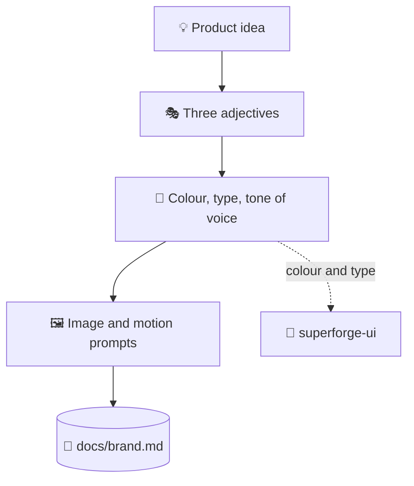

# 🎭 superforge-brand

[](https://opensource.org/licenses/MIT)
[](https://claude.com/claude-code)
[](https://github.com/takaoumehara/superforge-skill)

**English** · [日本語](README.ja.md) · [简体中文](README.zh-CN.md) · [Español](README.es.md) · [한국어](README.ko.md)

> **Decide how the product looks and sounds — and leave with the prompts that actually generate the assets.**

---

## 🔰 What is this?

An art director does two jobs. The first is deciding the mood: what this thing feels like, what it never says, which three words it lives by. The second is the shot list — the concrete instructions a photographer can act on tomorrow.

Most brand exercises stop after the first job. This skill does both: a brand system in three adjectives, and copy-paste-ready generation prompts for images and motion built from an explicit formula.

---

## 📐 Architecture



Colour and type decisions are handed to `superforge-ui`, which turns them into tokens. They are never defined twice.

---

## ✨ Features

### 🎭 Three adjectives everything else answers to
Visual personality is fixed as exactly three words, and every later decision — palette, type pairing, tone of voice — has to be defensible against them. Three is a constraint you can argue with; a mood board is not.

### 🖼️ Prompt formulas, not vague art direction
Images follow *subject + style + lighting and palette + composition + mood*; motion follows *action + camera movement + lighting transition + aesthetic + pacing*. Interface assets are generated frameless by default, with no laptop mockup wrapped around them.

### 🔗 Hands tokens off instead of inventing them
Colour and type go to `superforge-ui` to become tokens in `docs/design.md`. This skill deliberately does not define tokens, which is what stops a brand doc and a design system from disagreeing.

---

## 🔄 Before / After

| | Before | After |
|---|---|---|
| Brand definition | A mood board and a feeling | Three adjectives plus functional colours |
| Asset generation | "Make it look nicer" | A named formula, filled in |
| Interface imagery | Wrapped in a laptop mockup | The interface itself, frameless |
| Colour source of truth | Redefined in every document | Defined once, as tokens |

---

## 🚀 Install & Usage

You need `git` and an AI tool that loads skills from a directory.

### 🖥️ Claude Code (CLI)

Clone the suite anywhere, then link this one skill:

```bash
git clone https://github.com/takaoumehara/superforge-skill ~/src/superforge-skill
ln -s ~/src/superforge-skill/skills/superforge-brand ~/.claude/skills/superforge-brand
```

Restart Claude Code, then invoke it:

```
/superforge-brand
```

Without an image tool available it still produces the prompts, ready to paste into whichever generator you use.

### 🔗 Codex CLI / Gemini CLI / Antigravity

The same link, a different directory. Or let the installer find every skills directory on this machine and link all eleven skills at once:

```bash
cd ~/src/superforge-skill
./install.sh
```

It is idempotent, touches only its own symlinks, and accepts `--dry-run` and `--uninstall`.

### 🌐 claude.ai (browser)

Zip this skill's folder and upload it in your account's skill settings:

```bash
cd ~/src/superforge-skill/skills/superforge-brand
zip -r superforge-brand.zip .
```

The browser UI takes one skill at a time, so repeat it for each skill you want.

---

## 📄 License

MIT — see [LICENSE](../../LICENSE). The full skill body, including both prompt formulas, is in [SKILL.md](SKILL.md). Suite overview: [superforge-skill](../../README.md).
