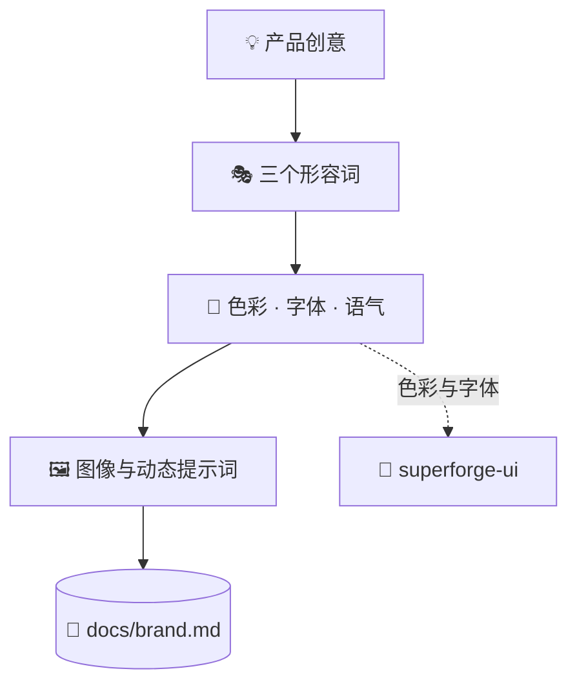

# 🎭 superforge-brand

[](https://opensource.org/licenses/MIT)
[](https://claude.com/claude-code)
[](https://github.com/takaoumehara/superforge-skill)

[English](README.md) · [日本語](README.ja.md) · **简体中文** · [Español](README.es.md) · [한국어](README.ko.md)

> **定下产品的长相和口吻，同时带走真正能生成素材的提示词。**

---

## 🔰 这是什么？

艺术指导做两件事。第一件是定调子：这东西给人什么感觉，绝不会说什么话，靠哪三个词活着。第二件是拍摄清单，也就是摄影师明天就能照着干的具体指令。

大多数品牌工作停在第一件。这个技能两件都做：用三个形容词搭起品牌体系，再按明确的公式产出可直接粘贴的图像与动态生成提示词。

---

## 📐 系统架构



色彩和字体的决定会交给 `superforge-ui` 变成 token，绝不定义两遍。

---

## ✨ 三大亮点

### 🎭 一切都要对三个形容词负责
视觉人格被固定成正好三个词，之后的每个决定——配色、字体搭配、语气——都必须能对着这三个词自圆其说。三个词是可以争论的约束，情绪板不是。

### 🖼️ 给公式，而不是含糊的方向
图像用「主体 + 风格 + 光线与配色 + 构图 + 氛围」，动态用「动作 + 运镜 + 光线变化 + 质感 + 节奏」。UI 素材默认不带外框生成，不再套一层笔记本电脑样机。

### 🔗 只交接 token，不自己发明
色彩和字体交给 `superforge-ui`，在 `docs/design.md` 里变成 token。这个技能刻意不定义 token，正是这一点让品牌文档和设计系统不会互相打架。

---

## 🔄 使用前 / 使用后

| | 使用前 | 使用后 |
|---|---|---|
| 品牌定义 | 一块情绪板加一种感觉 | 三个形容词加功能色 |
| 素材生成 | "再好看一点" | 按有名字的公式填空 |
| 界面视觉 | 套上笔记本样机 | 只生成界面本身，不带边框 |
| 色彩的唯一来源 | 每份文档各定义一次 | 作为 token 定义一次 |

---

## 🚀 安装与使用

### 🖥️ 一次装好全部 12 个技能（只需一次）

克隆仓库并运行安装脚本。它会找出本机所有技能目录，把 12 个技能一次性链接进去（Claude Code / Codex CLI / Gemini CLI / Antigravity）。

```bash
git clone https://github.com/takaoumehara/superforge-skill
cd superforge-skill
./install.sh
```

完整选项、只装单个技能的方法，以及 claude.ai 的上传步骤，都在[整套 README](../../README.zh-CN.md)。

### ⌨️ 调用它

```
/superforge-brand
```

即使当前环境没有可用的图像生成工具，它照样输出提示词，粘到你惯用的生成器里就行。

---

## 📄 许可证

MIT — 见 [LICENSE](../../LICENSE)。含两套提示词公式的技能正文在 [SKILL.md](SKILL.md)。整套说明见 [superforge-skill](../../README.zh-CN.md)。
