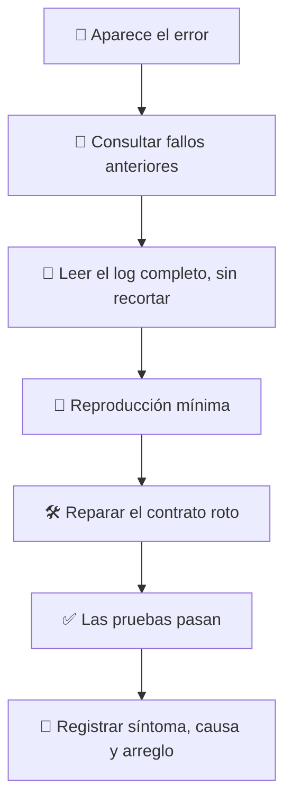

# 🐛 superforge-debug

[](https://opensource.org/licenses/MIT)
[](https://claude.com/claude-code)
[](https://github.com/takaoumehara/superforge-skill)

[English](README.md) · [日本語](README.ja.md) · [简体中文](README.zh-CN.md) · **Español** · [한국어](README.ko.md)

> **Encuentra la causa antes de tocar el código, y no pagues dos veces por el mismo bug.**

---

## 🔰 ¿Qué es esto?

Un buen médico lee tu historial antes de recetar, porque el hecho de que algo te sentara mal hace dos años no es información que convenga redescubrir por las malas.

Esta skill le da ese historial a la depuración. Antes de formular una sola hipótesis consulta el registro local de fallos anteriores con `failforward recall`. Después trabaja desde el log completo en lugar de desde conjeturas, repara el contrato que se rompió de verdad y devuelve la lección al registro, para que la próxima vez el problema se reconozca en vez de resolverse otra vez.

---

## 📐 Arquitectura



La consulta va antes que las hipótesis. El registro va después de la verificación, no en su lugar.

---

## ✨ 3 puntos clave

### 🧠 Primero la memoria, luego las hipótesis
Se consulta la base de fallos antes que nada, y una lección recuperada que encaje se aplica de inmediato y se marca como útil. El esfuerzo de depuración se reserva para los problemas que aún no has resuelto una vez.

### 📜 Evidencia en vez de prueba y error
Se lee la traza completa sin recortar, se extraen los símbolos y las líneas exactas, se reduce la reproducción al mínimo y se sigue el flujo de datos aguas arriba hasta el punto donde se rompió el contrato. Cambiar algo y volver a ejecutar no es un método de diagnóstico.

### 🚫 Los síntomas nunca se tapan
Ni excepciones tragadas, ni aserciones esquivadas, ni valores de relleno que hagan desaparecer el rojo. Un arreglo que esconde el fallo no lo ha eliminado: lo ha movido a un sitio más incómodo.

---

## 🔄 Antes / Después

| | Antes | Después |
|---|---|---|
| Un bug que ya te pasó | Se redescubre desde cero | Se recupera con su lección verificada |
| Método de diagnóstico | Cambiar algo, reejecutar, repetir | Log completo y reproducción mínima |
| El «arreglo» | Un `try/catch` que lo esconde | El contrato roto, reparado |
| Después del arreglo | No queda nada escrito | Síntoma, causa y arreglo registrados |

---

## 🚀 Instalación y uso

Solo hacen falta `git` y una herramienta de AI que cargue skills desde un directorio.

### 🖥️ Claude Code (CLI)

Clona la suite donde quieras y enlaza solo esta skill:

```bash
git clone https://github.com/takaoumehara/superforge-skill ~/src/superforge-skill
ln -s ~/src/superforge-skill/skills/superforge-debug ~/.claude/skills/superforge-debug
```

Reinicia Claude Code e invócala:

```
/superforge-debug
```

Los pasos de FailForward usan una CLI local llamada `failforward`. Si no está, la skill se salta la consulta y escribe la lección en `docs/`: la falta de esa CLI nunca detiene el diagnóstico.

### 🔗 Codex CLI / Gemini CLI / Antigravity

El mismo enlace, otro directorio. O deja que el instalador busque todos los directorios de skills de la máquina y enlace las once de una vez:

```bash
cd ~/src/superforge-skill
./install.sh
```

Es idempotente, solo toca sus propios enlaces simbólicos y acepta `--dry-run` y `--uninstall`.

### 🌐 claude.ai (navegador)

Comprime la carpeta de esta skill y súbela en los ajustes de skills de tu cuenta:

```bash
cd ~/src/superforge-skill/skills/superforge-debug
zip -r superforge-debug.zip .
```

La interfaz del navegador acepta una skill por vez, así que repite el proceso para cada una.

---

## 📄 Licencia

MIT — consulta [LICENSE](../../LICENSE). El protocolo de cuatro fases y las llamadas exactas a `failforward` están en [SKILL.md](SKILL.md). Visión general de la suite: [superforge-skill](../../README.es.md).
