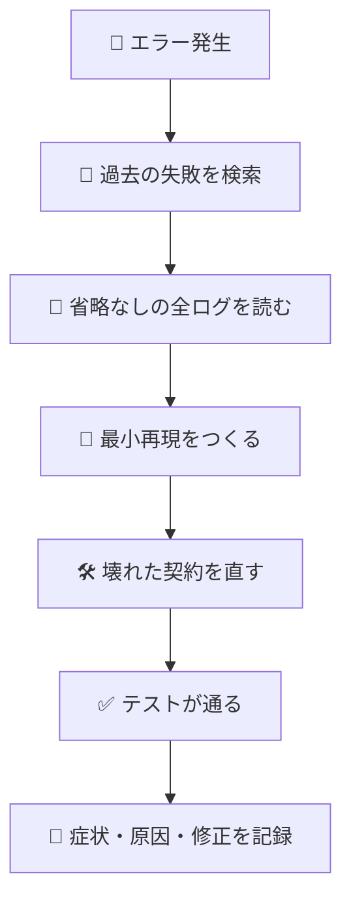

# 🐛 superforge-debug

[](https://opensource.org/licenses/MIT)
[](https://claude.com/claude-code)
[](https://github.com/takaoumehara/superforge-skill)

[English](README.md) · **日本語** · [简体中文](README.zh-CN.md) · [Español](README.es.md) · [한국어](README.ko.md)

> **コードを触る前に原因を突き止める。そして同じバグの代金を二度払わない。**

---

## 🔰 これは何？

良い医師は処方を書く前にカルテを読みます。2年前に何かで具合が悪くなった事実は、身をもって再発見していい情報ではないからです。

このスキルはデバッグにそのカルテを与えます。仮説を1つ立てる前に、`failforward recall` でローカルの失敗記録を検索します。そのうえで推測ではなく完全なログから作業し、実際に壊れた契約を直し、学びを書き戻します。次に同じことが起きたときは、解き直すのではなく気づけます。

---

## 📐 システム概念図



検索は仮説より先に。記録は検証の代わりではなく、検証の後に行います。

---

## ✨ 3つの強み

### 🧠 仮説より先に記憶を引く
まず失敗データベースを検索し、該当する学びがあれば即座に適用して「役に立った」と印を付けます。デバッグの労力は、まだ一度も解いたことのない問題に使います。

### 📜 試行錯誤ではなく証拠
省略なしのスタックトレースを読み、正確なシンボルと行番号を抜き出し、再現を最小まで絞り、上流のデータフローを辿って契約が壊れた地点を特定します。何かを変えて再実行することは診断ではありません。

### 🚫 症状を覆い隠さない
例外を握り潰さず、アサーションを迂回せず、赤を消すためのダミー値も入れません。失敗を隠す修正は、失敗を消したのではなく、もっと厄介な場所へ移しただけです。

---

## 🔄 導入前 / 導入後

| | 導入前 | 導入後 |
|---|---|---|
| 前にも踏んだバグ | 一から再発見 | 検証済みの学びごと呼び出す |
| 診断の方法 | 変えて実行、また変えて実行 | 全ログと最小再現 |
| 「修正」の中身 | 隠すための `try/catch` | 壊れた契約そのものを修復 |
| 修正の後 | 何も残らない | 症状・原因・修正を記録 |

---

## 🚀 インストールと使い方

### 🖥️ 11個まとめて入れる（最初の1回だけ）

クローンしてインストーラを走らせるだけです。マシンの中にあるスキル用フォルダを全部探して、11個をまとめてリンクします（Claude Code / Codex CLI / Gemini CLI / Antigravity）。

```bash
git clone https://github.com/takaoumehara/superforge-skill
cd superforge-skill
./install.sh
```

オプション、1個だけ入れる方法、claude.ai へのアップロード手順は [スイート全体の README](../../README.ja.md) にあります。

### ⌨️ 呼び出す

```
/superforge-debug
```

FailForward の手順はローカルの `failforward` CLI を使います。無い場合は検索を飛ばし、学びを `docs/` に書き残します。CLI が無いことで診断が止まることはありません。

---

## 📄 ライセンス

MIT — [LICENSE](../../LICENSE) を参照してください。4フェーズのプロトコルと `failforward` の正確な呼び出し方は [SKILL.md](SKILL.md) にあります。スイート全体の説明は [superforge-skill](../../README.ja.md) へ。
