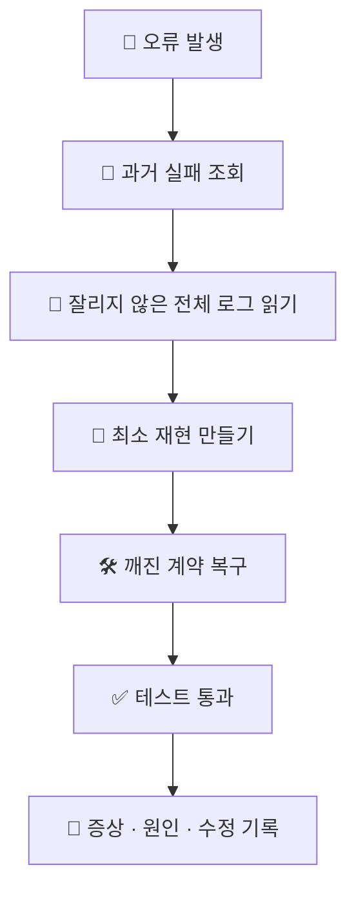

# 🐛 superforge-debug

[](https://opensource.org/licenses/MIT)
[](https://claude.com/claude-code)
[](https://github.com/takaoumehara/superforge-skill)

[English](README.md) · [日本語](README.ja.md) · [简体中文](README.zh-CN.md) · [Español](README.es.md) · **한국어**

> **코드를 건드리기 전에 원인을 찾고, 같은 버그의 값을 두 번 치르지 않습니다.**

---

## 🔰 이게 뭔가요?

좋은 의사는 처방을 쓰기 전에 진료 기록을 봅니다. 2년 전에 어떤 약이 맞지 않았다는 사실은, 몸으로 다시 확인해도 좋은 정보가 아니기 때문입니다.

이 스킬은 디버깅에 그 진료 기록을 붙여 줍니다. 가설을 하나 세우기 전에 `failforward recall`로 로컬의 과거 실패 기록을 조회합니다. 그다음 추측이 아니라 전체 로그에서 출발해, 실제로 깨진 계약을 고치고, 배운 것을 다시 기록합니다. 다음에 같은 일이 생기면 다시 푸는 대신 알아봅니다.

---

## 📐 시스템 구조



조회는 가설보다 먼저, 기록은 검증을 대신하지 않고 검증 뒤에 옵니다.

---

## ✨ 3가지 강점

### 🧠 가설보다 기억을 먼저 꺼냅니다
실패 데이터베이스를 가장 먼저 조회하고, 들어맞는 교훈이 있으면 즉시 적용한 뒤 유용했다고 표시합니다. 디버깅에 쓰는 힘은 아직 한 번도 풀어 본 적 없는 문제에 씁니다.

### 📜 시행착오가 아니라 증거
잘리지 않은 전체 스택 트레이스를 읽고, 정확한 심벌과 줄 번호를 뽑고, 재현을 최소로 좁히고, 상류 데이터 흐름을 따라가 계약이 깨진 지점을 짚습니다. 뭔가 바꾸고 다시 돌려 보는 것은 진단 방법이 아닙니다.

### 🚫 증상을 덮지 않습니다
예외를 삼키지 않고, 어서션을 우회하지 않고, 빨간불을 없애려는 더미 폴백 값도 넣지 않습니다. 실패를 감추는 수정은 실패를 없앤 것이 아니라 더 곤란한 자리로 옮긴 것입니다.

---

## 🔄 도입 전 / 도입 후

| | 도입 전 | 도입 후 |
|---|---|---|
| 전에 겪은 버그 | 처음부터 다시 발견 | 검증된 교훈과 함께 불러오기 |
| 진단 방식 | 바꿔서 돌리고 또 바꾸기 | 전체 로그와 최소 재현 |
| 이른바 "수정" | 가려 주는 `try/catch` | 깨진 계약 자체를 복구 |
| 수정한 뒤 | 아무것도 남지 않음 | 증상·원인·수정을 기록 |

---

## 🚀 설치 및 사용법

### 🖥️ 열두 개를 한 번에 설치 (처음 한 번만)

저장소를 클론하고 설치 스크립트를 실행하면 됩니다. 이 머신의 모든 스킬 디렉터리를 찾아 열두 개를 한 번에 링크합니다(Claude Code / Codex CLI / Gemini CLI / Antigravity).

```bash
git clone https://github.com/takaoumehara/superforge-skill
cd superforge-skill
./install.sh
```

옵션 전체와 스킬 하나만 설치하는 방법, claude.ai 업로드 절차는 [스위트 README](../../README.ko.md)에 있습니다.

### ⌨️ 호출하기

```
/superforge-debug
```

FailForward 단계는 로컬 `failforward` CLI를 사용합니다. 없으면 조회를 건너뛰고 교훈을 `docs/`에 기록합니다. CLI가 없다고 진단이 멈추는 일은 없습니다.

---

## 📄 라이선스

MIT — [LICENSE](../../LICENSE)를 참고하세요. 4단계 프로토콜과 `failforward`의 정확한 호출 방법은 [SKILL.md](SKILL.md)에 있습니다. 스위트 전체 소개는 [superforge-skill](../../README.ko.md)을 보세요.
