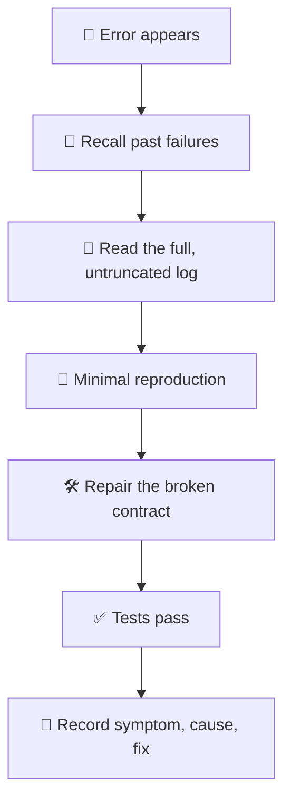

# 🐛 superforge-debug

[](https://opensource.org/licenses/MIT)
[](https://claude.com/claude-code)
[](https://github.com/takaoumehara/superforge-skill)

**English** · [日本語](README.ja.md) · [简体中文](README.zh-CN.md) · [Español](README.es.md) · [한국어](README.ko.md)

> **Find the cause before touching the code — and never pay for the same bug twice.**

---

## 🔰 What is this?

A good doctor reads your chart before writing a prescription, because the fact that you reacted badly to something two years ago is not information worth rediscovering the hard way.

This skill gives debugging that chart. Before forming a single hypothesis it queries a local record of past failures with `failforward recall`. Then it works from the full log rather than from guesses, fixes the contract that actually broke, and writes the lesson back so the next occurrence is recognised instead of re-solved.

---

## 📐 Architecture



Recall comes before hypotheses. Recording comes after verification, not instead of it.

---

## ✨ Features

### 🧠 Memory before hypotheses
The failure database is queried first, and a recalled lesson that matches is applied immediately and marked as useful. Debugging effort goes to problems you have not already solved once.

### 📜 Evidence, not trial and error
The complete untruncated stack trace is read, exact symbols and line numbers extracted, the reproduction narrowed to a minimum, and the upstream data flow traced to the point where the contract broke. Changing something and rerunning is not a diagnostic method.

### 🚫 Symptoms are never masked
No swallowed exceptions, no bypassed assertions, no dummy fallback values that make the red go away. A fix that hides the failure has moved it somewhere less convenient, not removed it.

---

## 🔄 Before / After

| | Before | After |
|---|---|---|
| A bug you have hit before | Rediscovered from scratch | Recalled, with the verified lesson |
| Diagnosis method | Change something, rerun, repeat | Full log, minimal reproduction |
| The "fix" | A `try/catch` that hides it | The broken contract repaired |
| After the fix | Nothing written down | Symptom, cause, and fix recorded |

---

## 🚀 Install & Usage

You need `git` and an AI tool that loads skills from a directory.

### 🖥️ Claude Code (CLI)

Clone the suite anywhere, then link this one skill:

```bash
git clone https://github.com/takaoumehara/superforge-skill ~/src/superforge-skill
ln -s ~/src/superforge-skill/skills/superforge-debug ~/.claude/skills/superforge-debug
```

Restart Claude Code, then invoke it:

```
/superforge-debug
```

The FailForward steps use a local `failforward` CLI. Without it the skill skips recall and writes the lesson into `docs/` instead — a missing CLI never stops the diagnosis.

### 🔗 Codex CLI / Gemini CLI / Antigravity

The same link, a different directory. Or let the installer find every skills directory on this machine and link all eleven skills at once:

```bash
cd ~/src/superforge-skill
./install.sh
```

It is idempotent, touches only its own symlinks, and accepts `--dry-run` and `--uninstall`.

### 🌐 claude.ai (browser)

Zip this skill's folder and upload it in your account's skill settings:

```bash
cd ~/src/superforge-skill/skills/superforge-debug
zip -r superforge-debug.zip .
```

The browser UI takes one skill at a time, so repeat it for each skill you want.

---

## 📄 License

MIT — see [LICENSE](../../LICENSE). The four-phase protocol and the exact `failforward` invocations are in [SKILL.md](SKILL.md). Suite overview: [superforge-skill](../../README.md).
