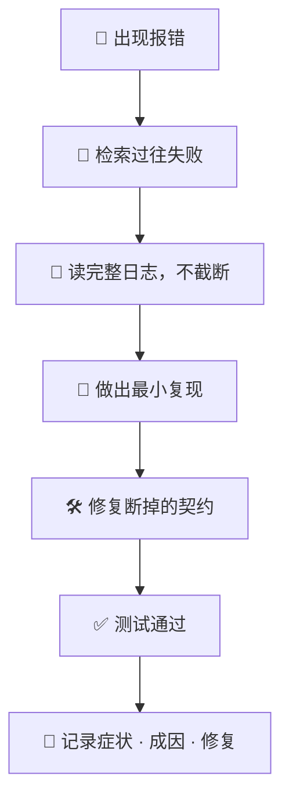

# 🐛 superforge-debug

[](https://opensource.org/licenses/MIT)
[](https://claude.com/claude-code)
[](https://github.com/takaoumehara/superforge-skill)

[English](README.md) · [日本語](README.ja.md) · **简体中文** · [Español](README.es.md) · [한국어](README.ko.md)

> **动代码之前先找到原因，同一个 bug 的学费不交第二次。**

---

## 🔰 这是什么？

好医生在开处方之前会先看病历，因为"两年前你对某种药反应不好"这种信息，不值得靠再痛一次来重新发现。

这个技能给调试配上了这份病历。在提出任何假设之前，它先用 `failforward recall` 查本机的失败记录；然后从完整日志出发而不是靠猜，修好真正断掉的那份契约，最后把教训写回去。下次同样的事发生时是被认出来，而不是被重新解一遍。

---

## 📐 系统架构



检索排在假设之前；记录排在验证之后，而不是替代验证。

---

## ✨ 亮点

### 🗂️ 记忆是仓库里的一个文件，不是一个你未必装了的工具
`docs/failforward.md`，提交进仓库，只追加，形成任何假设之前先读。真正有价值的不是修法，而是 **`Looked like`——最初怀疑错的那个方向**，因为它会重复出现。连着四次「查询很慢」最后都是漏了索引，这件事会告诉你下次先看哪儿，而个人记忆靠不住。

### 🔍 为那些四阶段根本开不了头的 bug 准备的
「复现并隔离」预设了复现是可能的，而真正昂贵的恰恰是复现不了的那些。先把「偶尔」缩小——时区和 locale 在一台机器上看起来就是纯随机。一次只对齐一个环境变量。与其猜，不如埋日志然后等。至于「以前是好的」，别再推理代码，直接二分。

### 🧠 先查记忆，再提假设
先查失败数据库，命中的教训立刻套用并标记为有用。调试的力气要花在你还没解过的问题上。

### 📜 靠证据，不靠试错
读完整、不截断的堆栈，提取准确的符号和行号，把复现收敛到最小，再顺着上游数据流找到契约断裂的那一点。改一处再跑一遍，不是诊断方法。

### 🚫 绝不掩盖症状
不吞异常、不绕过断言、不塞让红色消失的假兜底值。掩盖失败的修复不是消除了失败，只是把它挪到了更麻烦的地方。

---

## 🔄 使用前 / 使用后

| | 使用前 | 使用后 |
|---|---|---|
| 以前踩过的 bug | 从零重新发现 | 连同验证过的教训一起召回 |
| 诊断方式 | 改一下跑一下，反复来 | 完整日志加最小复现 |
| 所谓"修好了" | 一个用来遮丑的 `try/catch` | 把断掉的契约真正修好 |
| 修完之后 | 什么也没留下 | 症状、成因、修复都记下来 |

---

## 🚀 安装与使用

### 🖥️ 一次装好全部 13 个技能（只需一次）

克隆仓库并运行安装脚本。它会找出本机所有技能目录，把 13 个技能一次性链接进去（Claude Code / Codex CLI / Gemini CLI / Antigravity）。

```bash
git clone https://github.com/takaoumehara/superforge-skill
cd superforge-skill
./install.sh
```

完整选项、只装单个技能的方法，以及 claude.ai 的上传步骤，都在[整套 README](../../README.zh-CN.md)。

### ⌨️ 调用它

```
/superforge-debug
```

FailForward 相关步骤依赖本机的 `failforward` CLI。没有装也没关系，它会跳过检索，把教训写进 `docs/`，缺少 CLI 绝不会让诊断停下来。

---

## 📄 许可证

MIT — 见 [LICENSE](../../LICENSE)。四个阶段的流程和 `failforward` 的确切调用方式都在 [SKILL.md](SKILL.md)。整套说明见 [superforge-skill](../../README.zh-CN.md)。
