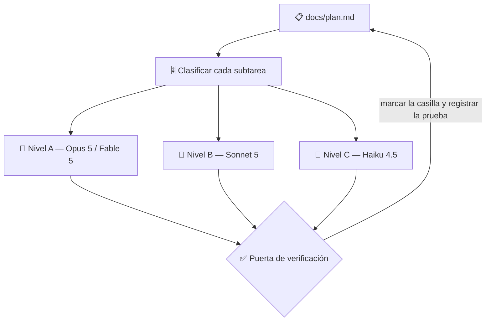

# 🔨 superforge-dev

[](https://opensource.org/licenses/MIT)
[](https://claude.com/claude-code)
[](https://github.com/takaoumehara/superforge-skill)

[English](README.md) · [日本語](README.ja.md) · [简体中文](README.zh-CN.md) · **Español** · [한국어](README.ko.md)

> **Divide la construcción, reparte los agentes y pon a cada uno sobre el modelo que su subtarea necesita de verdad.**

---

## 🔰 ¿Qué es esto?

En una obra, quien coordina no manda a la ingeniera de estructuras a barrer ni entrega los cálculos de carga a quien esté libre. Emparejar persona y tarea es casi todo lo que hace que una obra termine a tiempo y dentro del presupuesto.

Esta skill es esa figura para los agentes de AI. Descompone una funcionalidad, clasifica cada subtarea según cuánto criterio exige de verdad, lanza cada una sobre el modelo correspondiente y mantiene en disco un plan del que una ejecución caída puede continuar.

---

## 📐 Arquitectura



Nada se acepta por la palabra del subagente: primero se ejecutan las pruebas y se lee el diff, después se marca la casilla.

---

## ✨ Puntos clave

### 🗄️ El esquema es lo único que se vuelve más difícil de cambiar cuanto mejor te va
El código sin usuarios se reescribe en una tarde; una tabla con filas reales no. Así que las decisiones baratas ahora y caras después se toman a propósito — IDs no adivinables, marcas de tiempo en UTC, dinero en unidades menores enteras, y **la cadena de pertenencia que lee cada comprobación de permisos.** Y las tres causas de todo problema de rendimiento con datos, y migraciones aditivas contra una copia de producción con un rollback que ya has probado.

### 🧱 Una división en la que el paralelo es demostrablemente seguro
Ni la topología ni el nivel de modelo rescatan una mala división, y es ahí donde de verdad fallan las ejecuciones desatendidas. Cada tarea nombra un resultado, una línea de prueba y **los archivos que va a escribir** — porque la regla es: *dos tareas pueden ir en paralelo solo si esos conjuntos de archivos no se cruzan.* No «seguramente va bien»: listados, y disjuntos. Los cimientos compartidos van solos y primero.

### 🎚️ Un nivel por subtarea, en cuatro familias de modelos
Criterio a Opus 5, ejecuciones largas sin supervisión a Fable 5, implementación de volumen a Sonnet 5 y tareas rutinarias cerradas a Haiku 4.5, con el nivel equivalente nombrado también para los entornos Gemini, Codex y Kimi. El nivel de esfuerzo se fija junto al modelo, no se deja por defecto.

### 🧩 La topología se elige en voz alta, con su coste
Subagents (envío en un solo sentido, coste bajo de tokens) es lo predeterminado; Agent Teams (debate interactivo, coste alto) solo se propone cuando el contraste de perspectivas cambia realmente la respuesta. Sabes cuál se usa y por qué antes de que se lance nada.

### 📋 Un plan del que se puede resucitar
`docs/plan.md` guarda tareas con casilla, cada una con una **línea de prueba** que nombra el comando que demuestra que está hecha. El archivo se escribe después de cada tarea, así que una ejecución que muere en la tarea 7 arranca en la 8 solo con el disco, sin que nadie tenga que resumir nada.

---

## 🔄 Antes / Después

| | Antes | Después |
|---|---|---|
| Modelo por agente | El que traiga la sesión por defecto | Un nivel por subtarea, decidido antes |
| Topología de agentes | Implícita, se descubre en la factura | Anunciada en una línea, con su coste |
| Tras una caída | Explicarlo todo otra vez en otra sesión | Leer `docs/plan.md` y continuar |
| Aceptar el resultado | Fiarse del resumen que escribió | Pruebas ejecutadas, diff leído, y luego marcar |

---

## 🚀 Instalación y uso

### 🖥️ Instala las catorce skills (una sola vez)

Clona el repositorio y ejecuta el instalador. Enlaza las catorce skills en todos los directorios de skills de tu máquina (Claude Code, Codex CLI, Gemini CLI, Antigravity).

```bash
git clone https://github.com/takaoumehara/superforge-skill
cd superforge-skill
./install.sh
```

Todas las opciones, la instalación de una sola skill y la ruta de subida a claude.ai están en el [README de la suite](../../README.es.md).

### ⌨️ Invócala

```
/superforge-dev
```

Antes de lanzar ningún agente deberías ver anunciadas la topología y el nivel de modelo. Sin mecanismo de subagentes, el mismo bucle se ejecuta en secuencia.

---

## 📄 Licencia

MIT — consulta [LICENSE](../../LICENSE). El cuerpo de la skill está en [SKILL.md](SKILL.md); las condiciones previas de una ejecución sin supervisión, el bucle de construir, probar y reparar, y el formato del informe matutino están en [references/autonomous-run.md](references/autonomous-run.md). Visión general de la suite: [superforge-skill](../../README.es.md).
