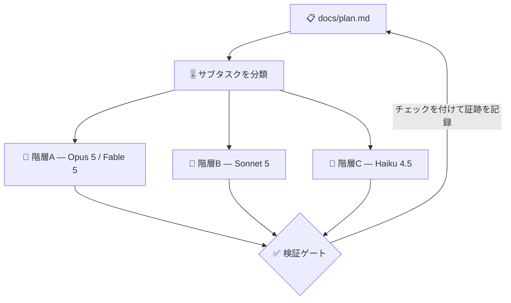

# 🔨 superforge-dev

[](https://opensource.org/licenses/MIT)
[](https://claude.com/claude-code)
[](https://github.com/takaoumehara/superforge-skill)

[English](README.md) · **日本語** · [简体中文](README.zh-CN.md) · [Español](README.es.md) · [한국어](README.ko.md)

> **実装を分解し、エージェントを配り、それぞれをそのサブタスクに見合ったモデルに乗せる。**

---

## 🔰 これは何？

現場監督は、構造設計者に掃き掃除をさせませんし、手が空いている人に荷重計算を渡したりもしません。人と仕事を合わせることが、工期と予算を守るほとんどすべてです。

このスキルは AI エージェントにとってのその監督です。機能を分解し、各サブタスクが本当に必要とする判断量で分類し、対応するモデルに乗せて起動し、落ちても再開できる計画ファイルをディスクに残します。

---

## 📐 システム概念図



サブエージェントの自己申告は受け取りません。テストを走らせ、差分を読んでからチェックを付けます。

---

## ✨ 3つの強み

### 🎚️ 4つのモデル系列にまたがる、サブタスク単位の階層
判断は Opus 5、無人の長時間実行は Fable 5、量の実装は Sonnet 5、閉じた雑務は Haiku 4.5。Gemini・Codex・Kimi 環境についても対応する階層が明記されています。effort（推論量）もモデルと同時に指定し、既定のままにしません。

### 🧩 トポロジーをコストごと口に出して選ぶ
既定は Subagents（一方向ディスパッチ、低トークンコスト）。Agent Teams（対話型の議論、高コスト）は、視点をぶつけることで結論が本当に変わる場合だけ提案します。何かを起動する前に、どちらをなぜ使うかが伝えられます。

### 📋 途中で死んでも再開できる計画
`docs/plan.md` はチェックボックス形式のタスクを持ち、各タスクに「完了を示すコマンド」を書いた**証跡行**が付きます。タスクごとにファイルを書き出すので、タスク7で落ちた実行はディスクだけを頼りにタスク8から再開します。人間の要約は要りません。

---

## 🔄 導入前 / 導入後

| | 導入前 | 導入後 |
|---|---|---|
| エージェントのモデル | セッションの既定モデルのまま | サブタスクごとに階層を先に決定 |
| エージェント構成 | 暗黙。請求で気づく | 一行で宣言、コストも明示 |
| クラッシュ後 | 新セッションに一から説明 | `docs/plan.md` を読んで続行 |
| 成果の受け取り | 本人の要約を信じる | テストと差分を確認してからチェック |

---

## 🚀 インストールと使い方

必要なのは `git` と、ディレクトリからスキルを読み込む AI ツールだけです。

### 🖥️ Claude Code（CLI）

好きな場所にスイート全体をクローンし、このスキルだけをリンクします。

```bash
git clone https://github.com/takaoumehara/superforge-skill ~/src/superforge-skill
ln -s ~/src/superforge-skill/skills/superforge-dev ~/.claude/skills/superforge-dev
```

Claude Code を再起動して呼び出します。

```
/superforge-dev
```

エージェントを起動する前に、構成とモデル階層が表示されます。サブエージェント機構がない環境では、同じループを逐次実行します。

### 🔗 Codex CLI / Gemini CLI / Antigravity

リンク先のディレクトリを変えるだけです。インストーラーに任せれば、このマシンにあるスキルディレクトリをすべて探して11個を一括でリンクします。

```bash
cd ~/src/superforge-skill
./install.sh
```

何度実行しても結果は同じで、自分が作ったシンボリックリンク以外には触れません。`--dry-run` で確認、`--uninstall` で削除できます。

### 🌐 claude.ai（ブラウザ）

このスキルのフォルダを zip にまとめ、アカウントのスキル設定からアップロードします。

```bash
cd ~/src/superforge-skill/skills/superforge-dev
zip -r superforge-dev.zip .
```

ブラウザ版は一度に1スキルずつなので、入れたい数だけ繰り返してください。

---

## 📄 ライセンス

MIT — [LICENSE](../../LICENSE) を参照してください。スキル本体は [SKILL.md](SKILL.md)、無人実行の前提条件・build/prove/repair ループ・朝の報告フォーマットは [references/autonomous-run.md](references/autonomous-run.md) にあります。スイート全体の説明は [superforge-skill](../../README.ja.md) へ。
