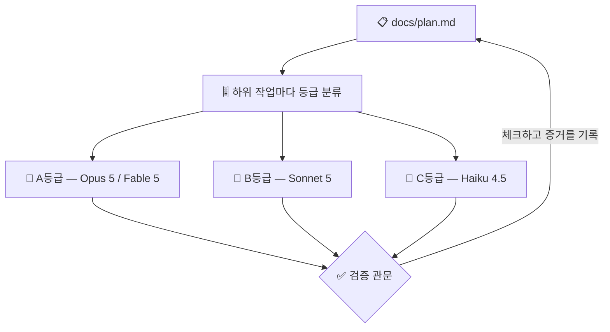

# 🔨 superforge-dev

[](https://opensource.org/licenses/MIT)
[](https://claude.com/claude-code)
[](https://github.com/takaoumehara/superforge-skill)

[English](README.md) · [日本語](README.ja.md) · [简体中文](README.zh-CN.md) · [Español](README.es.md) · **한국어**

> **구현을 쪼개고 에이전트를 배치하되, 각자를 그 하위 작업에 실제로 필요한 모델 위에 올립니다.**

---

## 🔰 이게 뭔가요?

현장 감독은 구조 엔지니어에게 바닥을 쓸게 하지 않고, 손이 빈 사람에게 하중 계산을 넘기지도 않습니다. 사람과 일을 맞추는 것이 공기와 예산을 지키는 일의 거의 전부입니다.

이 스킬은 AI 에이전트에게 그 감독 역할을 합니다. 기능을 분해하고, 각 하위 작업이 실제로 요구하는 판단의 양으로 등급을 매기고, 그에 맞는 모델로 띄우며, 중간에 죽어도 이어 갈 수 있는 계획 파일을 디스크에 남깁니다.

---

## 📐 시스템 구조



서브에이전트의 자기 보고만으로는 받아들이지 않습니다. 테스트를 돌리고 diff를 읽은 뒤에 체크합니다.

---

## ✨ 강점

### 🧱 병렬이 안전하다는 것을 증명할 수 있는 분할
토폴로지도 모델 등급도 잘못된 분할은 되돌리지 못하고, 무인 실행이 실제로 깨지는 지점이 대개 거기다. 작업마다 결과 하나, 증명 명령 하나, 그리고 **쓰게 될 파일 목록**을 붙인다 — 규칙은 *두 작업이 병렬로 돌아도 되는 것은 그 파일 집합이 겹치지 않을 때뿐*이기 때문이다. 「아마 괜찮다」가 아니라, 적어놓고, 겹치지 않을 것. 공용 기반은 혼자서 먼저 돈다.

### 🎚️ 네 개의 모델 계열에 걸친 하위 작업별 등급
판단은 Opus 5, 무인 장시간 실행은 Fable 5, 물량 구현은 Sonnet 5, 닫힌 잡무는 Haiku 4.5로 보냅니다. Gemini, Codex, Kimi 환경에 대해서도 대응 등급이 명시되어 있습니다. effort(추론 강도)도 모델과 함께 지정하고 기본값에 두지 않습니다.

### 🧩 토폴로지를 비용과 함께 소리 내어 고릅니다
기본은 Subagents(단방향 배치, 낮은 토큰 비용)이고, Agent Teams(상호작용 토론, 높은 비용)는 관점 충돌이 정말로 결론을 바꿀 때만 제안합니다. 무엇을 띄우기 전에 어느 쪽을 왜 쓰는지 먼저 알려 줍니다.

### 📋 도중에 죽어도 이어 갈 수 있는 계획
`docs/plan.md`는 체크박스 작업을 담고, 각 작업에는 완료를 증명하는 명령을 적은 **증거 줄**이 붙습니다. 작업마다 파일을 기록하므로 7번 작업에서 죽은 실행도 디스크만으로 8번부터 다시 시작합니다. 사람이 요약해 줄 필요가 없습니다.

---

## 🔄 도입 전 / 도입 후

| | 도입 전 | 도입 후 |
|---|---|---|
| 에이전트의 모델 | 세션 기본값 그대로 | 하위 작업별 등급을 먼저 결정 |
| 에이전트 구성 | 암묵적, 청구서로 알게 됨 | 한 줄로 선언, 비용까지 명시 |
| 크래시 이후 | 새 세션에 처음부터 설명 | `docs/plan.md`를 읽고 계속 |
| 결과물 수용 | 스스로 쓴 요약을 신뢰 | 테스트와 diff를 확인한 뒤 체크 |

---

## 🚀 설치 및 사용법

### 🖥️ 열세 개를 한 번에 설치 (처음 한 번만)

저장소를 클론하고 설치 스크립트를 실행하면 됩니다. 이 머신의 모든 스킬 디렉터리를 찾아 열세 개를 한 번에 링크합니다(Claude Code / Codex CLI / Gemini CLI / Antigravity).

```bash
git clone https://github.com/takaoumehara/superforge-skill
cd superforge-skill
./install.sh
```

옵션 전체와 스킬 하나만 설치하는 방법, claude.ai 업로드 절차는 [스위트 README](../../README.ko.md)에 있습니다.

### ⌨️ 호출하기

```
/superforge-dev
```

에이전트를 띄우기 전에 토폴로지와 모델 등급이 표시됩니다. 서브에이전트 기능이 없는 환경에서는 같은 루프를 순차로 실행합니다.

---

## 📄 라이선스

MIT — [LICENSE](../../LICENSE)를 참고하세요. 스킬 본문은 [SKILL.md](SKILL.md)에 있고, 무인 실행의 전제 조건과 빌드·증명·복구 루프, 아침 보고 형식은 [references/autonomous-run.md](references/autonomous-run.md)에 있습니다. 스위트 전체 소개는 [superforge-skill](../../README.ko.md)을 보세요.
