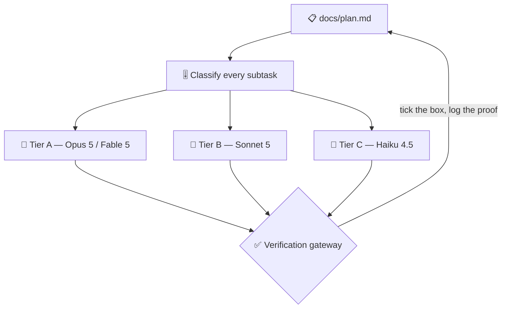

# 🔨 superforge-dev

[](https://opensource.org/licenses/MIT)
[](https://claude.com/claude-code)
[](https://github.com/takaoumehara/superforge-skill)

**English** · [日本語](README.ja.md) · [简体中文](README.zh-CN.md) · [Español](README.es.md) · [한국어](README.ko.md)

> **Split the build, dispatch the agents, and put each one on the model its subtask actually needs.**

---

## 🔰 What is this?

A site foreman does not send the structural engineer to sweep the floor, and does not hand the load calculations to whoever is free. Matching the person to the job is most of what makes a build finish on time and on budget.

This skill is that foreman for AI agents. It decomposes a feature, classifies every subtask by how much judgment it really needs, dispatches each one on the matching model, and keeps a plan file on disk that a crashed run can resume from.

---

## 📐 Architecture



Nothing is accepted from a subagent on its own word: tests run and diffs are read before the box gets ticked.

---

## ✨ Features

### 🗄️ The schema is the one thing that gets harder to change as you succeed
Code with no users can be rewritten in an afternoon; a table with real rows cannot. So the decisions that are cheap now and expensive later get made deliberately — non-guessable IDs, UTC timestamps, money in integer minor units, and **the ownership chain that every authorization check reads.** Plus the three causes of every data performance problem, and migrations run additively against a copy of production data with a rollback you have already tested.

### 🧱 A split where parallel is provably safe
Topology and model tier cannot rescue a bad split, and a bad split is where unattended runs actually fail. Every task names one outcome, a proof line, and **the files it will write** — because the rule is *two tasks may run in parallel only if those file sets do not intersect.* Not "probably fine": listed, and disjoint. Shared foundations run alone and first.

### 🎚️ A tier per subtask, across four model families
Judgment to Opus 5, unattended long runs to Fable 5, volume implementation to Sonnet 5, routine closed tasks to Haiku 4.5 — with the equivalent tier named for Gemini, Codex, and Kimi environments too. Effort level is set alongside the model, not left at the default.

### 🧩 Topology chosen out loud, with its cost
Subagents (one-way dispatch, low token cost) is the default; Agent Teams (interactive debate, high cost) is proposed only when cross-perspective argument genuinely changes the answer. You are told which one is being used and why before anything is spawned.

### 📋 A plan a dead run can resume from
`docs/plan.md` holds checkbox tasks, each with a **proof line** naming the command that shows it is done. The file is written after every task, so a run that dies at task 7 restarts at task 8 from disk alone — no human recap needed.

---

## 🔄 Before / After

| | Before | After |
|---|---|---|
| Model per agent | Whatever the session defaults to | A tier per subtask, decided first |
| Agent topology | Implicit, discovered by the bill | Announced in one line, with its cost |
| After a crash | Re-explain everything to a new session | Read `docs/plan.md` and continue |
| Accepting agent output | Trust the summary it wrote | Tests run, diff read, then ticked |

---

## 🚀 Install & Usage

### 🖥️ Install all fourteen skills (once)

Clone the repository and run the installer. It links every skill into every skills directory it finds on this machine — Claude Code, Codex CLI, Gemini CLI, Antigravity.

```bash
git clone https://github.com/takaoumehara/superforge-skill
cd superforge-skill
./install.sh
```

Full options, single-skill installs, and the claude.ai upload route are in the [suite README](../../README.md).

### ⌨️ Call it

```
/superforge-dev
```

Before any agent is spawned you should see the topology and the model tier stated. Without a subagent mechanism the same loop simply runs sequentially.

---

## 📄 License

MIT — see [LICENSE](../../LICENSE). The full skill body is in [SKILL.md](SKILL.md); the preconditions for an unattended run, the build/prove/repair loop, and the morning report format are in [references/autonomous-run.md](references/autonomous-run.md). Suite overview: [superforge-skill](../../README.md).
