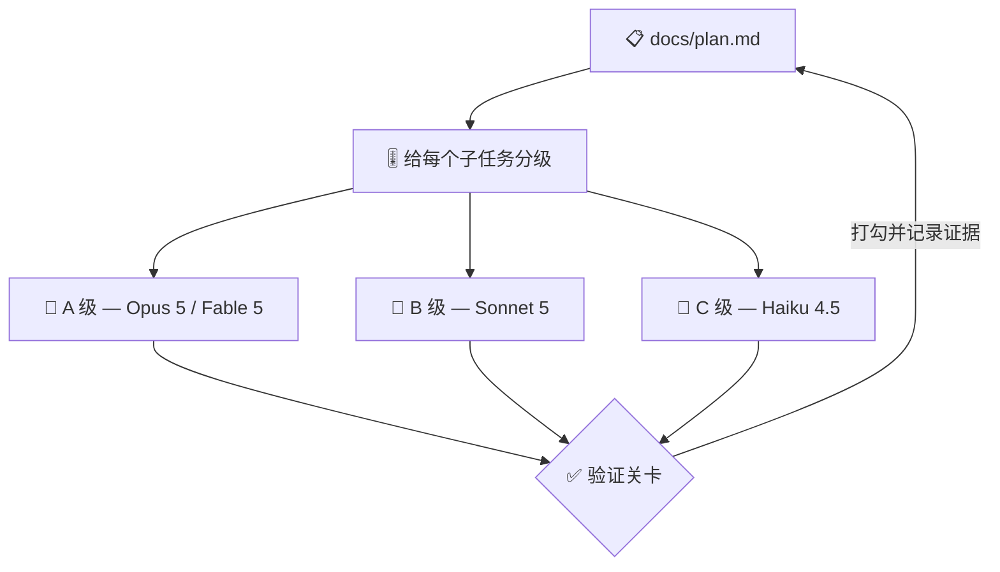

# 🔨 superforge-dev

[](https://opensource.org/licenses/MIT)
[](https://claude.com/claude-code)
[](https://github.com/takaoumehara/superforge-skill)

[English](README.md) · [日本語](README.ja.md) · **简体中文** · [Español](README.es.md) · [한국어](README.ko.md)

> **把实现拆开，把 agent 派出去，并让每个 agent 跑在它那份子任务真正需要的模型上。**

---

## 🔰 这是什么？

工地上的工长不会让结构工程师去扫地，也不会把荷载计算随手交给闲着的人。把人和活儿配对，几乎就是工期和预算能不能守住的全部。

这个技能就是 AI agent 的那位工长。它拆解功能，按每个子任务真正需要多少判断力来分级，把它们派到对应的模型上，并在磁盘上留一份计划文件，让崩掉的任务能接着跑。

---

## 📐 系统架构



子 agent 的自我陈述不作数：先跑测试、读 diff，再勾选。

---

## ✨ 三大亮点

### 🎚️ 跨四套模型体系的子任务分级
判断交给 Opus 5，无人值守的长任务交给 Fable 5，走量实现交给 Sonnet 5，封闭杂活交给 Haiku 4.5；Gemini、Codex、Kimi 环境也各自标出了对应级别。effort（推理强度）与模型一起指定，不留在默认值上。

### 🧩 拓扑连同成本一起说清楚
默认是 Subagents（单向派发、token 成本低）；只有当多视角争论确实会改变结论时，才提出 Agent Teams（可交互、成本高）。在启动任何 agent 之前，你就知道用哪种、为什么。

### 📋 一份中途死掉也能续跑的计划
`docs/plan.md` 用勾选框记录任务，每条都带一行**证据**，写明用哪条命令证明它做完了。每完成一个任务就落盘，所以在第 7 个任务崩掉的运行，可以只靠磁盘从第 8 个任务继续，不需要人来复述。

---

## 🔄 使用前 / 使用后

| | 使用前 | 使用后 |
|---|---|---|
| agent 用什么模型 | 会话默认是什么就用什么 | 先按子任务定好级别 |
| agent 拓扑 | 隐式决定，看账单才知道 | 一行说清，连成本一起 |
| 崩溃之后 | 对新会话从头讲一遍 | 读 `docs/plan.md` 继续 |
| 接收产出 | 信它自己写的总结 | 跑测试、读 diff，再勾选 |

---

## 🚀 安装与使用

### 🖥️ 一次装好全部 11 个技能（只需一次）

克隆仓库并运行安装脚本。它会找出本机所有技能目录，把 11 个技能一次性链接进去（Claude Code / Codex CLI / Gemini CLI / Antigravity）。

```bash
git clone https://github.com/takaoumehara/superforge-skill
cd superforge-skill
./install.sh
```

完整选项、只装单个技能的方法，以及 claude.ai 的上传步骤，都在[整套 README](../../README.zh-CN.md)。

### ⌨️ 调用它

```
/superforge-dev
```

派出任何 agent 之前，你应该先看到拓扑和模型级别。如果环境里没有子 agent 机制，同样的循环会改为串行执行。

---

## 📄 许可证

MIT — 见 [LICENSE](../../LICENSE)。技能正文在 [SKILL.md](SKILL.md)；无人值守运行的前提、build/prove/repair 循环，以及次日晨报格式都在 [references/autonomous-run.md](references/autonomous-run.md)。整套说明见 [superforge-skill](../../README.zh-CN.md)。
