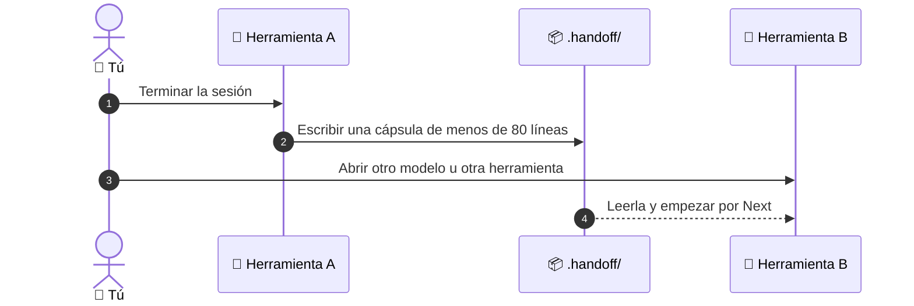

# 🔁 superforge-handoff

[](https://opensource.org/licenses/MIT)
[](https://claude.com/claude-code)
[](https://github.com/takaoumehara/superforge-skill)

[English](README.md) · [日本語](README.ja.md) · [简体中文](README.zh-CN.md) · **Español** · [한국어](README.ko.md)

> **Borra el hilo, cambia de modelo, cambia de herramienta, y conserva el trabajo.**

---

## 🔰 ¿Qué es esto?

En un cambio de turno hospitalario, quien sale no narra el día entero: entrega una nota breve y estructurada. Quién está, qué se ha hecho, qué toca ahora, qué vigilar. Es corta precisamente porque los historiales ya existen.

Esta skill escribe esa nota para una sesión de trabajo. Una cápsula de menos de 80 líneas queda en `.handoff/`, apuntando a los archivos que contienen el detalle en vez de repetirlo, y cualquier modelo o herramienta puede retomar el trabajo desde ahí.

---

## 📐 Arquitectura



La cápsula apunta a `docs/`, no lo duplica. Por eso se queda lo bastante corta como para que alguien la lea de verdad.

---

## ✨ 3 puntos clave

### 📦 Corta porque señala en vez de repetir
La cápsula guarda el objetivo, el estado verificado, los procesos y puertos en marcha, los siguientes pasos inmediatos y qué archivos leer primero. Todo lo demás se queda en los artefactos de `docs/` que ya escribieron las otras skills.

### 🔁 Markdown plano que lee cualquier herramienta
Claude Code, Codex, Gemini CLI, Antigravity, Cursor: la cápsula es un archivo de tu repositorio, no una función de un proveedor. Viaja con el código por git y no se sube a ninguna parte.

### 📋 Un prompt de reanudación que pegas y sigues
Junto a la cápsula recibes un prompt listo para pegar con el proyecto, el archivo, el objetivo, el estado verificado y el siguiente paso. Retomar es pegar una vez, no reconstruir de memoria.

---

## 🔄 Antes / Después

| | Antes | Después |
|---|---|---|
| Cambiar de herramienta | Volver a explicar todo el proyecto | Leer una cápsula |
| Antes de `/clear` | Mantener vivo un hilo enorme | Borrarlo con tranquilidad |
| Dónde vive el contexto | En un chat que acabarás perdiendo | En tu repositorio, bajo git |
| Retomar al día siguiente | Reconstruirlo de memoria | Pegar el prompt de reanudación |

---

## 🚀 Instalación y uso

### 🖥️ Instala las trece skills (una sola vez)

Clona el repositorio y ejecuta el instalador. Enlaza las trece skills en todos los directorios de skills de tu máquina (Claude Code, Codex CLI, Gemini CLI, Antigravity).

```bash
git clone https://github.com/takaoumehara/superforge-skill
cd superforge-skill
./install.sh
```

Todas las opciones, la instalación de una sola skill y la ruta de subida a claude.ai están en el [README de la suite](../../README.es.md).

### ⌨️ Invócala

```
/superforge-handoff
```

Aparece un archivo con fecha en `.handoff/` y, a continuación, el prompt de reanudación en la respuesta. El proyecto no necesita nada más.

---

## 📄 Licencia

MIT — consulta [LICENSE](../../LICENSE). El formato de la cápsula y la plantilla del prompt de reanudación están en [SKILL.md](SKILL.md). Visión general de la suite: [superforge-skill](../../README.es.md).
