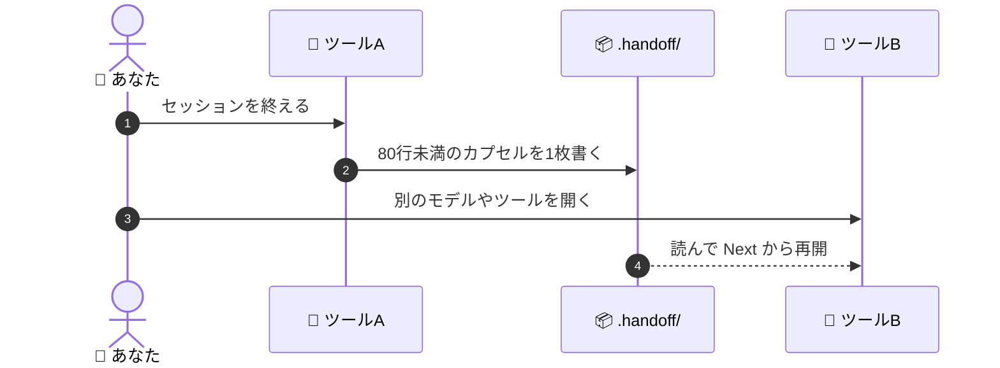

# 🔁 superforge-handoff

[](https://opensource.org/licenses/MIT)
[](https://claude.com/claude-code)
[](https://github.com/takaoumehara/superforge-skill)

[English](README.md) · **日本語** · [简体中文](README.zh-CN.md) · [Español](README.es.md) · [한국어](README.ko.md)

> **スレッドを消しても、モデルを変えても、ツールを乗り換えても、作業は続く。**

---

## 🔰 これは何？

病院の勤務交代で、去る看護師が一日を全部語り直すことはありません。渡すのは短い定型の申し送りです。誰がいて、何が済んでいて、次に何をして、何を見ておくか。短くて済むのは、カルテがすでに存在しているからです。

このスキルは作業セッションに対してその申し送りを書きます。80行未満のカプセルが `.handoff/` に残り、詳細を書き写す代わりに詳細のあるファイルを指し示します。どのモデル・どのツールでも、そこから作業を引き継げます。

---

## 📐 システム概念図



カプセルは `docs/` を指すだけで、複製はしません。だからこそ、実際に読まれる長さに収まります。

---

## ✨ 強み

### 📦 繰り返さず指し示すから短い
カプセルが持つのは、目的・検証済みの状態・動いているプロセスとポート・すぐ次にやること・最初に読むべきファイル。それ以外は、他のスキルがすでに書いた `docs/` の成果物に置いたままにします。

### 🔁 どのツールでも読めるただの Markdown
Claude Code、Codex、Gemini CLI、Antigravity、Cursor。カプセルは特定ベンダーの機能ではなく、リポジトリの中のファイルです。git でコードと一緒に移動し、どこにもアップロードされません。

### 📋 貼るだけで再開できるプロンプト
カプセルと一緒に、プロジェクト名・ファイル・目的・検証済みの状態・次の一歩を書いたコピペ用のチャットプロンプトが出力されます。再開は記憶からの再構成ではなく、1回の貼り付けです。

---

## 🔄 導入前 / 導入後

| | 導入前 | 導入後 |
|---|---|---|
| ツールの乗り換え | プロジェクトを一から説明 | カプセルを1枚読む |
| `/clear` の前 | 肥大したスレッドを延命 | 安心して消せる |
| コンテキストの置き場 | いずれ失うチャットログ | git 管理下のリポジトリ |
| 翌日の再開 | 記憶から組み立て直す | 再開プロンプトを貼る |

---

## 🚀 インストールと使い方

### 🖥️ 12個まとめて入れる（最初の1回だけ）

クローンしてインストーラを走らせるだけです。マシンの中にあるスキル用フォルダを全部探して、13個をまとめてリンクします（Claude Code / Codex CLI / Gemini CLI / Antigravity）。

```bash
git clone https://github.com/takaoumehara/superforge-skill
cd superforge-skill
./install.sh
```

オプション、1個だけ入れる方法、claude.ai へのアップロード手順は [スイート全体の README](../../README.ja.md) にあります。

### ⌨️ 呼び出す

```
/superforge-handoff
```

`.handoff/` に日付入りのファイルが作られ、返答に再開プロンプトが続きます。プロジェクト側に他の準備は要りません。

---

## 📄 ライセンス

MIT — [LICENSE](../../LICENSE) を参照してください。カプセルの書式と再開プロンプトのテンプレートは [SKILL.md](SKILL.md) にあります。スイート全体の説明は [superforge-skill](../../README.ja.md) へ。
