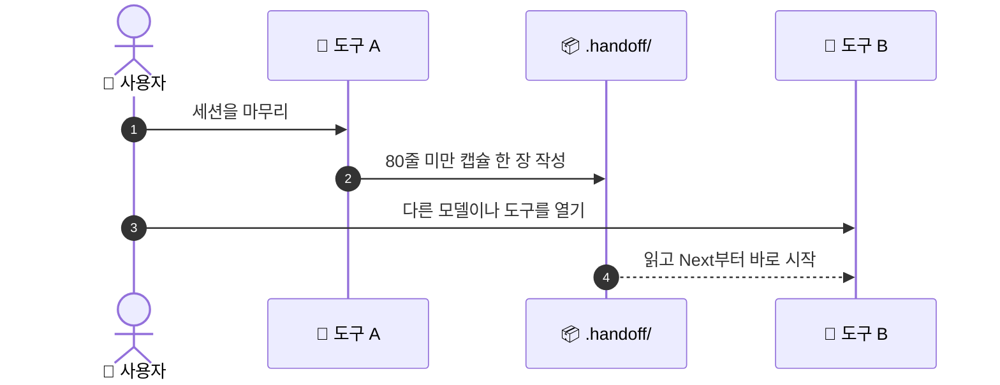

# 🔁 superforge-handoff

[](https://opensource.org/licenses/MIT)
[](https://claude.com/claude-code)
[](https://github.com/takaoumehara/superforge-skill)

[English](README.md) · [日本語](README.ja.md) · [简体中文](README.zh-CN.md) · [Español](README.es.md) · **한국어**

> **스레드를 지워도, 모델을 바꿔도, 도구를 갈아타도 작업은 이어집니다.**

---

## 🔰 이게 뭔가요?

병원에서 교대할 때 나가는 간호사는 하루를 통째로 다시 이야기하지 않습니다. 짧고 정형화된 인계 메모를 건넬 뿐입니다. 누가 있고, 무엇이 끝났고, 다음에 무엇을 하고, 무엇을 지켜봐야 하는지. 이렇게 짧아도 되는 이유는 차트가 이미 있기 때문입니다.

이 스킬은 작업 세션에 대해 그 인계 메모를 씁니다. 80줄 미만의 캡슐이 `.handoff/`에 남고, 세부 내용을 옮겨 적는 대신 그것이 담긴 파일을 가리킵니다. 어떤 모델이나 도구든 거기서부터 작업을 이어받을 수 있습니다.

---

## 📐 시스템 구조



캡슐은 `docs/`를 가리킬 뿐 복제하지 않습니다. 그래서 실제로 끝까지 읽히는 길이에 머무릅니다.

---

## ✨ 강점

### 📦 되풀이하지 않고 가리키기 때문에 짧습니다
캡슐에 담기는 것은 목표, 검증된 상태, 실행 중인 프로세스와 포트, 바로 다음에 할 일, 먼저 읽을 파일입니다. 나머지는 다른 스킬이 이미 써 둔 `docs/` 산출물에 그대로 둡니다.

### 🔁 어떤 도구든 읽는 순수 Markdown
Claude Code, Codex, Gemini CLI, Antigravity, Cursor 모두 가능합니다. 캡슐은 특정 벤더의 기능이 아니라 저장소 안의 파일이며, git으로 코드와 함께 이동하고 어디에도 업로드되지 않습니다.

### 📋 붙여 넣기만 하면 되는 재개 프롬프트
캡슐과 함께 프로젝트, 파일, 목표, 검증된 상태, 다음 단계를 담은 복사·붙여넣기용 프롬프트가 나옵니다. 재개는 기억으로 재구성하는 일이 아니라 한 번의 붙여넣기입니다.

---

## 🔄 도입 전 / 도입 후

| | 도입 전 | 도입 후 |
|---|---|---|
| 도구를 바꿀 때 | 프로젝트를 처음부터 다시 설명 | 캡슐 한 장 읽기 |
| `/clear` 직전 | 비대해진 스레드를 억지로 유지 | 마음 놓고 지우기 |
| 컨텍스트가 있는 곳 | 언젠가 잃어버릴 대화 기록 | git으로 관리되는 저장소 |
| 다음 날 재개 | 기억으로 다시 짜 맞추기 | 재개 프롬프트를 붙여넣기 |

---

## 🚀 설치 및 사용법

### 🖥️ 열세 개를 한 번에 설치 (처음 한 번만)

저장소를 클론하고 설치 스크립트를 실행하면 됩니다. 이 머신의 모든 스킬 디렉터리를 찾아 열세 개를 한 번에 링크합니다(Claude Code / Codex CLI / Gemini CLI / Antigravity).

```bash
git clone https://github.com/takaoumehara/superforge-skill
cd superforge-skill
./install.sh
```

옵션 전체와 스킬 하나만 설치하는 방법, claude.ai 업로드 절차는 [스위트 README](../../README.ko.md)에 있습니다.

### ⌨️ 호출하기

```
/superforge-handoff
```

`.handoff/`에 날짜가 붙은 파일이 생기고, 응답에 재개 프롬프트가 이어집니다. 프로젝트 쪽에 다른 준비는 필요 없습니다.

---

## 📄 라이선스

MIT — [LICENSE](../../LICENSE)를 참고하세요. 캡슐 형식과 재개 프롬프트 템플릿은 [SKILL.md](SKILL.md)에 있습니다. 스위트 전체 소개는 [superforge-skill](../../README.ko.md)을 보세요.
